# 分布式 KVCache 技术趋势与 openFuyao 战略规划

> **汇报目的**：为领导层提供分布式 KVCache 领域的技术趋势全景判断，明确 openFuyao 的差异化定位和生态影响力构建路径。

---

## 执行摘要（核心结论，一页纸，3 分钟）

### 一句话定位

```
openFuyao = 超节点硬件使能层 + 异构 KVCache 优化 + 上游贡献深耕
```

**核心论点**：openFuyao 不应成为"另一个 Mooncake"，而应通过 **超节点 + 灵衢 UB 总线硬件底座** + **Mooncake 上游席位获取**，成为 **Ascend NPU 生态的 KVCache 深度优化者与异构互通桥梁**。

### 三个关键数据支撑

| 数据 | 来源 | 对 openFuyao 的意义 |
|------|------|---------------------|
| Mooncake + vLLM：吞吐 **3.8x**，TTFT 降低 **46x** | [vLLM Blog, 2026-05-06] | 验证 KVCache 方案有效性，openFuyao 集成 Mooncake 已有收益 |
| CloudMatrix384 UB：KVCache 90% 重用，TTFT 降低 **59%** | [arXiv 论文] | 华为超节点 + UB 硬件优势，openFuyao 核心差异化底座 |
| 热点 KVCache 缓存：TTFT 降低 **55-93%** | [SIG 性能报告 v25.12] | openFuyao 已有 KVCache 热缓存优化贡献基础 |

### 三个核心判断

1. **底层存储引擎趋于收敛 → Mooncake Store 成为主流**（PyTorch 生态，HiCache/LMCache 均以其为后端）
2. **上层管理层竞争本质是推理引擎竞争 → HiCache vs LMCache 分别绑定 SGLang/vLLM**
3. **异构硬件是中国市场独特变量 → openFuyao 需填补 Ascend 深度优化 + GPU 互通空白**

### 下一步行动建议（摘要）

| 时间 | 行动 | 目标 |
|------|------|------|
| **本周** | 发起 Layout Handler RFC | 进入 Mooncake 社区讨论 |
| **Q3** | 热点缓存 PR 合并 + 灵衢 GVA PoC | Store Top 5 + UB 验证 |
| **Q4** | 申请 Reviewer 席位 | CODEOWNERS 申请资格 |
| **待协调** | 与 Yuanrong/MemCache 明确分工 | 避免内部竞争 |

---

## 一、行业痛点与 KVCache 价值（精选 3 个代表场景）

### 1.1 为什么 KVCache 是 LLM 推理的核心瓶颈？

LLM 推理中，KVCache（键值缓存）占用 GPU/NPU 高带宽内存的 **60-80%**（来源：[Mooncake 论文, arXiv 2407.00079](https://arxiv.org/abs/2407.00079)）。随着上下文长度增长，KVCache 成为核心瓶颈，直接影响吞吐、延迟和部署成本。

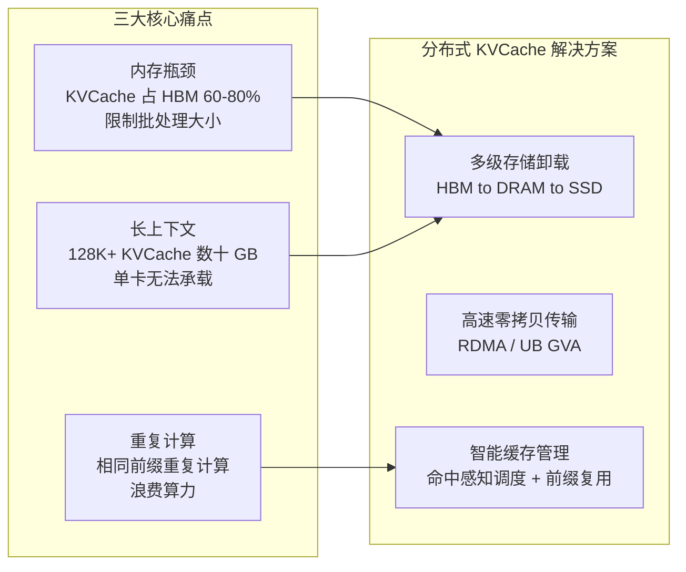

### 1.2 三个代表行业场景

#### 场景一：金融行业 — 智能客服 Agent 多轮对话

| 维度 | 具体情况 |
|------|---------|
| **业务场景** | 银行智能客服 Agent 处理多轮对话，历史上下文累积超过 64K tokens |
| **核心痛点** | 每轮对话需重复处理全量历史 KVCache，上下文超 64K 时 TTFT >10s |
| **KVCache 价值** | 热点 KVCache 缓存复用——历史对话 KVCache 常驻缓存，新请求仅计算增量部分 |
| **量化收益** | 热点缓存优化：**TTFT 降低 55-93%**，跨节点传输延迟从 881ms 降至 287ms（来源：[SIG 性能报告 v25.12]） |

#### 场景二：运营商/政务 — 超长文档与 PD 分离推理

| 维度 | 具体情况 |
|------|---------|
| **业务场景** | 政务法规问答、运营商合同审核等 128K-1M 上下文场景，采用 PD 分离部署 |
| **核心痛点** | 单卡 HBM 无法承载 128K+ KVCache（可达数十 GB）；预填充节点到解码节点跨节点传输延迟高 |
| **KVCache 价值** | 多级存储卸载（HBM→DRAM→SSD）+ RDMA/UB 零拷贝传输，突破单卡容量限制和跨节点延迟瓶颈 |
| **量化收益** | Mooncake Store + vLLM：**吞吐提升 3.8x，TTFT 降低 46x**（来源：[vLLM Blog, 2026-05-06]）；CloudMatrix384 UB：**KVCache 90% 重用率下 TTFT 降低 59%**（来源：[arXiv 论文]） |

#### 场景三：互联网 — RAG 知识库与企业 Agent

| 维度 | 具体情况 |
|------|---------|
| **业务场景** | 企业知识库 RAG 检索增强生成，大量用户查询共享相同文档前缀 |
| **核心痛点** | 相同文档前缀被不同用户请求重复计算 KVCache，浪费大量算力 |
| **KVCache 价值** | 跨请求 KVCache 智能复用——共享前缀 KVCache 直接命中，避免重复计算 |
| **量化收益** | LMCache CacheBlend：**RAG 场景接近 100% 命中率**（EuroSys 2025 Best Paper）；蚂蚁集团 DeepSeek-R1：**TTFT 降低 84%**（来源：[SGLang HiCache Blog]） |

### 1.3 主流组件全景图

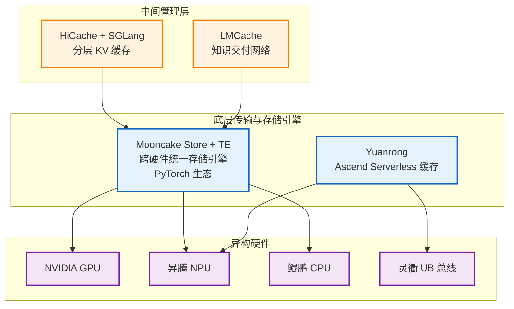

---

## 二、技术演进三大趋势

### 趋势总览与交叉关系

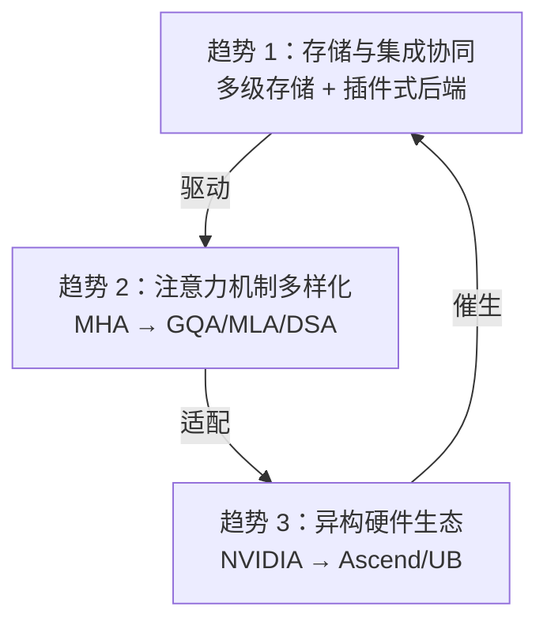

### 趋势 1：存储与集成协同 — 多级存储 + 插件式后端

**演进路径**：

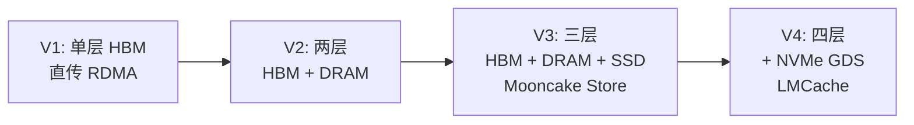

**关键创新点**：

| 系统 | 创新点 | 数据 |
|------|--------|------|
| HiCache | GPU 辅助 I/O 内核 | **3x cudaMemcpy 吞吐**（来源：[SGLang HiCache Blog]） |
| LMCache | NVMe GDS 直通 + NUMA 感知 | 四层存储最深 |
| HiCache | 3 函数后端接口（get/exist/set） | Mooncake/3FS/NIXL 已接入（来源：[HiCache Design]） |

### 趋势 2：注意力机制多样化

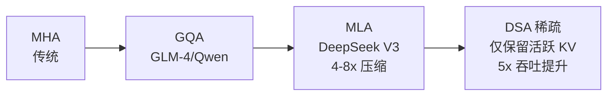

| 机制 | 存储影响 | 代表系统 |
|------|---------|---------|
| MLA | 压缩潜在向量，**存储缩减 4-8x** | Mooncake Store MLA Handler（来源：[mooncake-store/include/mla_layout_handler.h]） |
| DSA 稀疏 | 仅存储活跃 KV 子集 | **HiSparse 5x 吞吐**（来源：[SGLang HiSparse Blog]） |

**趋势判断**：Mooncake Store 已有 MHA/GQA/MLA/Hybrid 四种布局处理器——领先优势；稀疏注意力是下一个竞争焦点。

### 趋势 3：异构硬件生态 — NVIDIA vs 华为 UB

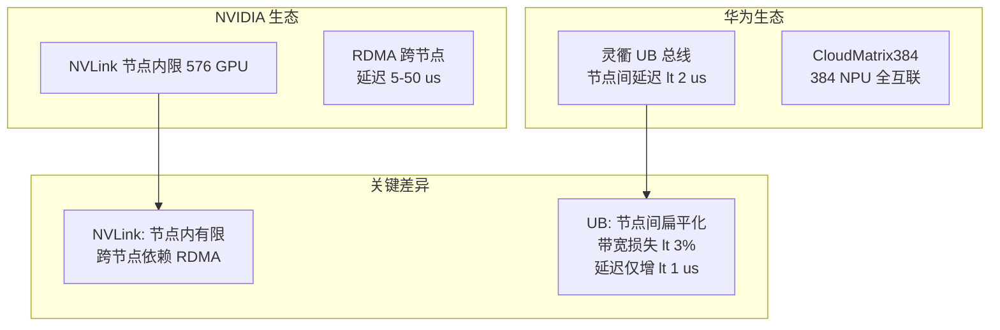

**实测数据（CloudMatrix384，来源：[arXiv 论文]）**：

| 指标 | NVIDIA RDMA | 华为 UB | 优势 |
|------|-------------|---------|------|
| NPU-NPU 读取带宽 | ~50 GB/s | **164 GB/s** | 3.3x |
| NPU-NPU 读取延迟 | ~5-10 μs | **1.9 μs** | 3-5x |
| 节点内/间带宽比 | 显著下降 | **98%（损失 <3%）** | 数量级优势 |
| KVCache 90% 重用 TTFT | — | **降低 59%** | 实测验证 |

---

## 三、生态格局与竞争态势

### 3.1 六大系统竞合关系

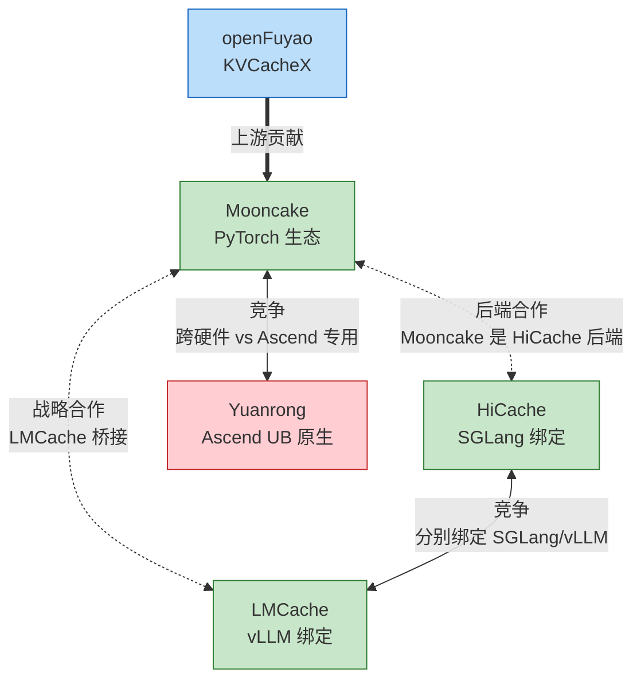

### 3.2 三大关键判断（高亮）

> **判断 1：底层存储引擎趋于收敛 → Mooncake Store 成为主流**
>
> Mooncake 2026.02 进入 PyTorch 生态，HiCache/LMCache 均以其为远程后端。vLLM 官方集成（2026.05）标志着主流推理引擎认可。（来源：[Mooncake GitHub]）

> **判断 2：上层管理层竞争本质是推理引擎竞争 → HiCache vs LMCache 分别绑定 SGLang/vLLM**
>
> HiCache 深度绑定 SGLang RadixAttention，LMCache 深度绑定 vLLM KV Connector。竞争格局跟随推理引擎市场份额演变。（来源：本文分析）

> **判断 3：异构硬件是中国市场独特变量 → openFuyao 需填补 Ascend 深度优化 + GPU 互通空白**
>
> Yuanrong 仅 Ascend、缺乏跨硬件互通；Mooncake 覆盖广但 Ascend 深度不足。**openFuyao 应做"深度 Ascend 优化 + Ascend↔NVIDIA 互通"**。（来源：本文分析）

### 3.3 收敛趋势图示

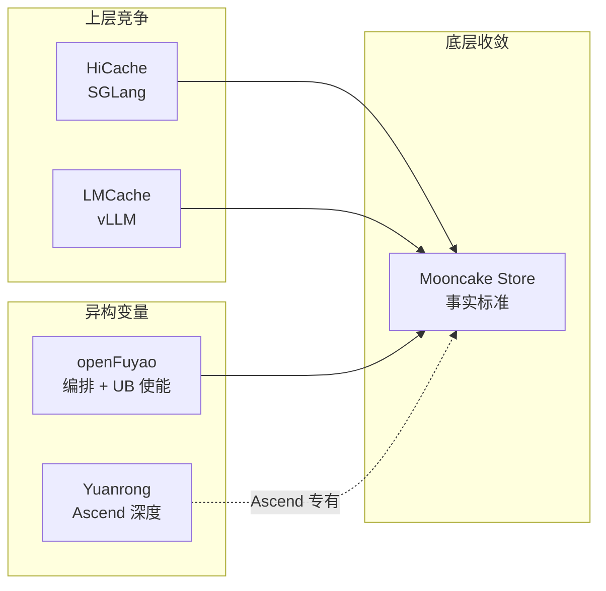

---

## 四、openFuyao 差异化定位：超节点 + UB 总线是核心底座

### 4.1 定位论证：为何不做"另一个 Mooncake"？

| 维度 | Mooncake | openFuyao 应该做 | 论据 |
|------|----------|-----------------|------|
| 技术栈层级 | 底层存储引擎（跨硬件广覆盖） | **Ascend 深度优化 + 异构互通** | Yuanrong/MemCache 已做 Ascend 底层，openFuyao 通过贡献上游 Mooncake 避免重复 |
| 硬件策略 | 广度覆盖 4+ 平台，Ascend 通过 HCCL 封装 | **深度优化昇腾 + 灵衢 UB 原生** | CloudMatrix384 实测优势，NVIDIA 无法复制 |
| 核心能力 | 传输 + 存储 | **NPU 原生 KVCache 优化 + 异构格式互通** | 超节点 + UB 是差异化护城河 |
| 上游策略 | — | **贡献 Mooncake → 获取 CODEOWNERS** | 席位 = 生态影响力，引导 NPU 支持成为核心路线 |

### 4.2 核心差异化底座：超节点 + UB 总线

> **华为超节点 + 灵衢 UB 总线是 openFuyao 区别于 Mooncake/HiCache/LMCache 的根本性差异**
>
> NVIDIA NVLink 节点内限 576 GPU，跨节点依赖 RDMA（4 跳，9-14 μs）；
> 华为 UB 总线通过 GVA 统一编址，将超节点扁平化为单一逻辑节点，节点间延迟 <2 μs，实现 1 跳零拷贝 KVCache 直访。

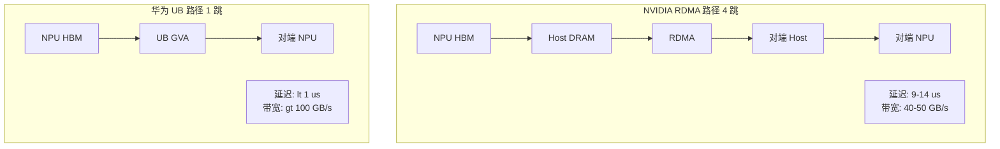

**两种超节点场景的 KVCache 发力空间**：

| 场景 | 硬件组合 | KVCache 发力点 | 关键指标 |
|------|---------|---------------|---------|
| **智算超节点** | Ascend 910C/950 + UB 全互联 | L0-L1 层 GVA 零拷贝直访 | 超节点内延迟 <1μs，带宽 >100 GB/s |
| **通算超节点** | Kunpeng 950 + Ascend NPU | CPU DRAM 冷存储 + NPU HBM 热缓存 | CPU-NPU 带宽 >100 GB/s，冷热切换 <2μs |

---

## 五、四大突破方向与 Mooncake 上游深耕路径

### 5.1 四大突破方向总览

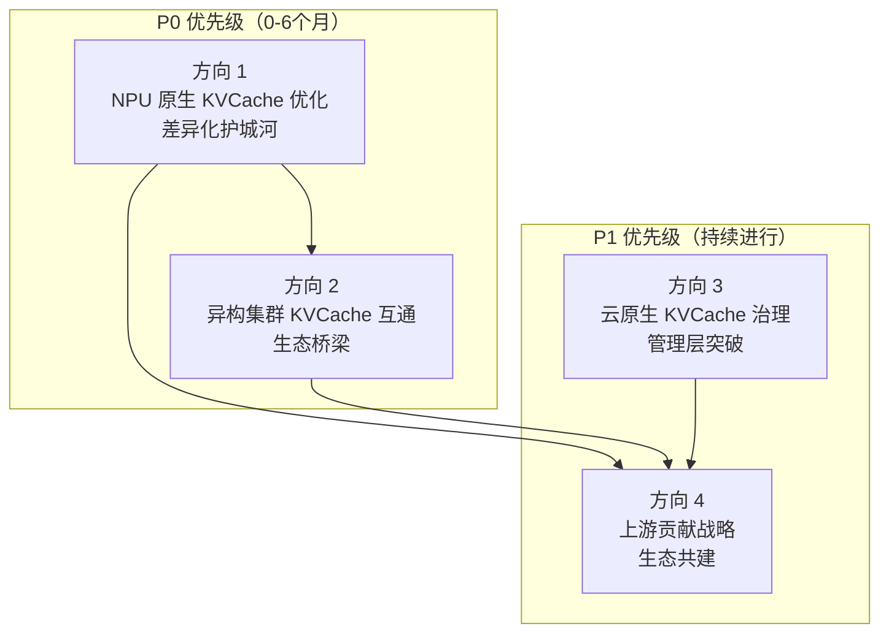

**逻辑依赖**：方向 1 和方向 2 是 P0 并行推进（都需要深入理解 Ascend KVCache 布局）；方向 3 在方向 1/2 基础能力后推进；方向 4 持续进行，将 1/2/3 的产出转化为上游贡献。

---

### 5.2 三大突破方向一览表

| 维度 | 方向 1：NPU 原生 KVCache 优化 | 方向 2：异构集群 KVCache 互通 | 方向 3：KVCache 智能管理 |
|------|------------------------------|------------------------------|---------------------------|
| **优先级** | **P0** | **P0** | P1 |
| **一句话定位** | 成为 Ascend NPU 生态的 KVCache 标准实现 | 成为异构推理（Ascend+NVIDIA）的唯一完整 KVCache 编排方案 | 从"被动缓存"升级为"主动智能 KVCache 管理" |
| **核心价值** | **硬件级差异化护城河**——NVIDIA NVLink 节点内限 576 GPU，UB 总线节点间延迟 <2μs，超节点扁平化为单一逻辑节点 | **生态桥梁**——Yuanrong 仅 Ascend 无法互通，openFuyao 跨厂商方案不可替代 | **智能层突破**——流量预测主动预热 + 多级存储智能淘汰 |
| **核心场景** | A. 智算超节点（910C/950 + UB）<br/>B. 通算超节点（Kunpeng + NPU） | Ascend Prefill + NVIDIA Decode PD 分离 | RAG 前缀复用、Agent 多轮对话、长上下文智能预热 |
| **技术突破路径** | A：L0-L1 GVA 零拷贝直访，构建 LingQuCacheTier<br/>B：CPU DRAM 冷存储 + NPU HBM 热缓存分层<br/>通用：Ascend 原生互连深度优化 + 稀疏 KV 子集传输 | ① 格式分析（数据类型/对齐/GQA 组划分差异）<br/>② 双向格式转换层设计（零拷贝）<br/>③ Mooncake TE 异构传输适配<br/>④ KVCache 路由感知跨硬件选择 | ① 基于流量预测的主动 KVCache 预热<br/>② 多级存储（HBM/DRAM/SSD）智能淘汰策略<br/>③ 超节点拓扑感知 KVCache 调度（超节点内优先）<br/>④ KVCache 命中率/层级分布/淘汰率深度可观测 |
| **关键对比基准** | RDMA 4 跳 9-14μs/40-50GB/s<br/>**UB 1 跳 <1μs/>100GB/s** | 同构集群性能的 90%+（损失 <10%） | 超节点内延迟 <2μs vs 跨超节点 5-50μs |
| **性能目标** | 智算：超节点内 <1μs、>100GB/s<br/>通算：Kunpeng-NPU 110-151GB/s<br/>Ascend 整体对标 GPU 80%+ | 异构 PD 分离性能损失 <10% | 命中率提升 20%+<br/>超节点内命中率 >80% |
| **Mooncake 上游贡献点** | NPU 专用 Layout Handler（Store）<br/>ADXL Direct 性能优化（TE）<br/>Ascend KVCache 性能基线 | 异构格式转换模块（TE）<br/>通用化后贡献 | KVCache 预热策略、淘汰算法贡献（Store） |
| **依赖关系** | 无（先行） | 依赖方向 1 格式分析结果 | 依赖方向 1/2 基础能力 |
| **时间窗口** | Q3 2026 启动，Q1 2027 验证 | Q4 2026 启动，Q1 2027 PoC | Q4 2026 启动，Q2 2027 发布 |
| **风险** | Yuanrong 已实现 UB 优化（48GB/s H2H），需达到同等水平 | 格式转换零拷贝实现复杂度高 | 预测模型准确率依赖历史数据质量 |

---

### 5.3 方向 4：Mooncake 上游深耕路径（生态共建）—— P1

**核心定位**：成为 Mooncake 核心 Maintainer 之一，通过持续高质量贡献建立技术影响力，使 openFuyao 成为 Mooncake 生态中 **异构 NPU 方向的权威贡献者**。

#### 5.5.1 Mooncake 深耕领域

基于方向 1/2/3 的技术产出，确定 Mooncake 上游深耕的四个高价值领域：

| 深耕领域 | 具体贡献点 | PR 类型 | 对应突破方向 |
|---------|-----------|---------|-------------|
| **布局处理器框架** | NPU 专用 Handler（Ascend 内存布局适配） | Store PR | 方向 1 |
| **传输引擎优化** | ADXL Direct Transport 性能优化、UB GVA 后端 | TE PR | 方向 1 |
| **异构格式转换** | Ascend↔NVIDIA KVCache 格式转换模块 | TE PR | 方向 2 |
| **新注意力机制** | DSA 稀疏注意力 Handler（紧跟 DeepSeek/Qwen/GLM 发布） | Store PR | 方向 4 |

#### 5.5.2 三阶段节奏路标

```mermaid
graph LR
    subgraph 阶段一["阶段一 Q2-Q3：核心贡献者确立"]
        A1["RFC: Layout Handler"]
        A2["PR: NPU Handler 合并"]
        A3["PR: 热缓存优化 5+ 合并"]
        A4["Store Top 5 贡献者"]
    end

    subgraph 阶段二["阶段二 Q3-Q4：模块主导权申请"]
        B1["主导热点缓存<br/>架构演进讨论"]
        B2["PR: ADXL 性能优化"]
        B3["PR: UB GVA 后端"]
        B4["Reviewer 席位申请"]
    end

    subgraph 阶段三["阶段三 Q4-Q1: CODEOWNERS 申请"]
        C1["累计 20+ commits"]
        C2["3+ 高价值 PR<br/>代表作"]
        C3["Review 10+ 次"]
        C4["CODEOWNERS 权限"]
    end

    阶段一 --> 阶段二 --> 阶段三
```

#### 5.5.3 关键里程碑与验收标准

| 里程碑 | 时间 | 验收标准 | Mooncake 深耕内容 | 硬件结合点 |
|--------|------|---------|------------------|-----------|
| **M1** | 2026 Q3 | Store Top 5 + Layout Handler PR 合并 | NPU 布局处理器 PR | 昇腾 NPU 适配 |
| **M1.5** | 2026 Q3 | 灵衢 GVA 直访 PoC 验证 <1μs | UB GVA 后端 RFC 提交 | **灵衢 UB 验证** |
| **M2** | 2026 Q4 | Reviewer 席位 + KVCache 性能对标 GPU | 热缓存架构演进主导 + ADXL PR | 昇腾性能对标 GPU |
| **M2.5** | 2026 Q4 | Kunpeng+NPU 混合验证 | 通算超节点格式转换 PR | **鲲鹏 950 + 昇腾** |
| **M3** | 2027 Q1 | 异构互通 PoC | Ascend↔NVIDIA 转换模块 PR | 跨硬件格式转换 |
| **M3.5** | 2027 Q1 | 超节点 KVCache 能力验证 | DSA 稀疏注意力 Handler PR | 智算超节点验证 |
| **M4** | 2027 Q2 | KVCache 智能管理上线 + CODEOWNERS | 代码审核参与 + 发布决策 | 全栈 KVCache 集成 |

#### 5.5.4 CODEOWNERS 申请触发条件

必须同时满足：

- [x] 累计 **20+ Store commits**
- [x] 获得 **1 位现有 CODEOWNER 公开认可**（@ykwd 或 @stmatengss）
- [x] 有 **3+ 高价值 PR** 作为代表作：
  1. NPU Layout Handler（方向 1）
  2. 热缓存架构优化（方向 1）
  3. 异构格式转换模块（方向 2）或 DSA Handler（方向 4）
- [x] 持续 Review 他人 PR **10+ 次**

---

### 5.6 核心风险与缓解

| 风险 | 影响 | 缓解措施 |
|------|------|---------|
| Yuanrong Ascend 性能大幅领先 | Mooncake 社区降低 NPU 优先级 | 持续高质量贡献保持影响力，推动 NPU 成为核心路线图 |
| Kunpeng 950 上市延迟（目标 Q4） | 通算超节点验证受阻 | 先用 Kunpeng 920 验证 UB 传输可行性 |
| MemCache 与 openFuyao 定位冲突 | 内部重复投入 | 明确分工：MemCache 做 Ascend 底层引擎，openFuyao 通过 Mooncake 上游做 NPU 优化 |
| vLLM-Ascend DSA 接口延迟 | 稀疏注意力验证受阻 | 联合对齐排期，同步准备算法侧验证 |

---

### 5.7 下一步行动建议

**立即启动（本周）**：

| 行动 | 负责人 | Mooncake 深耕点 |
|------|--------|----------------|
| 发起 Layout Handler RFC Issue | 技术负责人 | Store 布局处理器框架讨论 |
| 完善 GQA/MLA/Hybrid Handler 代码 | 开发团队 | RFC 定稿后提交 PR |

**近期推进（Q3 2026）**：

| 行动 | 目标 | Mooncake 深耕点 |
|------|------|----------------|
| 热点缓存优化 PR 合并 | Store Top 5 贡献者 | 热缓存模块持续贡献 |
| 灵衢 GVA 直访 PoC 启动 | UB 零拷贝验证 | TE UB GVA 后端 RFC |
| ADXL Direct 性能优化 | Ascend 传输优化 | TE Ascend 优化 PR |

**中期推进（Q4 2026 - Q1 2027）**：

| 行动 | 目标 | Mooncake 深耕点 |
|------|------|----------------|
| 申请 Store Reviewer 席位 | CODEOWNERS 申请资格 | 参与代码审核 |
| Kunpeng+NPU 混合验证 | 通算超节点能力 | 格式转换模块 PR |
| 异构互通 PoC | Ascend↔NVIDIA | 异构转换层 PR |
| DSA Handler 实现 | 稀疏注意力适配 | 新 Handler PR |

**待协调事项**：

| 事项 | 协调对象 | 目的 |
|------|---------|------|
| 与 Yuanrong/MemCache 明确分工 | 产品线 | 避免内部竞争，明确上游贡献边界 |
| 申请灵衢联合测试环境 | 灵衢团队 | UB GVA PoC 硬件验证资源 |
| vLLM-Ascend DSA 接口对齐 | vLLM-Ascend 团队 | DSA Handler 验证前提 |
| Mooncake Maintainer 沟通 | @ykwd/@stmatengss | 建立技术信任，获取认可 |

---

> **数据来源**：详见完整版技术洞察报告 `docs/superpowers/insights/2026-06-10-distributed-kvcache-technology-insight.md` Section 5.3-5.4 及附录 B
