# 分布式 KVCache 技术趋势与 openFuyao 战略规划

> **汇报目的**：为领导层提供分布式 KVCache 领域的技术趋势全景判断，明确 openFuyao 在此领域的差异化定位和生态影响力构建路径。

---

## 一、分布式 KVCache 技术背景与组件全景图

### 1.1 核心解决的场景与痛点

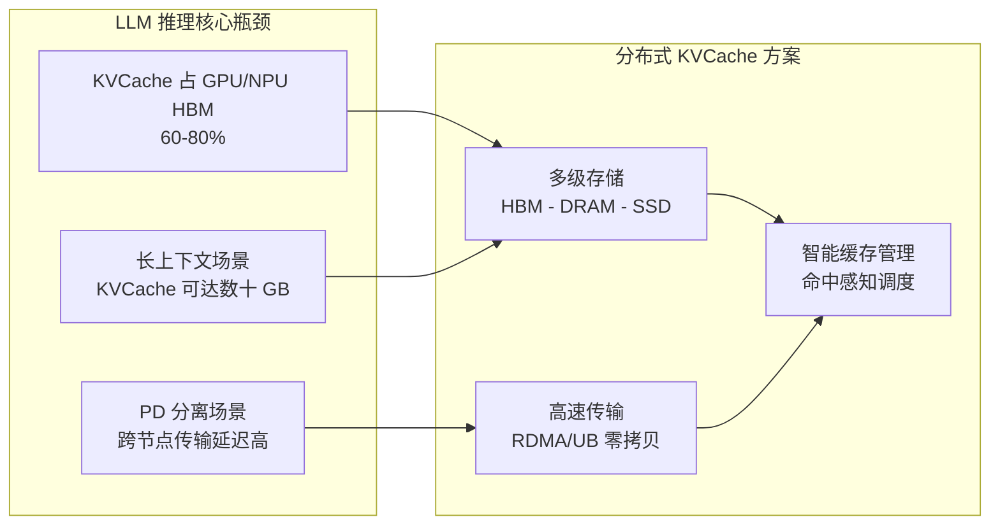

| 痛点 | 具体表现 | 分布式 KVCache 如何解决 |
|------|----------|------------------------|
| **内存瓶颈** | KVCache 占 HBM 60-80%，限制批处理大小和吞吐 | 多级存储卸载冷 KV 到 DRAM/SSD，释放 HBM |
| **长上下文** | 128K+ 上下文 KVCache 达数十 GB，单卡无法承载 | 分布式存储 + 跨节点传输，突破单卡容量限制 |
| **PD 分离传输** | 预填充节点到解码节点的 KVCache 传输成为延迟瓶颈 | RDMA/UB 零拷贝传输，跨节点延迟降至亚微秒级 |
| **重复计算** | 相同前缀重复计算 KVCache，浪费算力 | 缓存命中复用，避免重复计算 |

**量化收益（行业实测数据）**：

| 指标 | 无 KVCache | 有分布式 KVCache | 来源 |
|------|-----------|-----------------|------|
| 吞吐量 | 基线 | **3.8x 提升** | vLLM + Mooncake (2026.05) |
| TTFT（首 token 延迟） | 基线 | **降低 46x** | vLLM + Mooncake (2026.05) |
| RAG 场景 KVCache 命中率 | ~0% | **接近 100%** | LMCache CacheBlend (EuroSys 2025) |
| 长上下文吞吐量 | 基线 | **5x 提升** | HiSparse (SGLang 2026.04) |

### 1.2 主流组件全景图

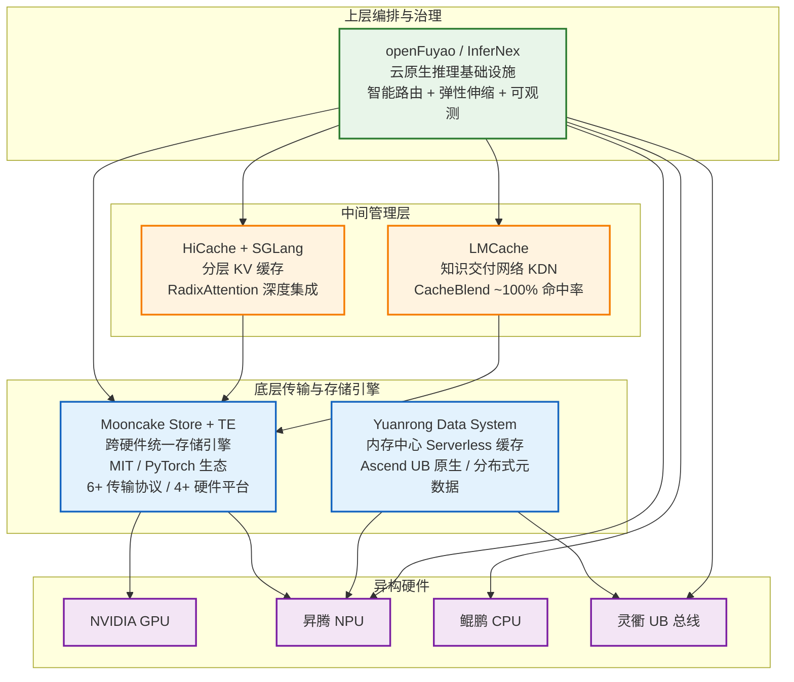

**六大系统定位一句话**：

| 系统 | 一句话定位 | 硬件覆盖 | 开源状态 |
|------|-----------|---------|---------|
| **Mooncake** | 跨硬件分布式 KVCache 存储引擎 + 传输引擎 | NVIDIA/AMD/Ascend/MT | MIT, PyTorch 生态 |
| **HiCache** | SGLang 内嵌的分层 KV 缓存（GPU 辅助 I/O 3x 加速） | NVIDIA 为主 | Apache 2.0 |
| **LMCache** | vLLM 与存储之间的知识交付网络（CacheBlend RAG ~100% 命中） | NVIDIA | Apache 2.0 |
| **Yuanrong** | 华为 openEuler 的 Serverless 分布式缓存（UB 总线原生） | 仅 Ascend | Apache 2.0 |
| **MemCache** | 华为 Ascend 专用分布式 KVCache 引擎 | 仅 Ascend | 华为内部 |
| **openFuyao** | 云原生 AI 推理基础设施（智能路由 + KVCache 编排） | x86/ARM/GPU/NPU | Apache 2.0 |

---

## 二、技术演进趋势

### 四大关键趋势总览

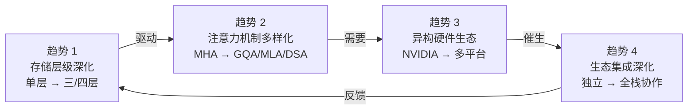

### 趋势 1：存储层级深化 — 从单层到三/四层

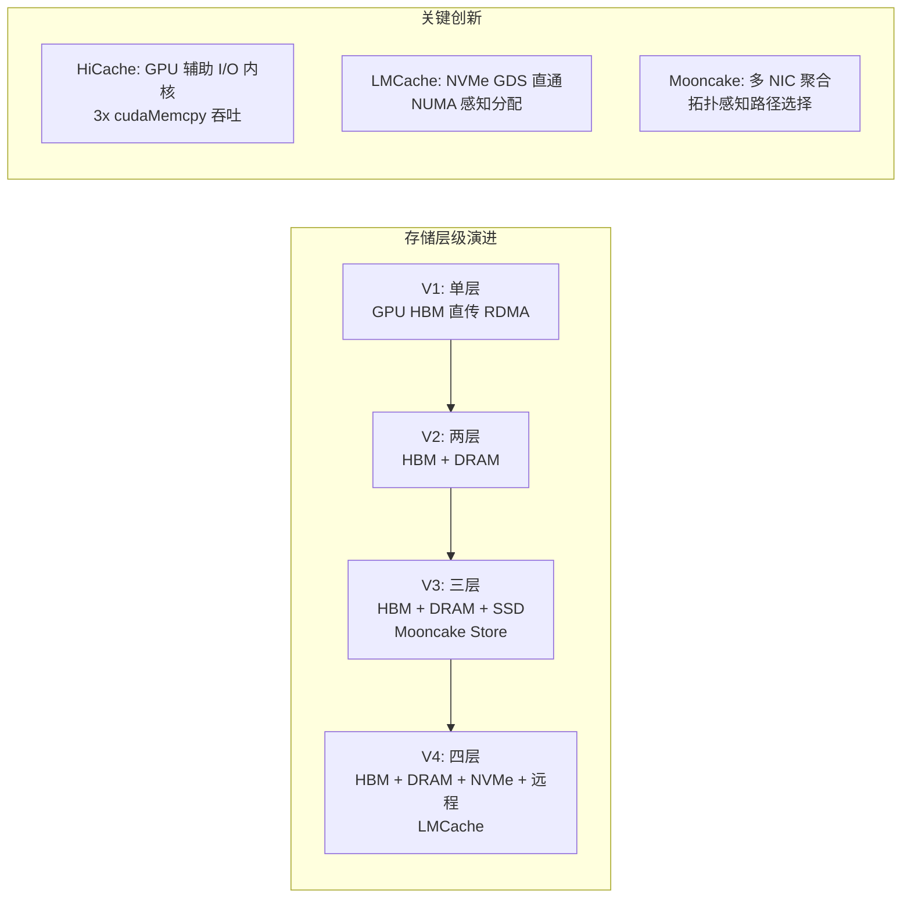

**趋势判断**：未来 CXL 内存、持久内存等新介质将加入层级体系。华为灵衢 UB 总线通过 GVA 统一编址，可将超节点内所有 NPU HBM 和 CPU DRAM 扁平化为单一地址空间，实现零拷贝跨层访问——这是 NVIDIA 生态无法复制的硬件级优势。

### 趋势 2：注意力机制多样化

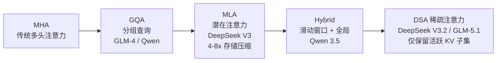

| 注意力机制 | 代表模型 | 对 KVCache 存储的影响 |
|-----------|---------|---------------------|
| MHA | 早期模型 | 每 head 独立 K/V，内存占用最大 |
| GQA | GLM-4, Qwen | KV 组共享，减少内存 |
| MLA | DeepSeek V3 | 压缩潜在向量，**存储缩减 4-8x** |
| Hybrid | Qwen 3.5 | 滑动窗口部分可淘汰，减少传输量 |
| DSA 稀疏 | DeepSeek V3.2 | 仅存储活跃 KV 子集，**5x 吞吐提升** |

**趋势判断**：注意力机制将持续多样化。Mooncake Store 已有 MHA/GQA/MLA/Hybrid 四种布局处理器——这是核心差异化优势。稀疏注意力适配是下一个竞争焦点。

### 趋势 3：异构硬件生态 — 尤其是中国市场

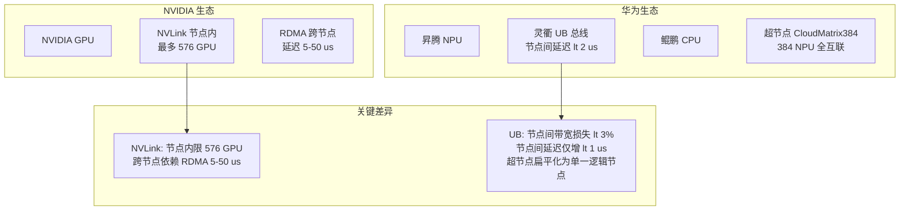

**实测数据（CloudMatrix384）**：

| 指标 | NVIDIA RDMA 跨节点 | 华为 UB 跨节点 | 优势 |
|------|-------------------|---------------|------|
| NPU-NPU 读取带宽 | ~50 GB/s | **164 GB/s** | 3.3x |
| NPU-NPU 读取延迟 | ~5-10 μs | **1.9 μs** | 3-5x |
| 节点内/间带宽比 | 显著下降 | **98%**（损失 <3%） | 数量级优势 |
| KVCache 90% 重用 TTFT | — | **降低 59%** | CloudMatrix 实测 |

### 趋势 4：生态集成深化

**从独立组件到全栈协作**：

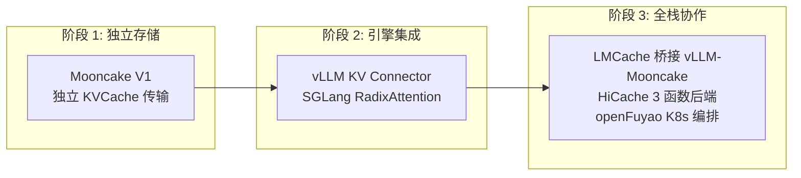

**趋势判断**：集成深度正从"put/get 接口"向"注意力感知决策"演进。HiCache 的 3 函数后端接口（get/exist/set）降低了集成门槛——Mooncake Store、DeepSeek 3FS、NVIDIA NIXL 等已作为后端接入。

---

## 三、生态格局与竞争合作关系

### 3.1 六大系统竞合关系图

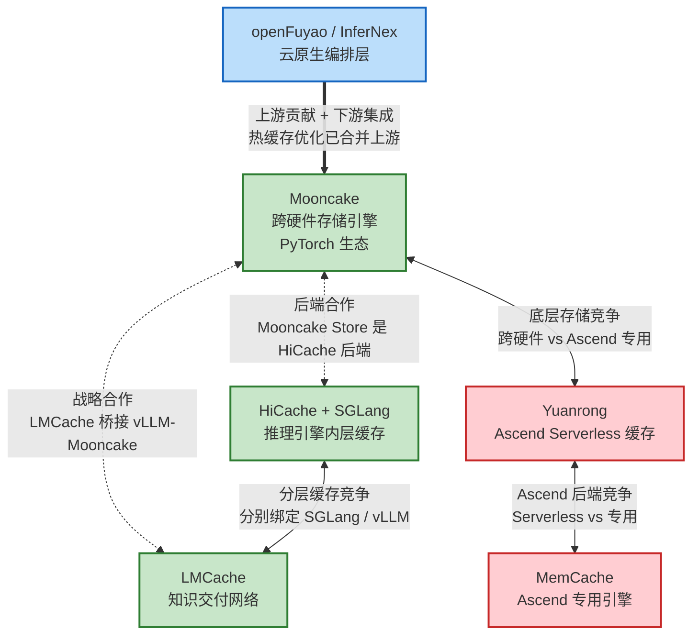

### 3.2 关键竞合判断

| 关系 | 性质 | 判断 |
|------|------|------|
| **Mooncake ↔ LMCache** | 战略合作 | LMCache 作为 vLLM-Mooncake 桥接层，2025.05 合作。实测 TTFT 降低 69.1% |
| **Mooncake ↔ HiCache** | 互补 | Mooncake Store 是 HiCache 远程后端。蚂蚁集团 TTFT 降低 84% |
| **HiCache ↔ LMCache** | 竞争 | 都做分层缓存，分别绑定 SGLang/vLLM。竞争格局跟随推理引擎市场份额 |
| **Mooncake ↔ Yuanrong** | **核心竞争** | 同类底层存储引擎，vLLM-Ascend KVPool 后端直接竞争 |
| **openFuyao → Mooncake** | 上下游 | 上游贡献（热缓存已合并）+ 下游集成（InferNex 使用 Mooncake Store） |

### 3.3 底层存储引擎趋于收敛

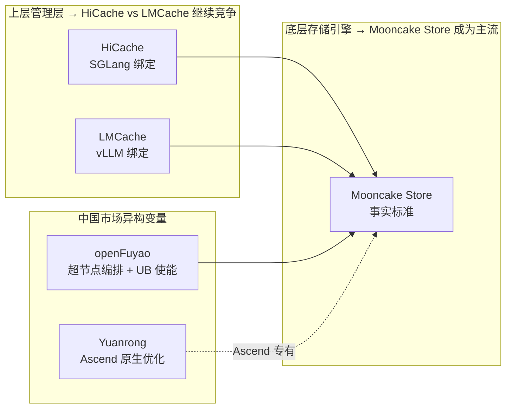

---

## 四、关键判断总结与 openFuyao 启示

### 判断 1：openFuyao 不应成为"另一个 Mooncake"

**论据**：

| 维度 | Mooncake | openFuyao 应该做 |
|------|----------|-----------------|
| 技术栈层级 | 底层存储引擎 | **上层编排 + 硬件使能** |
| 硬件策略 | 广度覆盖 4+ 平台 | **深度优化昇腾 + 灵衢 UB** |
| 核心能力 | 传输 + 存储 | **智能路由 + 弹性伸缩 + 可观测** |
| 竞争对手 | Yuanrong/MemCache | **无直接对手（新象限）** |

**定位公式**：

```
openFuyao/InferNex = 超节点硬件使能层 + 异构编排调度层 + 云原生治理层 + KVCache 存储优化贡献者
```

### 判断 2：超节点 + UB 总线是核心差异化底座

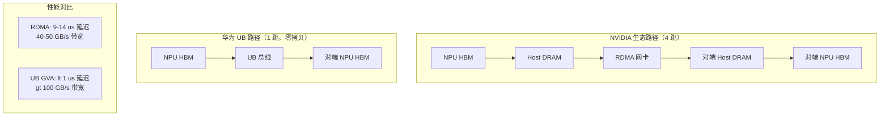

**两种超节点场景的 KVCache 发力空间**：

| 场景 | 硬件组合 | KVCache 发力点 | 关键指标 |
|------|---------|---------------|---------|
| **智算超节点** | Ascend 910C/950 + UB 全互联 | L0-L1 层 GVA 零拷贝直访 | 超节点内延迟 <1μs，带宽 >100 GB/s |
| **通算超节点** | Kunpeng 950 + Ascend NPU | CPU DRAM 冷存储 + NPU HBM 热缓存 | CPU-NPU 带宽 >100 GB/s，冷热切换 <2μs |

**实测验证（CloudMatrix384，来源：arXiv 论文）**：

- 节点间 NPU-NPU 读取带宽：164 GB/s（vs 节点内 167 GB/s，损失仅 2%）
- 节点间 NPU-NPU 读取延迟：1.9 μs（vs 节点内 1.2 μs，仅增 0.7 μs）
- KVCache 90% 重用率：预填充吞吐提升 2.28x，TTFT 降低 59%

### 判断 3：Yuanrong 竞争是双刃剑

| 维度 | 正面影响 | 风险因素 |
|------|---------|---------|
| Mooncake 贡献 | 竞争压力推动 Mooncake 重视 Ascend 生态 | Mooncake 可能降低 NPU 优先级 |
| 定位分工 | Yuanrong 做底层存储，openFuyao 做上层编排 | 需明确分工避免内部竞争 |
| 应对策略 | 支持多后端（Mooncake/Yuanrong/MemCache） | 避免绑定单一后端 |

### 判断 4：稀疏注意力是下一个竞争焦点

- Mooncake Store 已有 MHA/GQA/MLA/Hybrid 四种布局处理器——领先优势
- HiSparse 在稀疏注意力场景实现 **5x 吞吐提升**——但尚未集成到存储层
- **openFuyao 机会**：为 Mooncake Store 贡献 DSA 稀疏注意力布局处理器，填补社区空白

---

## 五、openFuyao KVCache 生态影响力构建路径

### 5.1 路径总览：通过 Mooncake 上游席位获取生态影响力

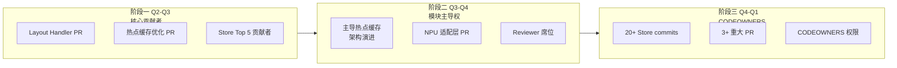

### 5.2 四个差异化技术切入点

| 优先级 | 切入点 | 对应趋势 | 已有基础 | 竞争优势 |
|--------|--------|---------|---------|---------|
| **P0** | **KVCache Layout Handler** | 趋势 2（注意力多样化） | GQA/MLA/Hybrid 代码已完成 | 仅 @ykwd 深度理解，缺乏第二专家 |
| **P0** | **Ascend NPU 适配层 + 灵衢直访** | 趋势 3（异构硬件） | 热缓存 PR 5+ 已提交，灵衢合作已建 | 灵衢联合验证场景独有 |
| **P1** | **热点缓存架构演进** | 趋势 1（存储层级） | 已有性能数据（TTFT ↓55-93%） | 可主导该方向架构讨论 |
| **P1** | **稀疏注意力布局处理器** | 趋势 2 | 设计完成 | **社区无人在此方向发力** |

### 5.3 关键里程碑与验收标准

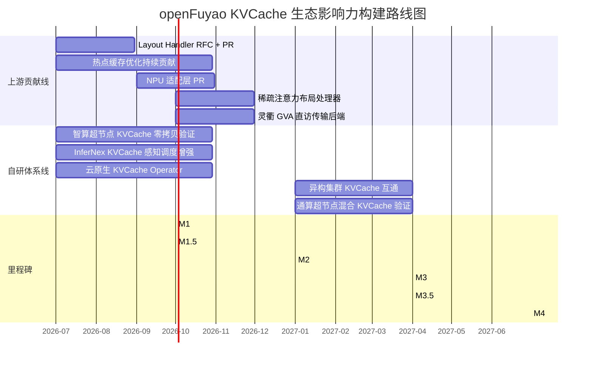

| 里程碑 | 时间 | 核心验收标准 | 对昇腾/鲲鹏/灵衢的结合 |
|--------|------|-------------|----------------------|
| **M1** | 2026 Q3 | Store Top 5 贡献者，Layout Handler PR 合并 | 昇腾 NPU 适配层作为贡献核心 |
| **M1.5** | 2026 Q3 | 灵衢 GVA 直访 KVCache PoC 验证 | **灵衢总线**零拷贝验证 |
| **M2** | 2026 Q4 | Store Reviewer 席位，InferNex 增强版发布 | 昇腾性能对标 GPU 版（差距 <10%） |
| **M2.5** | 2026 Q4 | 通算超节点 Kunpeng+NPU 混合验证 | **鲲鹏 950 + 昇腾** UB 分层验证 |
| **M3** | 2027 Q1 | 异构集群 Ascend↔NVIDIA 互通 PoC | 跨硬件 KVCache 格式转换 |
| **M3.5** | 2027 Q1 | 超节点 KVCache 能力验证 | **智算超节点** GVA + **通算超节点**混合 |
| **M4** | 2027 Q2 | 云原生 KVCache 治理平台发布 | 全栈昇腾/鲲鹏/灵衢集成 |

### 5.4 核心风险与缓解

| 风险 | 影响 | 缓解措施 |
|------|------|---------|
| Yuanrong 在 Ascend 性能大幅领先 | Mooncake 社区降低 NPU 优先级 | 持续高质量贡献保持影响力，推动 NPU 成为核心路线图 |
| Kunpeng 950 上市延迟（目标 Q4） | 通算超节点验证受阻 | 先用 Kunpeng 920 验证 UB 传输可行性 |
| MemCache 与 openFuyao 定位冲突 | 内部重复投入 | 明确分工：MemCache 做底层引擎，openFuyao 做上层编排 |
| vLLM-Ascend DSA 接口延迟 | 稀疏注意力验证受阻 | 联合对齐排期，同步准备算法侧验证 |

### 5.5 成功指标

| 指标 | 当前 | 2026 Q3 | 2026 Q4 | 2027 Q2 |
|------|------|---------|---------|---------|
| Store commits | ~10 | 20+ | 35+ | 50+ |
| Merged PRs | ~5 | 10+ | 18+ | 25+ |
| CODEOWNERS 状态 | 无 | 1 位认可 | **Reviewer 席位** | **CODEOWNERS** |
| 超节点 KVCache 延迟 | 未验证 | GVA PoC <1μs | — | 生产级验证 |
| InferNex E2EL 改善 | 22% | — | 30%+ | 40%+ |

---

> **数据来源**：详见完整版报告 `docs/superpowers/insights/2026-06-10-distributed-kvcache-technology-insight.md` 附录 B
