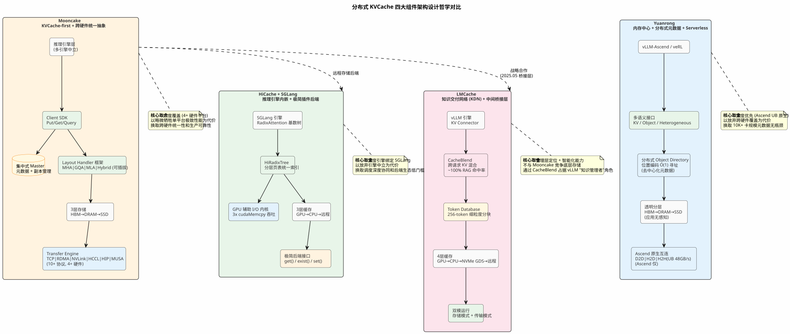

## 一、行业痛点洞察

### 核心瓶颈
KVCache 占用 GPU HBM 的 60-80%，长上下文场景单请求 KVCache 可达数十 GB。上下文窗口从 4K 扩展到 128K 甚至 1M tokens，重计算开销线性增长，严重制约推理吞吐和延迟。

### 范式跃迁
分布式 KVCache 正从"PD 分离的传输管道"演变为"多层级、多注意力机制、异构硬件的智能存储系统"：
1. 存储层级深化：GPU HBM → CPU DRAM → SSD → 远程存储
2. 注意力机制多样化：MHA → GQA → MLA → Hybrid → DSA
3. 异构硬件支持：NVIDIA → AMD → Ascend → Moore Threads
4. 生态集成深化：独立组件 → 推理引擎内嵌 → 注意力感知调度

### 六大生产场景痛点与数据

#### 场景 1：Coding Agent（代码智能体）
**痛点**：System prompt（10K+ tokens）+ 代码库上下文（50K+ tokens）在每次查询中被重复 prefill，KVCache 无法跨请求高效复用。Cursor、GitHub Copilot、Claude Code 等工具每次交互的 prefill 开销占总延迟 60-80%。
**数据**：
- Anthropic Prompt Caching：长提示场景降低 ~90% 成本、~85% 延迟（[Anthropic Blog, 2024-08](https://www.anthropic.com/news/prompt-caching)）
- Mooncake Store + vLLM：吞吐提升 3.8x，TTFT 降低 46x（[vLLM Blog, 2026-05-06](https://vllm.ai/blog/2026-05-06-mooncake-store)）
- Mooncake 热缓存优化：TTFT 降低 55-93%，跨节点延迟从 881ms 降至 287ms（v25.12，openFuyao 贡献）
**对应趋势**：→ 趋势 1（存储层级深化），共享前缀 KVCache 需分层存储和快速复用

#### 场景 2：多轮对话（Multi-turn Dialogue）
**痛点**：对话历史线性增长，KVCache 在 HBM 中累积，内存压力持续增大。百万级并发对话的 KVCache 总量可达 TB 级。Kimi、ChatGPT 等平台需管理海量并发对话的 KVCache 生命周期，传统"全量驻留 HBM"模式不可持续。
**数据**：
- Mooncake 支撑 Kimi K2 在 128xH200 上实现 224k/288k tokens/sec（prefill/decode）（[Mooncake GitHub](https://github.com/kvcache-ai/Mooncake/)）
- Mooncake 论文：KVCache 存储将 HBM 利用率从 20-40% 提升至 60-80%（[arXiv 2407.00079](https://arxiv.org/abs/2407.00079)，FAST 2025 Best Paper）
- openFuyao InferNex PD KVCache 感知路由：E2EL 改善 22.08%（[openFuyao v26.03 Release](https://www.openfuyao.cn/zh/blogs/blogsList/openFuyao-26-03-released/)）
**对应趋势**：→ 趋势 1 + 趋势 3，对话历史需分层存储 + 感知调度

#### 场景 3：RAG（检索增强生成）
**痛点**：文档前缀 KVCache 可跨查询复用，但传统方案每次查询重新计算。共享 system prompt + 检索文档的前缀 KVCache 计算量占总量的 70-90%。传统全量加载策略效率低下，需细粒度分块匹配。
**数据**：
- LMCache CacheBlend：RAG 场景接近 100% KVCache 命中率，获 EuroSys 2025 Best Paper（[CacheBlend 论文](https://dl.acm.org/doi/10.1145/3700250.3704832)）
- LMCache + Mooncake（8xH800 Qwen2.5-72B）：TTFT 降低 69.1%，吞吐提升 191%（[LMCache Blog](https://blog.lmcache.ai)）
- LMCache 256-token 细粒度分块：仅加载实际命中的 KV 块，相比全量 sequence 分块复用效率显著提升
**对应趋势**：→ 趋势 1 + 趋势 2，细粒度分块 + 跨请求智能混合

#### 场景 4：长上下文推理（128K-1M tokens）
**痛点**：KVCache 大小随上下文线性增长。70B 模型 128K 上下文的 KVCache 约 20-40GB，1M tokens 可达 80-300GB，远超单卡 HBM 容量（40-80GB）。TTFT 随上下文长度爆炸式增长，GPU HBM 成为硬瓶颈。
**数据**：
- HiCache：最高 6x 吞吐提升，80% TTFT 降低（[SGLang Blog, 2025-09-10](https://lmsys.org/blog/2025-09-10-sglang-hicache/)）
- HiCache GPU 辅助 I/O 内核：标准 cudaMemcpy 的 3x 吞吐，将 CPU DRAM 层从"低效中间缓存"转变为"高效扩展存储"
- CloudMatrix384 实测：KVCache 90% 重用率下 TTFT 降低 59%，预填充吞吐提升 2.28x（[arXiv CloudMatrix384 论文](https://arxiv.org/abs/2407.00079)）
**对应趋势**：→ 趋势 1 + 趋势 2，分层存储 + 稀疏注意力活跃子集驻留

#### 场景 5：Agent 工作流（多步推理）
**痛点**：Agent 每一步推理需维护完整上下文，KVCache 在多步调用间迁移。PD 分离场景下 Prefill 节点产生的 KVCache 需高效传输到 Decode 节点，跨节点传输延迟成为瓶颈。多步推理的累积上下文可达 100K+ tokens。
**数据**：
- 蚂蚁集团 DeepSeek-R1-671B + Mooncake Store 后端：TTFT 降低 84%（[SGLang HiCache Blog](https://lmsys.org/blog/2025-09-10-sglang-hicache/)）
- 华为 UB GVA 零拷贝传输：延迟 <1μs（vs 传统 RDMA 9-14μs），带宽 >100 GB/s（vs 40-50 GB/s）
- vLLM-Ascend PD 分离验证：Mooncake 后端跨节点 KVCache 传输可行（[vLLM-Ascend Docs](https://docs.vllm.ai/projects/ascend/en/v0.11.0/tutorials/multi_node_pd_disaggregation_mooncake.html)）
**对应趋势**：→ 趋势 3（异构硬件 + 生态集成深化），KVCache 跨节点迁移 + 感知调度

#### 场景 6：MoE 模型与新型注意力（DeepSeek V3 / GLM-5.1）
**痛点**：MLA 压缩 KVCache 到低维潜在向量，但需解压计算权衡。DSA 仅保留活跃 KV 子集，存储范式从"全量存储"变为"稀疏索引"。Hybrid 模型同一模型内部不同层使用不同注意力模式，KVCache 格式不统一。
**数据**：
- MLA（DeepSeek V2/V3）：4-8x 存储缩减，但传输时需权衡压缩格式 vs 解压计算（[DeepSeek-V2 Technical Report, arXiv 2405.04434](https://arxiv.org/abs/2405.04434)）
- HiSparse（GLM-5.1 DSA）：仅保留活跃 KV 子集，长上下文场景 5x 吞吐提升（[SGLang Blog, 2026-04-10](https://lmsys.org/blog/2026-04-10-sglang-hisparse/)）
- Mooncake Store 已实现 MHA/GQA/MLA/Hybrid 四种布局处理器（magic: MHAC/GACK/MLAC/HYBD），DSA 规划中
**对应趋势**：→ 趋势 2（注意力机制多样化与稀疏化），可插拔布局适配 + 稀疏索引

### 关键性能数据汇总

| 系统/特性 | 性能数据 | 来源 |
|-----------|---------|------|
| Mooncake Store + vLLM | 吞吐提升 3.8x，TTFT 降低 46x | [vLLM Blog 2026-05-06](https://vllm.ai/blog/2026-05-06-mooncake-store) |
| Mooncake / Kimi K2（128xH200） | 224k/288k tokens/sec（prefill/decode） | [Mooncake GitHub](https://github.com/kvcache-ai/Mooncake/) |
| HiCache | 最高 6x 吞吐提升，80% TTFT 降低 | [SGLang Blog 2025-09-10](https://lmsys.org/blog/2025-09-10-sglang-hicache/) |
| 蚂蚁集团（DeepSeek-R1-671B + Mooncake） | TTFT 降低 84% | [SGLang HiCache Blog](https://lmsys.org/blog/2025-09-10-sglang-hicache/) |
| HiSparse（GLM-5.1 长上下文 DSA） | 5x 吞吐提升 | [SGLang Blog 2026-04-10](https://lmsys.org/blog/2026-04-10-sglang-hisparse/) |
| LMCache CacheBlend（RAG 场景） | 接近 100% KVCache 命中率 | [EuroSys 2025 Best Paper](https://dl.acm.org/doi/10.1145/3700250.3704832) |
| LMCache + Mooncake（8xH800 Qwen2.5-72B） | TTFT 降低 69.1%，吞吐提升 191% | [LMCache Blog](https://blog.lmcache.ai) |
| Anthropic Prompt Caching | ~90% 成本降低，~85% 延迟降低 | [Anthropic Blog 2024-08](https://www.anthropic.com/news/prompt-caching) |
| openFuyao InferNex（PD KVCache 感知路由） | E2EL 改善 22.08% | [openFuyao v26.03 Release](https://www.openfuyao.cn/zh/blogs/blogsList/openFuyao-26-03-released/) |

## 二、主流组件全景对比

### 六大系统综合对比表

| 维度 | Mooncake | HiCache + SGLang | LMCache | MemCache | Yuanrong | openFuyao |
|------|----------|------------------|---------|----------|----------|-----------|
| **核心定位** | 分布式 KVCache 存储引擎 + 传输引擎 | 分层 KV 缓存（RadixAttention 深度集成） | KVCache 管理层（KDN 知识交付网络） | Ascend NPU 原生分布式 KVCache 引擎 | 内存中心近计算分布式异构多级缓存（Serverless 数据子系统） | 云原生 AI 推理基础设施（编排 + 调度 + 存储） |
| **技术栈层级** | 底层传输 + 存储 | 推理引擎内层 | 推理引擎与存储之间的管理层 | 底层传输 + 存储（Ascend 原生） | 底层传输 + 存储（Serverless 原生） | 上层编排 + 调度 + 存储 |
| **硬件生态** | NVIDIA/AMD/Ascend/Moore Threads | NVIDIA（主力） | NVIDIA | Ascend NPU | Ascend NPU（仅） | x86/ARM/GPU/NPU |
| **存储层级** | GPU→DRAM→SSD（RDMA） | GPU→CPU→远程存储 | GPU→CPU→本地 NVMe→远程 | 设备→主机→远程（Ascend RDMA） | HBM→DRAM→SSD（透明分层） | 分布式池化存储 |
| **注意力机制适配** | MHA/GQA/MLA/Hybrid（完整 Handler 框架） | MHA/GQA（支持有限） | MHA/GQA（支持有限） | 未知 | MHA（其他未知） | 支持多种（通过 Mooncake） |
| **引擎集成深度** | 引擎中立（vLLM/SGLang/TRT-LLM/LMDeploy） | 深度绑定 SGLang | 深度绑定 vLLM | vLLM-Ascend | vLLM-Ascend（KVPool 后端）、veRL | vLLM/vLLM-Ascend |
| **核心创新** | Transfer Engine 统一抽象、Layout Handler 框架 | GPU 辅助 I/O 内核（3x cudaMemcpy）、HiRadixTree 基数树 | CacheBlend 跨请求 KVCache 混合、256-token 细粒度分块 | Ascend 原生互连（device_rdma/sdma/host_urma） | 透明分层、UB 总线 48GB/s H2H、分布式元数据 | Hermes-router 智能路由、弹性扩展器、Eagle-eye 可观测性 |
| **开源状态** | MIT（加入 PyTorch 组织） | Apache 2.0 | Apache 2.0 | 华为内部（未开源） | Apache 2.0（openEuler 社区） | Apache 2.0 |

### 架构设计哲学对比

下图以四列并排方式呈现四大组件的架构层级与设计哲学差异，黄色注释框标注各系统的核心取舍：



**设计哲学一句话总结：**

| 系统 | 核心取舍 | 设计哲学 |
|------|---------|---------|
| **Mooncake** | 以略微牺牲单平台极致性能换取跨硬件统一性和生产可靠性 | KVCache-first + 跨硬件统一抽象（广度优先，4+ 硬件平台） |
| **HiCache + SGLang** | 以放弃引擎中立性换取调度深度协同和后端生态低门槛 | 推理引擎内嵌 + 极简插件后端（深度绑定 SGLang RadixAttention） |
| **LMCache** | 不与 Mooncake 竞争底层存储，通过 CacheBlend 占据 vLLM "知识管理者"角色 | 知识交付网络（KDN）+ 中间桥接层（256-token 细粒度分块 + CacheBlend 混合） |
| **Yuanrong** | 以放弃跨硬件覆盖换取 10K+ 卡规模元数据无瓶颈 | 深度优先（Ascend UB 原生互连，分布式 Object Directory O(1) 寻址） |

### 三大关键判断

1. **底层存储引擎趋于收敛，Mooncake Store 成为主流**
   - Mooncake Transfer Engine 覆盖 10+ 传输协议，硬件广度开源唯一
   - 2026 年 2 月加入 PyTorch 组织，FAST 2025 Best Paper 学术背书
   - LMCache 与 HiCache 均已将 Mooncake Store 作为远程存储后端
   - vLLM 官方 2026 年 5 月正式集成，标志主流推理引擎认可

2. **上层管理层继续竞争，本质是推理引擎生态竞争**
   - HiCache 深度绑定 SGLang RadixAttention，GPU 辅助 I/O 核心优化与 SGLang 内部耦合
   - LMCache 深度绑定 vLLM KV Connector 和 CacheBlend，同样与 vLLM 调度逻辑耦合
   - 两者差异化价值服务不同工作负载，无明显技术逻辑表明一方胜出
   - SGLang 与 vLLM 作为两大开源推理引擎，市场份额短期无根本性变化

3. **异构硬件是中国市场独特变量，NPU 生态需要独立但与 GPU 互通的方案**
   - 中国企业普遍面临 Ascend + NVIDIA 混合集群部署需求，此场景全球几乎不存在
   - MemCache 专注 Ascend 原生优化但未开源，且缺乏跨硬件互通能力
   - Mooncake 支持 Ascend 但主要通过 HCCL 封装层，尚未充分利用底层互连能力
   - 目前无任何开源系统在"Ascend 原生深度优化 + 跨硬件互通"两维度同时达到生产级水平——明确技术空白

## 三、核心技术演进 Top 3 趋势

### 趋势 1：存储层级深化（从 PD 分离到自适应分层缓存）

**一句话趋势判断**：从简单的 GPU-to-GPU RDMA 传输，演进为 GPU HBM/CPU DRAM/SSD/远程存储的多级缓存体系，自适应分层缓存将成为主流。

**主流组件应对演进举证**：
- Mooncake：V1（纯 PD 分离）→ V2（传输抽象）→ V3（多级存储引擎，2025.03）
- HiCache：标准化三层模型，GPU 辅助 I/O 内核实现 3x cudaMemcpy 吞吐
- LMCache：四层扩展（新增本地 NVMe GDS），256-token 细粒度分块

**洞察数据**：
- HiCache GPU 辅助 I/O 内核：标准 cudaMemcpy 的 3x 吞吐提升
- LMCache CacheBlend：RAG 场景接近 100% KVCache 命中率
- Mooncake + LMCache：8xH800 Qwen2.5-72B 上 TTFT 降低 69.1%、吞吐提升 191%

**openFuyao 机会点**：
- 超节点硬件使能：智算超节点 GVA 零拷贝直访（延迟 <1μs vs RDMA 9-14μs）
- 通算超节点 CPU-NPU 分层：UB 总线 110-151 GB/s 带宽（vs PCIe ~50 GB/s）

### 趋势 2：注意力机制多样化与稀疏化

**一句话趋势判断**：从统一的 MHA 格式，快速演进为 GQA、MLA、Hybrid、DSA 等多种注意力机制，可插拔布局适配层成为必备能力。

**主流组件应对演进举证**：
- Mooncake Store：建立完整 Handler 框架，已支持 MHA/GQA/MLA/Hybrid 四种布局处理器
- HiSparse：专注 DSA 稀疏注意力，仅保留活跃 KV 子集，GLM-5.1 长上下文实现 5x 吞吐提升
- HiCache/LMCache：仅支持 MHA/GQA，对 MLA/Hybrid 支持有限

**洞察数据**：
- MLA（DeepSeek V2/V3）：4-8x 存储缩减，但需要解压计算权衡
- DSA（DeepSeek V3.2/GLM-5.1）：仅保留活跃 KV 子集，5x 吞吐提升
- Hybrid（Qwen3.5+）：滑动窗口 + 全局注意力交替，同一模型内部 KVCache 格式不统一

**openFuyao 机会点**：
- 为 Mooncake Store 贡献新布局处理器（DSA、NPU 专用）
- 每种新 Handler 是可直接合并的独立 PR，低风险高价值

### 趋势 3：异构硬件 + 生态集成深化（合并原趋势 3+4）

**一句话趋势判断**：从 NVIDIA 单一平台向多元异构生态扩展，同时从独立组件向与推理引擎深度集成的注意力感知决策系统演进，两者深度交织。

**主流组件应对演进举证**：
- Mooncake TE：覆盖 TCP/RDMA/NVLink/CXL/NVMe-oF/HIP/HCCL/MUSA 等 10+ 传输协议
- vLLM KV Connector：开创推理引擎与 KVCache 存储深度集成先例
- HiCache 极简接口：仅需实现 get/exist/set 三个函数即可接入新后端
- LMCache KDN 定位：2025.05 与 Mooncake 建立战略合作

**洞察数据**：
- Mooncake TE 覆盖 10+ 传输协议，4+ 异构硬件平台
- CloudMatrix384 实测：KVCache 90% 重用率下 TTFT 降低 59%，预填充吞吐提升 2.28x

**openFuyao 机会点**：
- 异构集群跨厂商 KVCache 互通：Ascend↔NVIDIA 格式转换 + 异构路由
- 超节点拓扑感知调度：优先在超节点内匹配 KVCache 命中
- 云原生 KVCache Operator：K8s 原生方式管理 KVCache 生命周期

## 四、openFuyao KVCache 核心规划与目标

### 差异化定位公式

```
openFuyao / InferNex = 超节点硬件使能层 + 异构编排调度层 + 云原生治理层 + KVCache 存储优化贡献者
```

**四层含义**：
1. **超节点硬件使能层**：基于华为超节点架构，利用 UB 总线全互联、GVA 统一编址
2. **异构编排调度层**：在 Ascend NPU/NVIDIA GPU 等多元硬件之上提供统一推理调度
3. **云原生治理层**：将 KVCache 管理与 K8s 生态深度集成，通过 Operator 实现自动化治理
4. **KVCache 存储优化贡献者**：通过向 Mooncake 上游贡献 NPU 专用优化，参与底层技术演进但不重复建设

### 核心规划四大方向表

| 方向 | 定位 | 优先级 | 关键技术路径 | 预期成果 |
|------|------|--------|-------------|---------|
| **方向 1：NPU 原生 KVCache 优化** | 差异化护城河 | P0 | 场景 A：智算超节点 LingQuCacheTier、GVA 零拷贝直访；场景 B：通算超节点 CPU DRAM 冷存储 + NPU HBM 热缓存零拷贝分层；通用：Ascend 原生互连深度优化、贡献 NPU 专用布局处理器 | 超节点内延迟 <1μs、带宽 >100 GB/s；Kunpeng-NPU 传输 110-151 GB/s；NPU 整体性能达到 Mooncake GPU 版 80%+ |
| **方向 2：异构集群跨厂商 KVCache 互通** | 生态桥梁 | P0 | KVCache 格式分析与转换层设计、异构传输路径优化、异构路由策略扩展 | 异构集群 PD 分离性能损失 <10%；格式转换层可被 Mooncake TE 复用 |
| **方向 3：云原生 KVCache 治理** | 管理层突破 | P1 | K8s CRD + Operator 管理生命周期（预热/淘汰/迁移/压缩）、基于流量预测的主动缓存调度、深度可观测性扩展、超节点拓扑感知调度 | Operator 支持 3+ 种生命周期操作；缓存命中率提升 20%+；超节点内命中率 >80% |
| **方向 4：上游贡献战略** | 生态共建 | P1 | 核心贡献回流（NPU 布局处理器、异构格式转换）、新注意力机制 Handler 贡献、社区治理参与 | 年度贡献进入 Mooncake Top 5；2+ 高价值 PR 合并；获得 Reviewer/Maintainer 角色 |

## 五、能力构建技术规划

### 双线规划时间线表（Q3 2026 - Q2 2027）

| 阶段 | 上游贡献线 | 自研体系线 |
|------|-----------|-----------|
| **Q3 2026** | NPU 布局处理器贡献、热缓存优化增强 | InferNex KVCache 感知调度增强、云原生 KVCache Operator、智算超节点 KVCache 零拷贝验证 |
| **Q4 2026** | 异构传输测试与优化、稀疏注意力布局处理器、灵衢 GVA 直访传输后端 | InferNex KVCache 感知调度增强（续）、云原生 KVCache Operator（续）、智算超节点 KVCache 零拷贝验证（续） |
| **Q1 2027** | — | 异构集群 KVCache 互通、通算超节点混合 KVCache 验证、智能缓存调度 |
| **Q2 2027** | — | 智能缓存调度（续） |

### 五个里程碑表

| 里程碑 | 时间 | 验收标准 | 前置依赖 |
|--------|------|---------|---------|
| **M1：成为 Mooncake 社区活跃贡献者** | 2026 Q3 | 1. NPU 布局处理器 PR 合并；2. 热缓存优化 PR 合并；3. 贡献者排名进入 Top 10 | 无 |
| **M2：InferNex KVCache 增强版发布** | 2026 Q4 | 1. KVCache 感知调度上线，E2EL 改善达到 30%+；2. 性能对标 Mooncake Store GPU 版（差距 <10%）；3. K8s KVCache Operator beta 版发布 | M1 |
| **M3：异构集群互通 PoC 验证** | 2027 Q1 | 1. Ascend Prefill + NVIDIA Decode 端到端推理成功；2. KVCache 传输性能损失 <10%；3. 格式转换层通过安全审计 | M2 |
| **M3.5：超节点 KVCache 能力验证** | 2027 Q1 | 1. 智算超节点 GVA 零拷贝验证通过，延迟 <1μs、带宽 >100 GB/s；2. 通算超节点混合分层验证通过，CPU-NPU 传输 >100 GB/s；3. LingQuCacheTier 基本功能可用 | M2 |
| **M4：完整云原生 KVCache 治理平台发布** | 2027 Q2 | 1. 智能缓存调度上线，命中率提升 20%+；2. K8s Operator 正式版（GA），支持预热/淘汰/迁移/压缩四种策略；3. Eagle-eye 可观测性集成 RDMA/KVCache 指标 | M3 |

### 硬件差异化关键数据表

| 维度 | 传统 RDMA 路径 | UB GVA 零拷贝路径 | 性能提升 |
|------|--------------|-----------------|---------|
| **跳数** | 4 跳（HBM→Host→RDMA→Host→HBM） | 1 跳（HBM→UB→HBM） | — |
| **延迟** | 9-14 μs | <1 μs | 降低 90%+ |
| **带宽** | 40-50 GB/s | >100 GB/s | 提升 2-3x |
| **CloudMatrix384 实测** | — | KVCache 90% 重用率下 TTFT 降低 59%，预填充吞吐提升 2.28x | — |

| 通算超节点场景 | NVIDIA 生态 PCIe | 华为 UB 总线 | 性能提升 |
|--------------|-----------------|-------------|---------|
| CPU-NPU 带宽 | ~50 GB/s | 110-151 GB/s | 2-3x |

## 六、上游 Mooncake 席位获取规划

### 当前基础

- 5+ PR 已提交到 Mooncake 上游（热点缓存优化、NPU 适配层）
- Store 模块热点缓存优化实现 TTFT 降低 55-93%（v25.12）
- 跨节点延迟从 881ms 降至 287ms（67% 降低）
- 与灵衢团队建立联合验证合作

### Store 模块 CODEOWNERS 格局

| CODEOWNER | 归属组织 | 角色 |
|-----------|---------|------|
| @ykwd (Ke Yang) | Approaching AI | Store 主负责人 |
| @stmatengss (Teng Ma) | 阿里云 | LLM 生态合作 |
| @XucSh | Approaching AI | — |
| @YiXR | 阿里云 | — |

**高贡献竞争者**：JinYan Su (100 commits/6mo)、Feng Ren (94 commits/6mo)

**关键判断**：Store 模块已有 4 位 CODEOWNER，接纳新成员门槛相对较低。需通过差异化贡献（NPU 优化、布局处理器）而非正面竞争建立影响力。

### 四个技术切入点（优先级排序）

| 优先级 | 切入点 | 对应趋势 | 竞争分析 | 行动路径 |
|--------|--------|---------|---------|---------|
| **P0** | Layout Handler | 趋势 2（注意力机制多样化） | 目前仅 @ykwd 深度理解这块，缺乏第二位专家 | 发起 RFC → 提交 PR → 成为该方向社区专家 |
| **P0** | Ascend NPU Tiered-Cache 适配 | 趋势 3（异构硬件生态） | Mooncake Ascend 支持主要通过 HCCL 封装层，未充分利用底层互连 | 提交 NPU 适配层优化 PR → 提供灵衢联合性能基准 |
| **P1** | 热点缓存架构演进 | 趋势 1（存储层级深化） | 已有 5+ PR 基础，可主导演进讨论 | 提出下一版本性能目标并主导实现 |
| **P1** | 稀疏注意力布局处理器 | 趋势 2（注意力机制多样化） | 竞争空白，目前无其他贡献者在此方向发力 | 参考 HiSparse 设计，贡献 DSA 布局处理器原型 |

### 三阶段获取路径

| 阶段 | 时间 | 行动 | 验收标准 |
|------|------|------|---------|
| **阶段一：核心贡献者确立** | Q2-Q3 2026 | 发起 RFC: KVCache Layout Handler for Hybrid Attention；提交 Layout Handler PR；持续热点缓存贡献；主动 Review 他人 PR | RFC 获得 @ykwd/stmatengss 回复；GQA/MLA/Hybrid 三种处理器合并；累计 15+ Store commits；Review 5+ Store PR |
| **阶段二：模块主导权申请** | Q3-Q4 2026 | 主导热点缓存架构演进讨论；提交 NPU 适配层 PR；稀疏注意力布局处理器；联合灵衢提供性能基准 | RFC 获得社区采纳；PR 合并 + CI 通过；DSA 处理器 PR 提交；公开发布 NPU 性能数据 |
| **阶段三：CODEOWNERS 申请** | Q4 2026 - Q1 2027 | 触发条件：累计 20+ Store commits；获得 @ykwd 或 @stmatengss 公开认可；3+ 重大 PR 代表作；持续 review 10+ PR | 正式提交 CODEOWNERS 申请 |

### 成功指标表

| 指标 | 当前 | Q3 目标 | Q4 目标 |
|------|------|--------|--------|
| Store commits | ~10 | 20+ | 35+ |
| Merged PRs | ~5 | 10+ | 18+ |
| Reviewed PRs | 0 | 5+ | 10+ |
| RFC 参与 | 0 | 2+ | 4+ |
| CODEOWNERS 认可 | 无 | 1 位认可 | 正式申请 |
