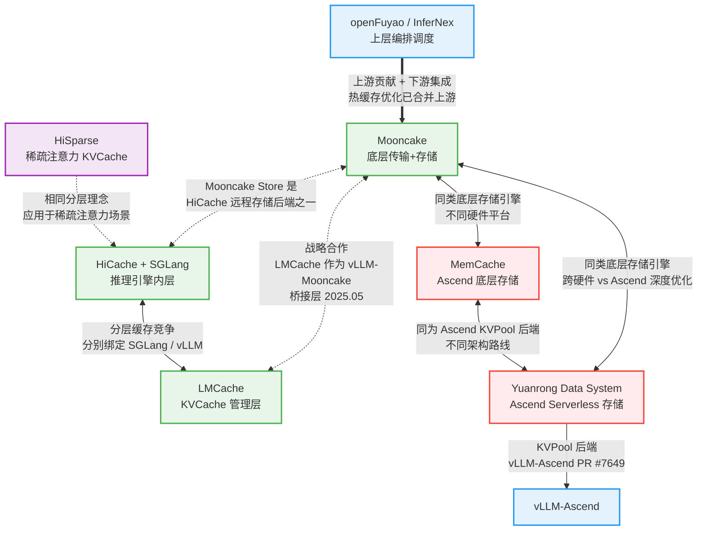
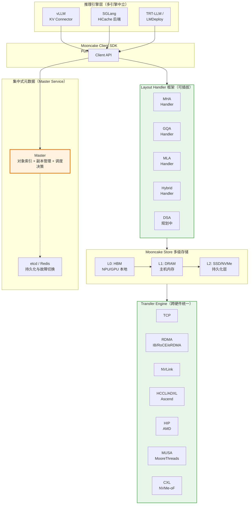
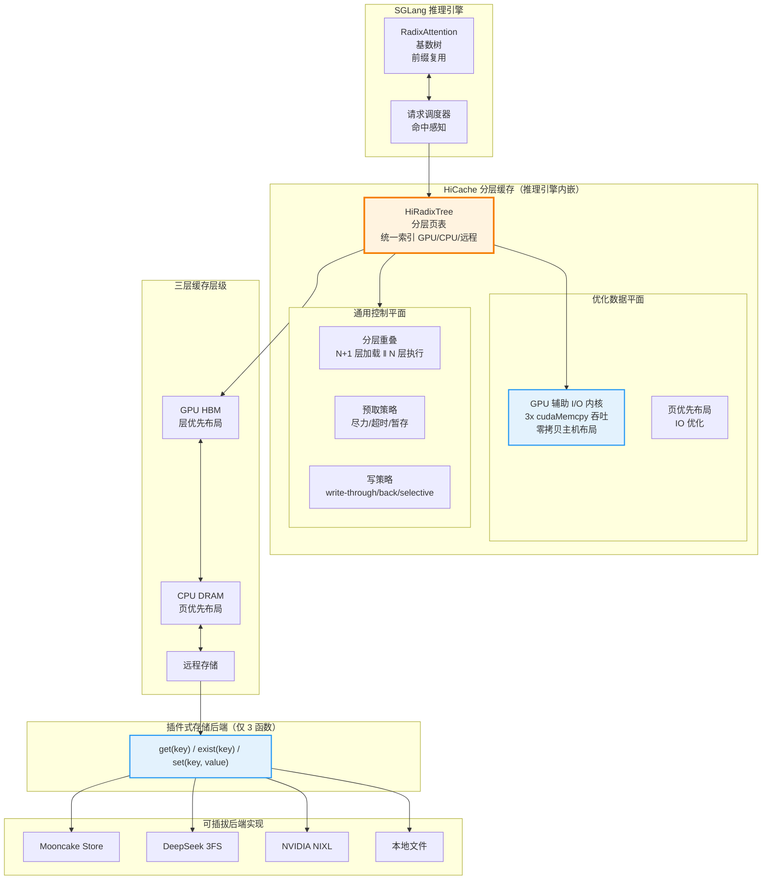
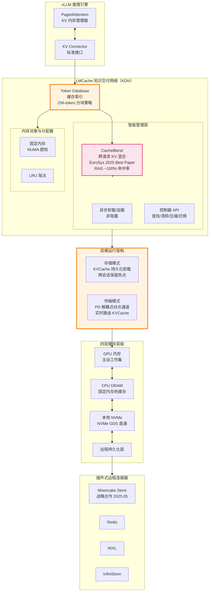
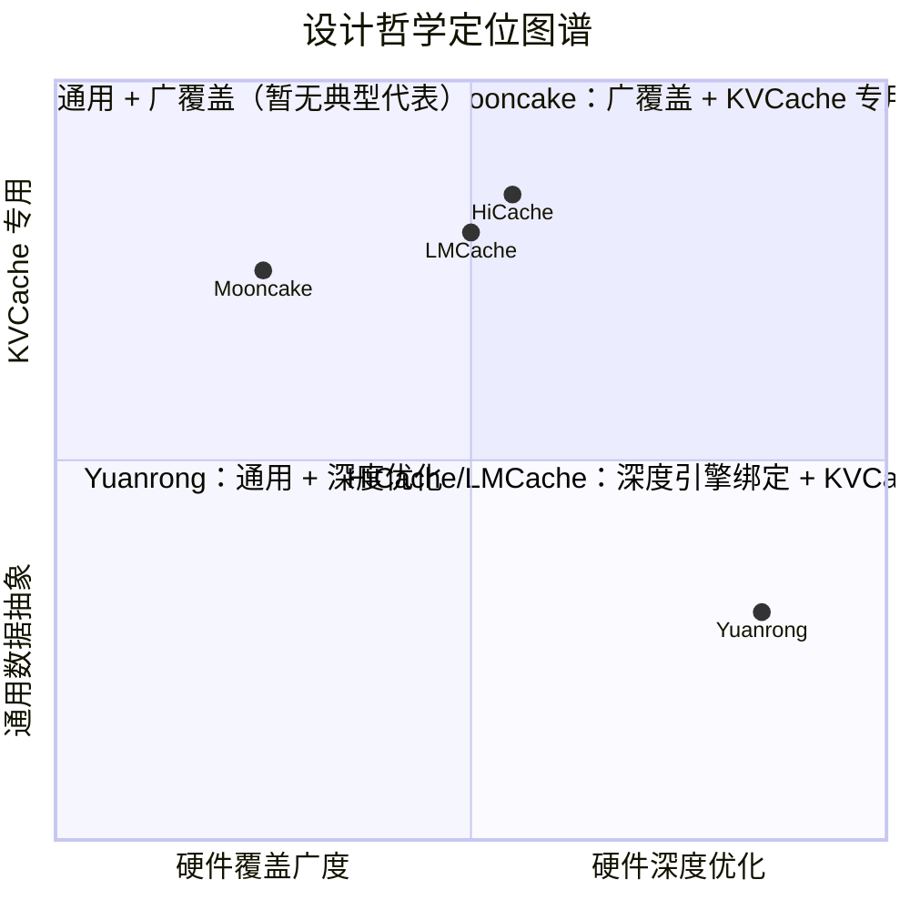
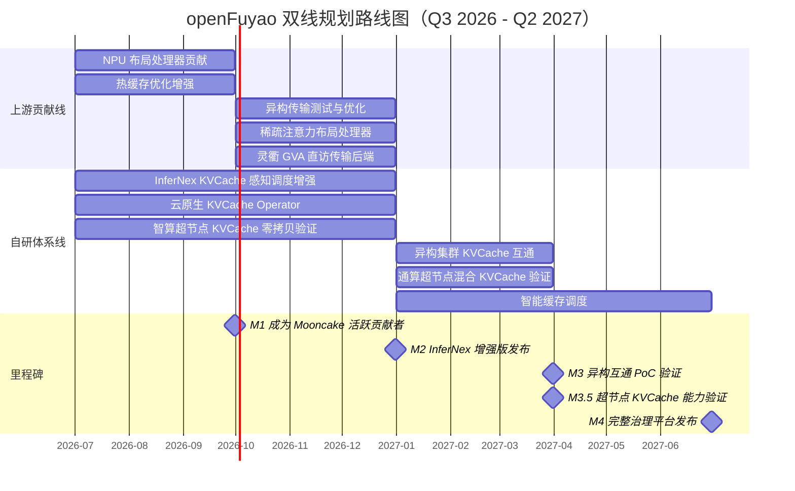

# 分布式 KVCache 技术趋势洞察与 openFuyao 规划

> **文档性质：** 技术趋势洞察报告
> **目标受众：** 技术团队、技术管理层
> **覆盖范围：** Mooncake V1/V2/V3、HiCache+SGLang、HiSparse、MemCache、LMCache、openFuyao/InferNex

---

## 目录

- [Section 1: 引言与核心洞察摘要](#section-1-引言与核心洞察摘要)
- [Section 2: 技术演进趋势](#section-2-技术演进趋势)
- [Section 3: 生态格局与竞合分析](#section-3-生态格局与竞合分析)
- [Section 4: 架构深度对比（含设计哲学架构图）](#section-4-架构深度对比)
- [Section 5: openFuyao 差异化定位与突破方向](#section-5-openfuyao-差异化定位与突破方向)
- [Section 6: 双线规划路线图](#section-6-双线规划路线图)
- [Section 7: 上游席位获取策略](#section-7-上游席位获取策略)

---

## Section 1: 引言与核心洞察摘要

### 背景

LLM 推理中 KVCache 管理已成为核心性能瓶颈——它占用 GPU HBM 的 60-80%，在长上下文场景下单次请求的 KVCache 可达数十 GB。随着上下文窗口从 4K 扩展到 128K 甚至 1M tokens，重计算 KVCache 的开销呈线性增长，严重影响推理吞吐和延迟。分布式 KVCache 通过将 KVCache 的存储和传输从 GPU 本地解耦，利用 CPU DRAM、SSD 和远程节点构建多级存储池，显著降低重计算开销和首 Token 延迟（TTFT）。

### 核心论点

**分布式 KVCache 正从"PD 分离的传输管道"演变为"多层级、多注意力机制、异构硬件的智能存储系统"。** 这一演进体现在四个关键维度：

1. **存储层级深化**——从单纯的 GPU-to-GPU RDMA 传输，发展为 GPU HBM / CPU DRAM / SSD / 远程存储的多级缓存体系（HiCache 三层模型、LMCache 四层扩展含 NVMe GDS）。
2. **注意力机制多样化**——从统一的 MHA 格式，扩展到 GQA（分组查询）、MLA（DeepSeek 压缩潜在向量）、Hybrid 混合注意力（Qwen3.5+）和稀疏注意力（DSA），迫使 KVCache 系统提供可插拔的布局适配层。
3. **异构硬件支持**——从 NVIDIA GPU 单一平台，扩展到 AMD GPU、华为 Ascend NPU、Moore Threads GPU 等多元硬件生态，传输引擎需要适配 HCCL、ROCm、MUSA 等多种互连协议。
4. **生态集成深化**——从独立的 put/get 存储接口，演进为与推理引擎深度集成的注意力感知决策系统（vLLM KV Connector、SGLang RadixAttention）。

### 关键数据点

以下数据点来自各系统的官方发布和学术文献，量化展示了分布式 KVCache 技术的实际收益：

| 数据点 | 来源 |
|--------|------|
| Mooncake Store + vLLM 实现 3.8x 吞吐提升、46x TTFT 降低 | [vLLM Blog, 2026-05-06](https://vllm.ai/blog/2026-05-06-mooncake-store) |
| Mooncake 为 Kimi K2 在 128xH200 上实现 224k/288k tokens/sec (prefill/decode) | [Mooncake GitHub README](https://github.com/kvcache-ai/Mooncake/) |
| HiCache 实现最高 6x 吞吐提升、80% TTFT 降低 | [SGLang Blog, 2025-09-10](https://lmsys.org/blog/2025-09-10-sglang-hicache/) |
| 蚂蚁集团使用 DeepSeek-R1-671B + Mooncake Store 后端 TTFT 降低 84% | [SGLang HiCache Blog](https://lmsys.org/blog/2025-09-10-sglang-hicache/) |
| HiSparse 在 GLM-5.1 长上下文场景实现 5x 吞吐提升 | [SGLang Blog, 2026-04-10](https://lmsys.org/blog/2026-04-10-sglang-hisparse/) |
| LMCache CacheBlend 在 RAG 场景接近 100% KVCache 命中率，获 EuroSys 2025 Best Paper | [EuroSys 2025 CacheBlend 论文](https://dl.acm.org/doi/10.1145/3700250.3704832), [LMCache GitHub](https://github.com/LMCache/LMCache) |
| LMCache + Mooncake 在 8xH800 Qwen2.5-72B 上 TTFT 降低 69.1%、吞吐提升 191% | [LMCache Blog](https://blog.lmcache.ai) |
| openFuyao InferNex PD KVCache 感知路由实现 22.08% E2EL 改善 | [openFuyao v26.03 Release](https://www.openfuyao.cn/zh/blogs/blogsList/openFuyao-26-03-released/) |

### 结论

KVCache 生态正从单一项目竞争走向分层协作——底层存储引擎趋于收敛（Mooncake Store 成为主流），上层管理层持续竞争（HiCache 绑定 SGLang、LMCache 绑定 vLLM），异构硬件是中国市场的独特变量。openFuyao 在异构 NPU 场景拥有独特定位，应聚焦**"异构推理的云原生编排层"**而非在底层存储引擎上重复造轮子，通过上游贡献建立技术影响力，通过自研编排层构建差异化护城河。

---

## Section 2: 技术演进趋势

分布式 KVCache 领域正在经历深刻的技术演进。我们识别出四个相互交织但又各具方向性的关键趋势，它们共同定义了未来 12-24 个月的技术竞争格局。理解这些趋势的来龙去脉，是制定 openFuyao 技术路线的基础。

---

### 趋势 1：从 PD 分离到 Tiered Cache（存储层级深化）

#### 演进脉络

KVCache 存储架构经历了一条清晰的从"传输"到"分层存储"的深化路径：

| 阶段 | 代表系统/版本 | 时间节点 | 核心特征 |
|------|-------------|---------|---------|
| V1 纯 PD 分离 | Mooncake V1 | 2024.06 | KVCache 通过 RDMA 直接传输，GPU-to-GPU 为主，无存储层级抽象 |
| V2 传输抽象 | Mooncake V2 | 2024.11 | Transfer Engine 统一抽象层，支持 TCP/RDMA/CXL/NVMe-oF 多种传输方式 |
| V3 多级存储 | Mooncake Store V3 | 2025.03 | 引入 GPU HBM -> CPU DRAM -> SSD 分层存储引擎，支持多副本和条带化 |
| 标准化三层 | HiCache | 2025.09 | 标准化三层模型（GPU HBM / CPU DRAM / 远程存储），GPU 辅助 I/O 内核 |
| 四层扩展 | LMCache | 2025+ | 新增本地 NVMe GDS 层，NUMA 感知分配，256 token 细粒度分块 |

**Mooncake 的基础性贡献**在于率先将 Prefill-Decode 分离架构工程化落地，并通过 Transfer Engine 将传输层从具体硬件中解耦。截至 2024 年 11 月的 V2 版本，Mooncake 的传输引擎已抽象出 TCP、RDMA（InfiniBand/RoCEv2/eRDMA）、CXL/共享内存、NVMe over Fabric 等多种传输方式，并通过拓扑感知的路径选择（topology-aware path selection）实现多 NIC 带宽聚合和 NUMA 亲和性优化。这一抽象层使得上层存储引擎无需关心底层传输细节，为后续的多级存储奠定了架构基础。

**HiCache 的关键创新**在于将存储层级标准化为三层模型，并引入了 GPU 辅助 I/O 内核（GPU-assisted I/O kernel）。传统方案中，KVCache 从 CPU DRAM 到 GPU HBM 的拷贝依赖标准 `cudaMemcpy`，这一过程受限于 PCIe 带宽且 CPU 成为瓶颈。HiCache 的 GPU 辅助内核将数据搬运逻辑卸载到 GPU 上执行，通过 GPU SM（Streaming Multiprocessor）直接发起内存拷贝操作，实测吞吐量达到标准 `cudaMemcpy` 的 3 倍。这一创新使得 CPU DRAM 层从"低效的中间缓存"转变为"高效的扩展存储"，显著提升了整个分层体系的性价比。

**LMCache 的差异化路线**则体现在更细粒度的控制和更多存储层级上。LMCache 引入了第四层——本地 NVMe（通过 GPUDirect Storage / GDS 支持），适合大规模持久化场景。同时，LMCache 采用 256 token 的细粒度分块策略（相比之下 Mooncake 和 HiCache 通常以完整 sequence 为单位），这使得 RAG 等场景下的 KVCache 复用更加高效——只有实际命中的 KV 块才会被加载。此外，LMCache 的 NUMA 感知分配确保了在多路 CPU 服务器上，KVCache 数据被分配在距离目标 GPU 最近的 NUMA 节点上。

#### 关键洞察

1. **存储层级正在从"3 层够用"走向"N 层可选"**：GPU HBM -> CPU DRAM -> 远程 DRAM -> 本地 SSD -> 远程 SSD -> CXL 内存，每一层都有不同的延迟-容量-成本权衡。未来的系统需要能根据工作负载自动选择最优层级。

2. **GPU 辅助 I/O 是高价值创新方向**：HiCache 的 3x cudaMemcpy 吞吐证明，打破 CPU-GPU 数据搬运瓶颈的关键不在于增加带宽，而在于改变搬运方式。这一思路可以延伸到更多场景（如 GPU 直接发起 RDMA、GPU 感知的预取策略）。

3. **分块粒度决定复用效率**：Mooncake 以 sequence 为单位适合 PD 分离场景；LMCache 的 256-token 块适合 RAG/共享前缀场景。未来的系统需要支持可配置的分块策略。

4. **新存储介质即将入局**：CXL 内存（CXL 3.0 Type 3 设备）提供跨节点共享的内存语义访问，延迟在亚微秒级；持久内存（Intel Optane 继任者、三星 Memory Semantic SSD）可能填补 DRAM 与 SSD 之间的延迟鸿沟。这些新介质的加入将进一步丰富层级体系。

#### 趋势判断

未来 12 个月内，**自适应分层缓存（Adaptive Tiered Cache）** 将成为主流——系统根据访问频率、延迟要求和硬件拓扑自动决定 KVCache 的放置层级。我们预计 Mooncake Store 将引入更细粒度的层级管理（当前以 segment 为基本单位），而 HiCache 和 LMCache 将在各自的推理引擎生态中深化层级优化。对于 openFuyao 而言，新介质（CXL、持久内存）的适配将是异构推理场景下的差异化机会。

#### 参考来源

- Mooncake 论文：[arXiv 2407.00079](https://arxiv.org/abs/2407.00079)，FAST 2025 Best Paper
- HiCache 博客：[https://lmsys.org/blog/2025-09-10-sglang-hicache/](https://lmsys.org/blog/2025-09-10-sglang-hicache/)
- HiCache 设计文档：[https://docs.sglang.ai/advanced_features/hicache_design.html](https://docs.sglang.ai/advanced_features/hicache_design.html)
- LMCache 架构文档：[https://docs.lmcache.ai/developer_guide/architecture.html](https://docs.lmcache.ai/developer_guide/architecture.html)

---

### 趋势 2：从全量注意力到稀疏/混合注意力适配

#### 演进脉络

大语言模型的注意力机制正在快速多样化，KVCache 的存储格式也随之分化：

| 注意力类型 | 代表模型 | KVCache 特征 | 存储影响 |
|-----------|---------|-------------|---------|
| MHA（Multi-Head Attention） | 早期 LLM | 每 head 独立 K/V，格式统一 | 存储量最大，布局最简单 |
| GQA（Grouped-Query Attention） | GLM-4、Qwen 系列 | KV 组内共享，减少 head 数 | 内存占用减少，需组对齐处理 |
| MLA（Multi-head Latent Attention） | DeepSeek V3 | 压缩到低维潜在向量 | 4-8x 存储缩减，但需解压 |
| Hybrid（混合注意力） | Qwen3.5+ | 滑动窗口 + 全局注意力交替 | 不同层有不同 KV 格式，需变长存储 |
| DSA（稀疏注意力） | DeepSeek V3.2、GLM-5.1 | 仅保留活跃 KV 子集 | KV 子集高度动态，需稀疏索引 |

**这一演进对 KVCache 系统提出了根本性挑战**：不同注意力机制产生的 KVCache 在数据布局、维度、对齐方式上完全不同。例如，MHA 的每层 KV 形状是 `[num_heads, head_dim, seq_len]`；GQA 则是 `[num_kv_heads, head_dim, seq_len]`（其中 `num_kv_heads < num_heads`）；MLA 存储的不是完整 KV，而是压缩后的潜在向量 `[latent_dim, seq_len]`（`latent_dim` 远小于 `num_heads * head_dim`）；Hybrid 模型更复杂——不同层使用不同的注意力模式，有的层只保留最近 N 个 token 的 KV（滑动窗口），有的层保留全部 KV（全局注意力），导致同一模型内部 KVCache 格式不统一。

**Mooncake Store 的工程实践**已经建立了可插拔的布局适配层。从代码分析来看，Mooncake Store 实现了一个抽象基类 `KVCacheLayoutHandler`（定义于 `mooncake-store/include/kvcache_layout_handler.h`），提供统一的 `serialize` / `deserialize` / `calculateSerializedSize` / `validate` 接口，并提供了四种具体实现：

- `MHALayoutHandler` — 传统多头注意力布局
- `GQALayoutHandler` — 分组查询注意力布局（GLM-4、Qwen）
- `MLALayoutHandler` — 压缩潜在向量布局（DeepSeek V3）
- `HybridLayoutHandler` — 混合/滑动窗口布局（Qwen3.5+），支持 `[header][metadata_json][windowed_kv_data]` 存储格式

这种设计模式确保了新注意力机制可以通过新增 Handler 来支持，而无需修改存储引擎核心逻辑——这是生产系统应对快速变化的模型架构的正确工程实践。

**HiSparse 的突破**在于将稀疏注意力与 KVCache 管理深度融合。在 GLM-5.1 等使用 DSA（Dynamic Sparse Attention）的模型中，并非所有 KV 都参与计算，只有被注意力模式选中的"活跃" KV 子集才是必要的。HiSparse 精准地只将这些活跃 KV 子集保留在 GPU 上，丢弃或降级非活跃 KV，在长上下文场景实现了 5x 吞吐提升。这意味着 KVCache 系统不仅需要知道"存储什么格式的 KV"，还需要理解"哪些 KV 是活跃的"——这是从格式适配到语义理解的跃迁。

#### 关键洞察

1. **可插拔布局适配层是必备能力**：随着新模型架构的快速迭代（平均每 3-6 个月出现一种新的注意力变体），KVCache 系统必须能在不修改核心代码的前提下支持新布局。Mooncake Store 的 Handler 模式树立了工程标杆。

2. **稀疏注意力改变 KVCache 存储范式**：传统存储假设"所有 KV 都同等重要"，但稀疏注意力打破了这一假设。未来的 KVCache 系统需要维护稀疏索引（哪些 token 的 KV 是活跃的），并在跨节点传输时只传输活跃子集——这直接影响传输引擎的设计。

3. **Hybrid 模型带来工程复杂度**：同一模型内部不同层使用不同注意力模式，意味着一次推理请求的 KVCache 包含多种格式。存储引擎需要以"层"为粒度管理格式差异，而非以"模型"为粒度。

4. **MLA 的压缩-解压权衡**：MLA 在存储端大幅节省空间（4-8x），但在传输和加载时需要考虑是否传输压缩格式（节省带宽但增加 GPU 解压计算）还是传输解压后格式（增加带宽但减少 GPU 计算）。这一权衡目前尚无定论。

#### 趋势判断

未来 12-18 个月，**注意力机制多样化将加速**——随着 DeepSeek、Qwen、GLM 等模型团队的持续创新，新的注意力变体将不断涌现。KVCache 系统的竞争力将越来越取决于"新注意力机制的支持速度"。Mooncake Store 的 Handler 模式已经建立了正确的架构基线。对于 openFuyao，布局适配层的扩展性将是上游贡献的高价值切入点——每种新注意力机制的 Handler 实现都是可直接合并的独立 PR。

#### 参考来源

- HiSparse 博客：[https://lmsys.org/blog/2026-04-10-sglang-hisparse/](https://lmsys.org/blog/2026-04-10-sglang-hisparse/)
- Mooncake Store 布局处理器代码：`mooncake-store/include/kvcache_layout_handler.h`、`gqa_layout_handler.h`、`mla_layout_handler.h`、`hybrid_layout_handler.h`、`mha_layout_handler.h`
- DeepSeek MLA 论文：[DeepSeek-V2 Technical Report, arXiv 2405.04434](https://arxiv.org/abs/2405.04434)

---

### 趋势 3：从同构 GPU 到异构硬件生态

#### 演进脉络

KVCache 传输和存储的硬件基础正在从 NVIDIA GPU 单一平台向多元异构生态扩展：

| 硬件平台 | 互连技术 | Mooncake TE 支持 | 代表场景 |
|---------|---------|-----------------|---------|
| NVIDIA GPU | InfiniBand / RoCEv2 / GPUDirect | 原生支持（主力） | 主流大规模推理 |
| AMD GPU | ROCm / HIP | HIP Transport | 替代 GPU 方案 |
| 华为 Ascend NPU | HCCL / ADXL / device_rdma / sdma / host_urma | HCCL Transport + ADXL Direct Transport | 国产化推理（中国市场刚需） |
| Moore Threads GPU | MUSA | MUSA Transport | 国产 GPU 替代 |
| 异构集群 | 混合互连 | TCP 兜底 + 协议适配 | Ascend Prefill + NVIDIA Decode |

**Mooncake Transfer Engine 的架构优势**在于将传输层完全抽象化。从源码分析来看，Mooncake TE 的传输实现分布在 `mooncake-transfer-engine/src/transport/` 目录下，已覆盖以下传输协议：

- `tcp_transport/` — TCP 传输（兜底方案，通用性好）
- `rdma_transport/` — RDMA 传输（InfiniBand/RoCEv2/eRDMA，高性能场景）
- `nvlink_transport/` 和 `intranode_nvlink_transport/` — NVLink 传输（GPU 间高速互联）
- `cxl_transport/` — CXL 传输（共享内存语义）
- `nvmeof_transport/` — NVMe over Fabric 传输（远程存储访问）
- `hip_transport/` — AMD ROCm/HIP 传输
- `hccl_transport/` — 华为 Ascend HCCL 传输
- `ascend_direct_transport/` — 华为 Ascend 直连传输（device_rdma/sdma）
- `heterogeneous_rdma_transport/` — 异构 RDMA 传输
- `barex_transport/` — BaREx 传输

**这一覆盖广度在开源 KVCache 项目中独一无二**，是 Mooncake 能成为中国市场主流选择的核心原因之一。

**异构推理的实际需求**在中国市场尤为迫切。受限于芯片供应，中国企业普遍面临"Ascend Prefill + NVIDIA Decode"或"多品牌 GPU 混部"的场景。在这种场景下，Prefill 节点产生的 KVCache 需要跨硬件平台传输到 Decode 节点——这不仅要求传输层能同时操作两种硬件，还要求 KVCache 的数据格式在不同硬件间保持一致（或定义标准转换协议）。

**MemCache 的 Ascend 原生优化**代表了国产硬件深度适配的前沿探索。MemCache（vLLM-Ascend 社区项目）针对 Ascend NPU 的原生互连技术（`device_rdma`、`sdma`、`host_urma`）进行了专门的 KVCache 传输优化，绕过通用传输抽象层，直接利用 Ascend 硬件特性。这种"原生优先"的优化思路与 Mooncake TE 的"抽象优先"思路形成互补——前者追求单硬件极致性能，后者追求跨硬件统一接口。

#### 关键洞察

1. **异构推理在中国市场是刚需而非可选项**：受地缘政治影响，中国企业必须在 Ascend + NVIDIA 混合集群上运行推理服务。支持异构 KVCache 传输不是技术加分项，而是市场准入条件。

2. **传输协议数量不等于传输效率**：Mooncake TE 覆盖了 6+ 传输协议，但不同协议的性能差异巨大（RDMA 比 TCP 快 10x+）。关键不是"支持多少种"，而是"每种都优化到位"。

3. **国产硬件的原生互连尚未被充分挖掘**：Ascend 的 `device_rdma` / `sdma` / `host_urma` 提供了不同层次的传输能力，但当前 Mooncake TE 对 Ascend 的支持主要通过 HCCL 封装，尚未完全利用底层硬件直连能力。MemCache RFC 中提出的原生互连优化方向值得关注。

4. **异构集群的 KVCache 格式标准化是未解难题**：Ascend GPU 和 NVIDIA GPU 的内存布局可能不同（对齐方式、bank conflict 规避策略），KVCache 在跨硬件传输时可能需要格式转换。目前业界尚无统一的"KVCache 传输格式标准"。

#### 趋势判断

未来 12-24 个月，**异构硬件支持将从"能传输"升级为"能优化"**。当前多数系统的异构支持停留在 TCP 兜底或 HCCL/ROCm 适配层面；下一阶段的竞争焦点将是：针对每种硬件特性的深度优化（如 Ascend ADXL 的批量传输、AMD Infinity Fabric 的低延迟通信）、异构集群中的智能路由（根据源-目标硬件类型自动选择最优传输路径）、以及 KVCache 跨硬件格式标准化。对于 openFuyao，基于 Ascend 原生互连的 KVCache 传输优化是核心差异化方向。

#### 参考来源

- MemCache RFC：[https://github.com/vllm-project/vllm-ascend/issues/6410](https://github.com/vllm-project/vllm-ascend/issues/6410)
- Mooncake TE 传输引擎源码：`mooncake-transfer-engine/src/transport/`
- vLLM-Ascend PD 分离验证：[https://docs.vllm.ai/projects/ascend/en/v0.11.0/tutorials/multi_node_pd_disaggregation_mooncake.html](https://docs.vllm.ai/projects/ascend/en/v0.11.0/tutorials/multi_node_pd_disaggregation_mooncake.html)

---

### 趋势 4：从独立组件到生态集成

#### 演进脉络

KVCache 系统与推理引擎的关系正在从松耦合的独立组件走向深度集成的协作伙伴：

| 阶段 | 代表方案 | 集成深度 | 特征 |
|------|---------|---------|------|
| 独立存储 | Mooncake V1（2024.06） | 接口层集成 | 独立的 put/get 存储服务，推理引擎通过简单 API 访问 |
| 引擎集成 | vLLM KV Connector / SGLang HiRadixTree | 框架层集成 | KVCache 管理嵌入推理引擎调度逻辑 |
| 全栈协作 | LMCache 作为 vLLM-Mooncake 桥接（2025.05） | 语义层集成 | 跨系统 KVCache 生命周期管理 |
| 插件式后端 | HiCache 后端接口 | 极简集成 | 仅需实现 `get` / `exist` / `set` 三个函数即可接入新后端 |

**集成深度的演进方向**是从"数据搬运"走向"决策参与"。在早期阶段，KVCache 系统只是一个被动的存储服务——推理引擎告诉它"存这个"或"取那个"，它不参与任何调度决策。但随着 PD 分离、共享前缀、RAG 等场景的复杂化，KVCache 系统越来越多地参与到推理调度的决策过程中。

**vLLM KV Connector** 开创了推理引擎与 KVCache 存储深度集成的先例。KV Connector 不是一个独立服务，而是 vLLM 推理引擎内部的一个组件，它在 vLLM 的调度器（scheduler）做出批次决策之前，就可以查询远程 KVCache 的可用性，并根据 KVCache 命中情况调整调度策略。例如，如果某个请求的 KVCache 已经在远程节点上存在，调度器可以优先调度该请求并跳过 prefill 阶段。这种"注意力感知调度"（attention-aware scheduling）使得 KVCache 命中率从被动统计变为主动优化。

**HiCache 的极简集成设计**降低了生态参与的门槛。HiCache 定义了仅包含三个函数的后端接口：`get(keys)` 获取 KVCache、`exist(keys)` 检查是否存在、`set(keys, values)` 写入 KVCache。任何存储系统只需实现这三个函数即可成为 HiCache 后端——Mooncake Store、LMCache、本地内存、甚至是 Redis 都可以无缝接入。这种极简接口设计促进了生态繁荣，但也限制了深度优化的空间（后端无法感知推理引擎的调度意图）。

**LMCache 的"知识交付网络"定位**代表了最深层级的集成愿景。LMCache 将自己定位为"KDN（Knowledge Delivery Network）"——类比 CDN（内容分发网络），但分发的是"知识"（以 KVCache 形式编码的模型推理结果）。LMCache 的 CacheBlend 技术不仅能缓存和复用 KVCache，还能在不同请求之间智能混合部分 KVCache（例如，共享 system prompt 的 KVCache + 请求特定的 KVCache），在 RAG 场景中接近 100% 的 KVCache 命中率。2025 年 5 月，LMCache 与 Mooncake 正式建立战略合作，LMCache 作为 vLLM 和 Mooncake 之间的桥接层，使得 vLLM 用户可以透明地使用 Mooncake Store 作为分布式 KVCache 后端。

**SGLang 的 RadixAttention 与 HiCache 绑定**则展示了另一种深度集成路径。SGLang 的核心创新 RadixAttention 使用基数树（Radix Tree）管理 KVCache 的共享前缀，使得多个请求可以高效共享公共前缀的 KVCache。HiCache 与 RadixAttention 深度绑定，缓存粒度精确对齐到 Radix Tree 的叶子节点，实现了与推理引擎内部数据结构的无缝衔接。

#### 关键洞察

1. **集成深度正从"put/get 接口"向"注意力感知决策"演进**：下一代 KVCache 系统不仅存储和传输数据，还参与推理调度的决策——何时预取、何时驱逐、如何路由。这要求 KVCache 系统理解推理引擎的工作负载特征。

2. **极简接口促进生态，深度集成创造价值**：HiCache 的三函数接口让新后端接入变得容易，但深度优化（如 LMCache 的 CacheBlend、SGLang 的 RadixAttention 对齐）才能带来数量级的性能提升。两种策略各有所长，适合不同定位的系统。

3. **"桥接层"角色具有战略价值**：LMCache 作为 vLLM-Mooncake 桥接层的定位，使其在两个重要项目之间建立了不可替代的连接。这种"生态粘合剂"角色虽然技术门槛不如底层存储引擎高，但战略影响力巨大。

4. **标准化与碎片化的张力**：KVCache 存储接口趋向标准化（HiCache 的三函数模型），但各系统的深度集成能力（RadixAttention、CacheBlend）形成了差异化壁垒。未来可能形成"底层存储标准 + 上层管理层竞争"的格局。

#### 趋势判断

未来 12 个月，**KVCache 系统的竞争力将越来越取决于与推理引擎的集成深度而非存储效率本身**。存储效率（压缩比、吞吐量）的差异将逐渐缩小，但集成深度（能否参与调度决策、能否感知注意力模式）的差距将持续扩大。对于 openFuyao，在异构 NPU 场景下与推理引擎（vLLM-Ascend、MindIE）的深度集成是构建护城河的关键——单纯提供存储服务容易被替代，但深度参与调度决策的系统迁移成本极高。

#### 参考来源

- HiCache 博客：[https://lmsys.org/blog/2025-09-10-sglang-hicache/](https://lmsys.org/blog/2025-09-10-sglang-hicache/)
- LMCache 博客：[https://blog.lmcache.ai](https://blog.lmcache.ai)
- LMCache EuroSys 2025 论文（CacheBlend）：[https://dl.acm.org/doi/10.1145/3700250.3704832](https://dl.acm.org/doi/10.1145/3700250.3704832)
- vLLM PD 解耦验证：[https://docs.vllm.ai/projects/ascend/en/v0.11.0/tutorials/multi_node_pd_disaggregation_mooncake.html](https://docs.vllm.ai/projects/ascend/en/v0.11.0/tutorials/multi_node_pd_disaggregation_mooncake.html)
- vLLM Mooncake Store 集成博客：[https://vllm.ai/blog/2026-05-06-mooncake-store](https://vllm.ai/blog/2026-05-06-mooncake-store)

---

### 趋势交汇点：四大趋势的协同效应

以上四个趋势并非孤立演进，它们在多个维度产生交汇和协同：

1. **趋势 1 x 趋势 2（分层存储 x 注意力多样化）**：不同注意力机制的 KVCache 适合不同的存储层级。例如，MLA 的压缩潜在向量体积小、适合常驻 GPU HBM；MHA 的全量 KV 体积大、适合降级到 CPU DRAM 或 SSD。未来的分层缓存策略需要是"注意力感知"的。

2. **趋势 1 x 趋势 3（分层存储 x 异构硬件）**：不同硬件的存储层级结构不同——NVIDIA GPU 有 HBM + NVLink + InfiniBand 的成熟层级；Ascend NPU 有 HBM + HCCL + ADXL 的层级；CXL 内存可以跨硬件共享但延迟特性不同。异构集群中的分层缓存需要理解每种硬件的存储层级特征。

3. **趋势 2 x 趋势 4（注意力多样化 x 生态集成）**：推理引擎对 KVCache 的调度决策需要理解注意力模式。例如，对于 Hybrid 模型，推理引擎需要知道哪些层使用滑动窗口（KV 可安全驱逐）、哪些层使用全局注意力（KV 需保留），并据此做出调度决策。这要求 KVCache 系统向推理引擎暴露注意力语义信息。

4. **趋势 3 x 趋势 4（异构硬件 x 生态集成）**：异构推理场景下的集成挑战最大——不同硬件上的推理引擎（vLLM、MindIE、TensorRT-LLM）有不同的 KVCache 管理接口，异构 KVCache 传输需要在这些引擎之间建立统一的语义桥梁。

这些交汇点正是技术创新的机会空间，也是 openFuyao 可以建立差异化优势的领域。后续章节将在此基础上分析生态格局（Section 3）、对比架构差异（Section 4），并最终定义 openFuyao 的技术路线（Section 5、Section 6）。

---

## Section 3: 生态格局与竞合分析

分布式 KVCache 领域已经形成一个多层次的生态系统——底层传输与存储引擎、中间 KVCache 管理层、上层推理引擎集成，以及更上层的云原生编排调度。本节从定位矩阵、竞合关系和关键判断三个维度，客观呈现当前格局，为 openFuyao 的技术定位提供决策依据。

---

### 3.1 定位矩阵

下表从八个维度对六大系统进行横向对比，揭示各系统在生态中的差异化定位：

| 维度 | Mooncake | HiCache + SGLang | LMCache | MemCache | Yuanrong Data System | openFuyao / InferNex |
|------|----------|-------------------|---------|----------|---------------------|----------------------|
| **核心定位** | 分布式 KVCache 存储引擎 + 传输引擎 | 分层 KV 缓存系统（RadixAttention 深度集成） | KVCache 管理层（KDN — 知识交付网络） | Ascend NPU 原生分布式 KVCache 引擎 | 内存中心、近计算分布式异构多级缓存（Serverless 数据子系统） | 云原生 AI 推理基础设施（编排 + 调度 + 存储） |
| **技术栈层级** | 底层传输 + 存储 | 推理引擎内层 | 推理引擎与存储之间的管理层 | 底层传输 + 存储（Ascend 原生） | 底层传输+存储（Serverless原生） | 上层编排 + 调度 + 存储 |
| **推理引擎支持** | vLLM / SGLang / TRT-LLM / LMDeploy | SGLang 原生（RadixAttention 绑定） | vLLM 原生（KV Connector 绑定） | vLLM-Ascend | vLLM-Ascend（KV Pool 后端）、veRL | vLLM / vLLM-Ascend |
| **硬件生态** | NVIDIA / AMD / Ascend / Moore Threads | NVIDIA（主力） | NVIDIA | Ascend NPU | Ascend NPU（仅） | x86 / ARM / GPU / NPU |
| **存储层级** | GPU → DRAM → SSD（RDMA） | GPU → CPU → 远程存储 | GPU → CPU → 本地 NVMe → 远程 | 设备 → 主机 → 远程（Ascend RDMA） | HBM→DRAM→SSD（透明分层） | 分布式池化存储 |
| **开源协议** | MIT | Apache 2.0 | Apache 2.0 | 华为内部（未开源） | Apache 2.0（openEuler 社区） | Apache 2.0 |
| **社区活跃度** | PyTorch 生态核心项目；FAST 2025 Best Paper；2026.02 正式加入 PyTorch 组织；支撑 Kimi K2 大规模推理 | LMSYS / UC Berkeley 背书；蚂蚁集团、Novita AI、阿里云 Tair 等生产使用；SGLang 社区高速增长 | Tensormesh 公司运营；EuroSys 2025 CacheBlend Best Paper；2025.05 与 Mooncake 战略合作；vLLM 生态重要组成 | 华为内部驱动；vLLM-Ascend 社区 RFC #6410 提案阶段；尚未形成独立开源社区 | ~19 贡献者，华为主导，Beta 阶段，SIGCOMM 2024 论文背书 | 华为 / 中国移动 / 中国联通联盟驱动；v26.03 正式发布；声称 10,000+ 节点调度能力 |
| **代表用户 / 案例** | Kimi K2（128x H200，224k/288k tokens/sec）；vLLM 官方集成（2026.05） | 蚂蚁集团 DeepSeek-R1-671B（TTFT 降低 84%）；Novita AI；阿里云 Tair | vLLM KV Connector 标准后端；RAG 场景近 100% 命中率 | vLLM-Ascend PD 分离验证（Mooncake 后端） | 工行联合开发，华为云验证，vLLM-Ascend 集成 | 中国移动 / 中国联通 AI 推理平台；InferNex PD 感知路由（E2EL 改善 22.08%） |

#### 定位矩阵解读

从矩阵中可以提炼出四个结构性特征：

**第一，技术栈层级分化明显。** Mooncake、MemCache 和 Yuanrong 位于底层（传输 + 存储），HiCache 嵌入推理引擎内部，LMCache 位于推理引擎与存储之间的中间层，openFuyao 则定位在上层编排。这六个系统并不完全在同一维度竞争——底层竞争传输效率和硬件覆盖面，中层竞争 KVCache 管理策略和复用效率，上层竞争调度智能和运维自动化。

**第二，推理引擎绑定形成阵营效应。** HiCache 与 SGLang 深度绑定（RadixAttention），LMCache 与 vLLM 深度绑定（KV Connector），Mooncake 则保持引擎中立（同时支持 vLLM、SGLang、TRT-LLM、LMDeploy）。这种绑定关系既是竞争优势（深度集成带来性能优势），也是竞争局限（迁移成本高，生态受限于绑定引擎的市场份额）。

**第三，硬件生态是最大的分化因素。** Mooncake 覆盖 NVIDIA / AMD / Ascend / Moore Threads 四大平台；HiCache 和 LMCache 聚焦 NVIDIA；MemCache 和 Yuanrong 专注 Ascend（但 Yuanrong 专一性更强——仅支持 Ascend）；openFuyao 追求全平台覆盖但深度有限。在中国市场，硬件多样性不是可选项，这直接影响了各系统的市场空间。

**第四，Ascend 生态内部存在底层存储引擎竞争。** Yuanrong Data System 与 MemCache 同为 Ascend 生态的底层 KVCache 存储方案，但定位有所不同：Yuanrong 作为 openEuler 社区的 Serverless 数据子系统，具有更完整的开源生态和 SIGCOMM 2024 论文的学术背书；MemCache 作为 vLLM-Ascend 社区的 RFC 提案，尚处于提案阶段。两者在 Ascend KV Pool 后端市场存在直接竞争，且 Yuanrong 已在 vLLM-Ascend PR #7649 中作为 KVPool 后端集成，与 Mooncake Store 形成多后端选择。

---

### 3.2 竞合关系

以下 Mermaid 图展示了六大系统之间的竞合关系网络：



#### 3.2.1 合作关系

**Mooncake 与 LMCache 的战略合作（2025.05）** 是当前生态中最具代表性的跨层合作。LMCache 定位为 vLLM 和 Mooncake Store 之间的"桥接层"——vLLM 通过 KV Connector 标准 API 与 LMCache 交互，LMCache 再通过 Mooncake Store 的存储接口进行远程 KVCache 的存取和管理。这一合作关系使得 vLLM 用户无需直接操作 Mooncake Store 的底层 API，降低了集成复杂度。同时，LMCache 在此基础上提供了 CacheBlend（跨请求 KVCache 智能混合）和 256-token 细粒度分块等上层优化能力，与 Mooncake Store 的高性能传输和存储形成互补。实测数据表明，LMCache + Mooncake 在 8xH800 Qwen2.5-72B 上实现了 TTFT 降低 69.1%、吞吐提升 191%。这一合作的战略意义在于：它验证了"底层存储引擎 + 中间管理层"的分层架构在工程上是可行的，且性能收益显著。

**Mooncake 与 HiCache 的后端合作** 体现了极简接口设计的生态价值。HiCache 定义了仅包含 `get` / `exist` / `set` 三个函数的后端接口，Mooncake Store 作为 HiCache 的远程存储后端之一，只需实现这三个函数即可接入。蚂蚁集团在 DeepSeek-R1-671B 上的生产实践正是基于此方案——SGLang 通过 HiCache 接口访问 Mooncake Store 中的远程 KVCache，实现了 84% 的 TTFT 降低。这一合作关系的意义在于：它证明了"推理引擎内层缓存 + 远程存储后端"的分层协作模式可以产生实际的生产价值。

#### 3.2.2 竞争关系

**HiCache 与 LMCache 的分层缓存之争**，本质上是推理引擎生态竞争在 KVCache 领域的映射。两个系统都提供分层 KVCache 管理能力，但技术路线和生态绑定截然不同：

- HiCache 深度绑定 SGLang，核心优势是 RadixAttention 基数树管理，GPU 辅助 I/O 内核实现了 3x cudaMemcpy 吞吐提升，适合 SGLang 生态内的深度优化场景。
- LMCache 深度绑定 vLLM，核心优势是 CacheBlend 跨请求混合技术和 256-token 细粒度分块，适合 RAG 和共享前缀场景。

两者的竞争格局受制于 vLLM 与 SGLang 之间的推理引擎市场份额竞争。如果 vLLM 保持市场份额领先，LMCache 的生态基础更稳固；如果 SGLang 在特定场景（如 MoE、PD 分离）中快速渗透，HiCache 将获得增长动能。短期内（12 个月内），两者将维持"各自深耕绑定引擎生态、在标准接口层面保持兼容"的竞合态势。

**Mooncake 与 MemCache 的底层存储引擎之争**，是中国市场异构硬件背景下的特殊竞争。两者定位相似（都是底层 KVCache 传输 + 存储引擎），但硬件平台不同：

- Mooncake 追求跨硬件统一抽象（NVIDIA / AMD / Ascend / Moore Threads），通过 Transfer Engine 的多传输协议适配实现硬件无关性。
- MemCache 专注 Ascend NPU 原生优化，直接利用 `device_rdma` / `sdma` / `host_urma` 等 Ascend 原生互连技术，追求单平台极致性能。

在纯 Ascend 集群场景下，MemCache 的原生优化可能带来性能优势；但在异构混合集群（Ascend + NVIDIA）场景下，Mooncake 的跨平台能力更具价值。值得注意的是，MemCache 目前以 vLLM-Ascend RFC #6410 提案的形式存在，尚未形成独立的开源社区，其长期发展路径仍存在不确定性。

**Yuanrong 与 Mooncake 的 Ascend 底层存储引擎之争**，是 Ascend 生态内最直接的底层竞争。两者都提供 vLLM-Ascend 的 KV Pool 后端能力，形成直接竞争关系：

- Yuanrong 定位为 Ascend-only 的 Serverless 数据子系统，采用分布式元数据架构（Object Directory + Location Encoding），更适合 10,000+ 卡规模的超大规模部署场景。Yuanrong 通过 UB 总线（鲲鹏处理器与 Ascend NPU 之间的高速互连）实现 48GB/s H2H 带宽，在 Ascend 原生传输路径上具有独特优势。SIGCOMM 2024 论文为 Yuanrong 提供了学术界权威背书。
- Mooncake 追求跨硬件统一抽象，元数据采用集中式 Master 架构，在异构集群（Ascend + NVIDIA 混合部署）场景下更具优势。Mooncake 的 Transfer Engine 覆盖 10+ 种传输协议，跨硬件适配能力远超 Yuanrong。

在纯 Ascend 大规模集群场景下，Yuanrong 的分布式元数据架构和 UB 总线优化可能带来性能和扩展性优势；但在异构混合集群场景下，Mooncake 的跨平台能力不可替代。当前 vLLM-Ascend 社区面临 KVPool 后端的选择问题（Mooncake Store vs Yuanrong），这一选择将深刻影响 Ascend 推理生态的演进方向。

**Yuanrong 与 MemCache 的 Ascend KVPool 后端之争**，是 Ascend 生态内部的二级竞争。两者都专注于 Ascend NPU 平台的 KVCache 存储优化，但技术路线和社区生态不同：

- Yuanrong 拥有 SIGCOMM 2024 论文背书和 openEuler 社区的开源生态，已通过 vLLM-Ascend PR #7649 作为 KVPool 后端集成，社区可见度更高。
- MemCache 聚焦 Ascend 原生互连（device_rdma / device_sdma / host_urma）的极致优化，但以 vLLM-Ascend RFC #6410 提案形式存在，尚未形成独立社区。

短期内，Yuanrong 在社区生态和产品化进度上领先于 MemCache；但 MemCache 的底层硬件直连优化理念如果成熟落地，可能在纯 Ascend 场景下实现更高的传输性能。

#### 3.2.3 上下游关系

**openFuyao 与 Mooncake 的上下游关系** 是一种兼具贡献与集成的双向关系。openFuyao 团队已向 Mooncake 上游贡献了 Ascend 热缓存优化（hot cache optimization）代码，这些贡献已合并到 Mooncake 主分支，表明 openFuyao 在 Mooncake 生态中的技术参与度正在提升。在下游，openFuyao 的 InferNex 平台集成 Mooncake Store 作为分布式 KVCache 的存储后端，通过 PD KVCache 感知路由实现了 22.08% 的端到端延迟改善。这种"上游贡献 + 下游集成"的双向关系，既让 openFuyao 借力 Mooncake 的技术积累，也通过上游贡献建立了技术影响力。

#### 3.2.4 承继关系

**HiSparse 与 HiCache 的承继关系** 体现了同一技术理念在不同场景下的演化。HiCache 建立了"GPU → CPU → 远程存储"的三层分层缓存模型和 RadixAttention 基数树管理机制；HiSparse 将相同的分层理念应用于稀疏注意力（DSA）场景，核心创新在于只保留"活跃" KV 子集而非全量 KV，在 GLM-5.1 长上下文场景实现了 5x 吞吐提升。两者的承继关系表明：分层缓存是一个可复用的架构模式，可以在不同注意力机制场景下迁移应用。

---

### 3.3 关键判断

基于以上定位矩阵和竞合关系分析，我们提出三个关键判断：

#### 判断 1：底层存储引擎趋于收敛，Mooncake Store 成为主流

**判断结论：** 在 KVCache 底层传输与存储领域，Mooncake Store 正在成为事实标准，其他底层引擎（如 MemCache）将逐步融入 Mooncake 生态或在特定硬件平台上形成补充而非替代。

**证据支撑：** Mooncake 的 Transfer Engine 覆盖了 TCP / RDMA / NVLink / CXL / NVMe-oF / HIP / HCCL / Ascend Direct 等 6+ 传输协议，硬件覆盖面在开源项目中独一无二。2026 年 2 月 Mooncake 正式加入 PyTorch 组织，FAST 2025 Best Paper 的学术认可进一步巩固了其技术权威性。LMCache 与 HiCache 均已将 Mooncake Store 作为远程存储后端，形成"底层统一、上层竞争"的格局。vLLM 官方在 2026 年 5 月正式集成 Mooncake Store（vLLM Blog），标志着主流推理引擎的认可。

**对 openFuyao 的启示：** openFuyao 不应在底层存储引擎上重复造轮子，而应通过持续的上游贡献（Ascend 原生互连优化、新注意力机制布局 Handler）深化与 Mooncake 的绑定，同时在异构 NPU 场景下的深度优化中积累差异化能力。

#### 判断 2：上层管理层（HiCache vs LMCache）继续竞争，本质是推理引擎生态竞争

**判断结论：** HiCache 与 LMCache 的竞争短期内不会收敛，两者的竞争格局将跟随 vLLM 与 SGLang 的市场份额演变，KVCache 管理层的统一标准短期内难以形成。

**证据支撑：** HiCache 深度绑定 SGLang 的 RadixAttention，GPU 辅助 I/O 内核等核心优化与 SGLang 内部数据结构紧密耦合，迁移到 vLLM 的成本极高。LMCache 深度绑定 vLLM 的 KV Connector 和 CacheBlend 技术，同样与 vLLM 调度逻辑紧密耦合。两者的差异化价值（RadixAttention 基数树 vs CacheBlend 智能混合）服务于不同的工作负载模式，没有明显的"一方胜出"的技术逻辑。SGLang 与 vLLM 作为两大开源推理引擎，短期内市场份额不会出现根本性变化。

**对 openFuyao 的启示：** openFuyao 的编排层应同时兼容 HiCache 和 LMCache 的接口，避免绑定单一推理引擎生态。在异构 NPU 场景下，可以通过 vLLM-Ascend 生态切入 LMCache 兼容路径，同时关注 SGLang 对 Ascend 的支持进展。

#### 判断 3：异构硬件是中国市场独特变量，NPU 生态需要独立但与 GPU 互通的方案

**判断结论：** 中国市场的异构硬件需求（Ascend NPU + NVIDIA GPU 混合部署）是区别于全球市场的独特变量，需要既具备 NPU 原生优化能力、又能与 GPU 生态互通的 KVCache 方案。

**证据支撑：** 受地缘政治因素影响，中国企业普遍面临 Ascend + NVIDIA 混合集群的部署需求，这种场景在全球市场几乎不存在。MemCache 专注 Ascend 原生优化但尚未开源，且缺乏跨硬件互通能力；Mooncake 虽然支持 Ascend，但主要通过 HCCL 封装层，尚未充分利用 Ascend 的底层互连能力（device_rdma / sdma / host_urma）。目前没有任何开源系统在"Ascend 原生深度优化 + 跨硬件互通"这两个维度上同时达到生产级水平——这是一个明确的技术空白。

**对 openFuyao 的启示：** openFuyao 应聚焦于"Ascend 原生深度优化"这一差异化方向，通过 Ascend Direct Transport 的深度优化填补 Mooncake 尚未覆盖的性能空间，同时利用 Mooncake 的跨硬件抽象层实现与 GPU 生态的互通。这一"深度优化 NPU + 互通 GPU"的定位，既有技术壁垒（需要 NPU 原生互连的深度知识），又有生态价值（填补 Mooncake 的 Ascend 性能短板）。

---

## Section 4: 架构深度对比

Section 3 从生态格局角度分析了各系统的定位与竞合关系。本节从技术架构维度切入，聚焦存储层级设计、传输引擎能力、注意力机制适配和推理引擎集成深度四个核心维度，深入对比各系统的设计取舍与工程实现差异。理解这些底层架构差异，是评估技术选型和规划贡献方向的关键基础。

---

### 4.1 存储层级设计对比

存储层级是 KVCache 系统的骨架——它决定了数据在不同介质间的流转方式、淘汰策略和性能上限。五大系统在层级数、层级定义、淘汰策略和层间迁移方式上呈现出显著差异：

| 系统 | 层级数 | 层级定义 | 淘汰策略 | 层间迁移 | 关键创新 |
|------|--------|----------|----------|----------|----------|
| Mooncake Store | 3 | HBM -> DRAM -> SSD | 应用控制 | RDMA 传输 | 多 NIC 带宽聚合、拓扑感知路径选择 |
| HiCache | 3 | GPU -> CPU -> 远程存储 | 分层重叠 + 预取 | GPU 辅助 I/O 内核（3x cudaMemcpy） | HiRadixTree 页表管理、可配置写策略（write-through / write-back） |
| LMCache | 4 | GPU -> CPU -> 本地 NVMe -> 远程 | LRU + 256-token 分块 | 异步 + NUMA 感知分配 | CacheBlend 跨请求混合、NVMe GDS 直通 |
| MemCache | 3 | 设备 -> 主机 -> 远程 | 多副本负载均衡 | Ascend 互连（SDMA / RDMA） | device_rdma / device_sdma / host_urma 原生互连 |
| Yuanrong Data System | 3 | HBM -> DRAM -> SSD | 透明分层，应用无感知 | 自动溢出，H2D/D2D/UB 多种传输路径 | 透明分层抽象、UB 总线 48GB/s H2H 传输、分布式元数据（Object Directory + Location Encoding） |

#### 层级架构的设计取舍

**Mooncake Store** 采用经典的 3 层架构（HBM -> DRAM -> SSD），但通过 Transfer Engine 的拓扑感知路径选择实现了独特优势。Mooncake 的淘汰策略由应用层控制，这意味着推理引擎可以根据工作负载特征（如请求的优先级、重复访问概率）灵活决定 KVCache 的生命周期。层间迁移通过 RDMA 实现，多 NIC 带宽聚合使得跨节点传输不再是性能瓶颈。这种"应用控制 + RDMA 加速"的组合，在 PD 分离场景下尤其高效——Prefill 节点产生的 KVCache 可以通过 RDMA 高速推送到 Decode 节点的 DRAM 或 SSD 层。

**HiCache** 同样采用 3 层架构，但在层间迁移方式上实现了突破性创新。其 GPU 辅助 I/O 内核将数据搬运逻辑从 CPU 卸载到 GPU SM（Streaming Multiprocessor）上执行，实测吞吐达到标准 `cudaMemcpy` 的 3 倍。这一创新的关键意义在于：它将 CPU DRAM 层从"低效的中间缓存"转变为"高效的扩展存储"，使得 3 层架构的整体性价比大幅提升。此外，HiCache 的 HiRadixTree 页表管理机制将 KVCache 的存储粒度精确对齐到 RadixAttention 的叶子节点，实现了存储管理与推理引擎内部数据结构的无缝衔接。可配置的写策略（write-through / write-back）则允许用户在数据一致性和写入性能之间灵活权衡。

**LMCache** 在 3 层基础上引入了第 4 层——本地 NVMe，并通过 GPUDirect Storage（GDS）实现 GPU 到 NVMe 的直通访问，绕过 CPU 中转。这一设计在大规模持久化场景（如 RAG 共享前缀、长上下文对话历史）中具有独特价值。LMCache 的 256-token 细粒度分块策略与 LRU 淘汰策略配合，使得只有实际被访问的 KV 块才会被加载，大幅提高了 RAG 等场景的复用效率。NUMA 感知分配确保了在多路 CPU 服务器上，KVCache 数据被分配在距离目标 GPU 最近的 NUMA 节点上，减少了跨 NUMA 访问的延迟开销。

**MemCache** 针对 Ascend NPU 的硬件特性定义了 3 层架构（设备 -> 主机 -> 远程），并通过 `device_rdma`、`device_sdma`、`host_urma` 等 Ascend 原生互连技术实现层间迁移。其中 `device_rdma` 允许 NPU 设备直接发起 RDMA 操作，`device_sdma` 提供设备间的高速直接内存访问，`host_urma` 则提供主机侧的用户态 RDMA 能力。这种"原生互连优先"的设计在纯 Ascend 集群场景下可能带来显著性能优势，但也意味着与 GPU 生态的互通需要额外的协议转换层。

**Yuanrong Data System** 同样采用 3 层架构（HBM -> DRAM -> SSD），但其核心设计理念是"透明分层"——应用层无需感知 KVCache 位于哪个存储层级，系统根据容量压力和访问模式自动在 HBM、DRAM 和 SSD 之间进行数据溢出和回填。层间迁移支持多种 Ascend 原生传输路径：H2D（Host to Device）用于 DRAM 到 NPU HBM 的数据搬运，D2D（Device to Device）用于 NPU 间的直接数据传输，UB（UniBand）总线实现鲲鹏处理器与 Ascend NPU 之间 48GB/s 的高速 H2H 传输。Yuanrong 的分布式元数据架构（Object Directory + Location Encoding）是其在大规模集群场景下的关键差异化优势——相比 Mooncake 的集中式 Master 架构，分布式元数据避免了单点瓶颈，更适合 10,000+ 卡规模的超大规模部署。但这一架构的代价是增加了元数据一致性管理的复杂度。

#### 关键洞察

HiCache 的 GPU 辅助 I/O 内核是当前所有系统中最为独特的存储层创新——它改变了数据搬运的计算模型（从 CPU 搬运到 GPU 自搬运），而非仅仅优化搬运参数。LMCache 的 NVMe GDS 层和 NUMA 感知分配使其在大规模持久化场景中具有差异化优势，特别是对于需要长期保存 KVCache 的 RAG 和多轮对话场景。MemCache 和 Yuanrong 均在 Ascend NPU 场景下拥有硬件直连优势，但路线不同：MemCache 通过原生互连（device_rdma / device_sdma / host_urma）追求极致传输性能，Yuanrong 通过透明分层和分布式元数据追求超大规模部署的可扩展性。总体而言，层级数的差异（3 层 vs 4 层）并非关键竞争维度，**层间迁移效率和淘汰策略的智能化程度**才是决定存储层级性能上限的核心因素。

---

### 4.2 传输引擎设计对比

传输引擎是 KVCache 系统的血脉——它决定了数据在不同节点、不同硬件之间流转的速度和可靠性。各系统在传输协议覆盖、关键能力和独特优势上差异显著：

| 系统 | 支持后端 / 协议 | 关键能力 | 独特优势 |
|------|----------------|----------|----------|
| Mooncake TE | TCP / RDMA（InfiniBand / RoCEv2 / eRDMA / GPUDirect） / NVLink / CXL / NVMe-oF + 异构（HCCL / ADXL / HIP / MUSA） | 拓扑感知路径选择、多 NIC 聚合、零拷贝、连接池 SIEVE 算法 | 最广泛的传输协议覆盖（10+ 种），单一代码库支持 4+ 异构硬件平台 |
| HiCache | 插件式后端（3 函数接口：get / exist / set） | Mooncake Store / DeepSeek 3FS / NVIDIA NIXL / 本地文件 | 极简接口设计，新后端接入仅需 3 个函数 |
| LMCache | NIXL / Redis / Mooncake Store / InfiniStore | 点对点通道、Pinned Memory 传输 | 存储模式（持久化卸载） + 传输模式（PD 解耦）双模 |
| MemCache | MemFabric（device_rdma / device_sdma / host_rdma / host_urma） | Ascend 原生互连、Kunpeng URMA | Ascend NPU 底层硬件直连优化 |
| Yuanrong Data System | D2D（NPU P2P）/ H2D / H2H（UB 48GB/s）/ 跨节点 H2D 直访 | Ascend 原生互连、HCCL/HCCS/RoCE/UB 多路径 | Ascend 生态最完整的传输路径覆盖（UB 总线 48GB/s H2H 是独有优势） |

#### 传输能力的设计哲学差异

**Mooncake Transfer Engine（TE）** 在传输能力上具有压倒性的广度优势。从源码分析来看，其传输实现覆盖了 TCP（通用兜底）、RDMA（InfiniBand / RoCEv2 / eRDMA / GPUDirect，高性能场景主力）、NVLink（GPU 间高速互联）、CXL（共享内存语义）、NVMe over Fabric（远程存储访问）等多种协议，同时通过 HCCL Transport、ADXL Direct Transport、HIP Transport、MUSA Transport 适配华为 Ascend、AMD GPU、Moore Threads GPU 等异构硬件平台。这种广覆盖的实现复杂度极高——每种传输协议都有不同的内存注册、连接管理和错误处理机制。Mooncake TE 通过拓扑感知路径选择（根据源-目标节点的 NUMA 亲和性和网络拓扑自动选择最优传输路径）和多 NIC 带宽聚合（将多个网卡的带宽叠加用于单次传输）在工程上实现了这些协议的统一管理。连接池采用 SIEVE 算法（一种高效的近似 LRU 替换算法）管理海量连接，避免频繁建立/拆除 RDMA 连接的开销。

**HiCache** 选择了完全不同的设计哲学——它不自己实现传输协议，而是定义了极简的插件式后端接口（`get` / `exist` / `set` 三个函数），将传输实现委托给后端存储系统。这种设计使得 HiCache 可以快速接入多种存储后端（Mooncake Store、DeepSeek 3FS、NVIDIA NIXL、本地文件系统），且每种后端可以充分发挥自身的传输优势。新后端的接入成本极低（仅需实现 3 个函数），这促进了生态繁荣。但这一设计的局限在于：HiCache 无法感知后端的传输拓扑和带宽状况，无法做跨后端的智能调度。

**LMCache** 提供了"存储模式"和"传输模式"两种工作模式。存储模式将 KVCache 持久化卸载到远程存储（如 Redis、Mooncake Store），适合长期保存和跨请求复用；传输模式则实现 PD 解耦场景下 Prefill 节点到 Decode 节点的直接 KVCache 传输，适合实时推理场景。Pinned Memory 传输确保了 KVCache 在 CPU DRAM 中的物理页面锁定，避免操作系统页面置换导致的传输延迟抖动。LMCache 通过 NIXL（NVIDIA 的统一传输库）获得高性能 RDMA 传输能力。

**MemCache** 的 MemFabric 传输层专为 Ascend NPU 生态设计，直接利用 `device_rdma`（设备侧 RDMA）、`device_sdma`（设备间直接内存访问）、`host_rdma`（主机侧 RDMA）、`host_urma`（Kunpeng 处理器用户态 RDMA）等 Ascend 原生互连技术。这种硬件直连方式绕过了通用传输抽象层的开销，在纯 Ascend 集群中可以实现接近硬件极限的传输性能。但这一优势以牺牲跨硬件平台的可移植性为代价。

**Yuanrong Data System** 的传输层覆盖了 Ascend 生态内最完整的传输路径组合：D2D（NPU P2P 直接传输）用于 NPU 间高速数据交换，H2D（Host to Device）用于 CPU 到 NPU 的数据搬运，H2H（Host to Host）通过 UB 总线实现鲲鹏处理器间 48GB/s 的高速传输，以及跨节点 H2D 直访用于远程 NPU 的直接数据写入。Yuanrong 支持 HCCL、HCCS、RoCE 和 UB 等多种 Ascend 原生互连协议，其 UB 总线的 48GB/s H2H 带宽是当前 Ascend 生态中独有的传输优势——相比标准 RDMA 的 ~25GB/s，UB 总线在鲲鹏 + Ascend 组合场景下提供了接近 2 倍的带宽提升。但 Yuanrong 的传输能力完全绑定 Ascend 生态，无法支持跨硬件平台传输。

#### 关键洞察

Mooncake TE 的传输能力在广度和深度上均为当前开源项目之最——10+ 种传输协议和 4+ 种异构硬件平台的覆盖，使其成为"传输层事实标准"的有力候选。HiCache 的插件式设计虽然传输能力有限，但其极简接口（3 函数模型）大幅降低了新存储后端的集成门槛，从工程实践角度看，这是一种"以接口换生态"的有效策略。MemCache 和 Yuanrong 均在 Ascend 原生互连上拥有独特优势，但路线不同：MemCache 聚焦底层硬件直连（device_rdma / device_sdma / host_urma），Yuanrong 聚焦 Ascend 生态内最完整的传输路径覆盖（D2D / H2D / H2H / 跨节点直访），其中 UB 总线 48GB/s 的 H2H 传输是 Yuanrong 独有的性能优势。**传输引擎的竞争正在从"支持更多协议"走向"更智能的协议选择"**——未来系统需要根据实时网络状况、数据大小、硬件拓扑等因素动态选择最优传输路径，而非静态配置固定协议。

---

### 4.3 注意力机制适配对比

注意力机制的快速多样化是 KVCache 系统面临的核心技术挑战——不同注意力机制产生的 KVCache 在数据布局、维度、对齐方式上完全不同，存储系统必须提供灵活的布局适配能力。下表展示各系统对不同注意力机制的支持情况：

| 系统 | MHA | GQA | MLA | Hybrid（滑动窗口） | 稀疏注意力（DSA） |
|------|-----|-----|-----|-------------------|-------------------|
| Mooncake Store | 支持（MHAC） | 支持（GACK） | 支持（MLAC） | 支持（HYBD） | 规划中 |
| HiCache | 支持 | 支持 | 有限 | 不支持 | 不支持 |
| LMCache | 支持 | 支持 | 有限 | 不支持 | 不支持 |
| HiSparse | 不支持 | 不支持 | 不支持 | 不支持 | 支持（DSA 专项） |
| Yuanrong Data System | 支持 | 其他机制适配未知 | 其他机制适配未知 | 其他机制适配未知 | 其他机制适配未知 |

#### 适配能力的技术实现差异

**Mooncake Store** 在多注意力机制适配方面建立了当前最完善的工程实践。从代码分析来看，Mooncake Store 实现了抽象基类 `KVCacheLayoutHandler`，提供统一的 `serialize` / `deserialize` / `calculateSerializedSize` / `validate` 接口，并提供了四种具体实现：

- `MHALayoutHandler` — 传统多头注意力布局，序列化 magic number 为 `MHAC`（Multi-Head Attention Cache）
- `GQALayoutHandler` — 分组查询注意力布局，magic number 为 `GACK`（Grouped-Attention Cache KV），处理 KV 组内共享和组对齐
- `MLALayoutHandler` — 压缩潜在向量布局，magic number 为 `MLAC`（Multi-head Latent Attention Cache），处理 DeepSeek 系列模型的低维潜在向量存储
- `HybridLayoutHandler` — 混合 / 滑动窗口布局，magic number 为 `HYBD`（Hybrid），支持 `[header][metadata_json][windowed_kv_data]` 存储格式，处理同一模型内部不同层使用不同注意力模式的复杂场景

这种 Handler 模式确保了新注意力机制可以通过新增 Handler 来支持，而无需修改存储引擎核心逻辑。每种布局处理器拥有独立的序列化 magic number，使得存储引擎可以在反序列化时自动识别 KVCache 的布局类型，实现了格式自描述。

**HiCache 和 LMCache** 对 MLA 的支持有限——主要是因为 MLA 的压缩潜在向量格式与传统的 KV 格式差异较大，需要专门的解压 / 压缩逻辑。两者均不支持 Hybrid 模型（滑动窗口 + 全局注意力交替），这一限制与它们的推理引擎绑定有关：SGLang 和 vLLM 对 Hybrid 模型的 KVCache 管理支持尚在开发中。两者也均不支持稀疏注意力（DSA）。

**HiSparse** 是 DSA（Dynamic Sparse Attention）的专项解决方案，它精准地只保留被注意力模式选中的"活跃" KV 子集，丢弃或降级非活跃 KV。在 GLM-5.1 长上下文场景实现了 5x 吞吐提升。但 HiSparse 的设计完全围绕 DSA 展开，不支持其他注意力机制。

#### 关键洞察

Mooncake Store 在多注意力机制适配方面建立了明确的领先优势——已有 MHA / GQA / MLA / Hybrid 四种布局处理器，每种有独立的序列化 magic number，形成了可扩展的 Handler 架构。这是 Mooncake Store 相对于其他系统的核心差异化优势之一。Yuanrong 目前仅确认支持 MHA，对 GQA、MLA、Hybrid、DSA 等新注意力机制的适配状态尚不明确，这在注意力机制快速多样化的趋势下构成潜在短板——随着 DeepSeek V3.2、GLM-5.1、Qwen3.5+ 等新模型的普及，不支持新型注意力机制的系统将无法覆盖这些模型的 KVCache 场景。**注意力机制适配的广度和扩展速度，将直接决定 KVCache 系统的市场覆盖范围**——只支持 MHA / GQA 的系统将无法服务于使用 MLA（DeepSeek 系列）或 Hybrid（Qwen3.5+）的模型用户。对于 openFuyao 而言，为 Mooncake Store 贡献新的布局 Handler（如 DSA Handler）是高价值、低风险的切入点——每种新 Handler 都是可直接合并的独立 PR，既能提升 Mooncake 生态的完整性，又能建立 openFuyao 在注意力机制适配方面的技术影响力。

---

### 4.4 推理引擎集成深度对比

KVCache 系统的价值最终体现在与推理引擎的集成效果上。集成深度决定了 KVCache 系统能在多大程度上参与推理调度的决策过程，而非仅仅作为被动的存储服务。下表对比各系统与主流推理引擎的集成情况：

| 系统 | vLLM | SGLang | 其他引擎 |
|------|------|--------|----------|
| Mooncake Store | KV Connector（官方集成 2026.05） | HiCache 远程存储后端 | TRT-LLM / LMDeploy / TensorOpt |
| HiCache | 间接（通过 Mooncake） | 原生（RadixAttention / HiRadixTree） | — |
| LMCache | 原生（KV Connector 标准实现） | 间接 | — |
| MemCache | vLLM-Ascend 后端（提案中） | — | — |
| Yuanrong Data System | vLLM-Ascend KVPool 后端（PR #7649） | — | veRL |
| openFuyao | vLLM-Ascend | 间接 | InferNex 套件（Hermes-router 等） |

#### 集成深度的三个层次

从上表可以看出，推理引擎集成正在从"接口层对接"走向"语义层协作"，形成三个清晰的层次：

**第一层：接口层集成（put / get 抽象）。** Mooncake Store 与 vLLM 的 KV Connector 集成属于这一层次——vLLM 通过标准化的 KV Connector API（`save_kv` / `load_kv` / `drop_kv`）与 Mooncake Store 交互，Mooncake Store 作为被动存储服务响应读写请求。这种集成方式的优点是引擎与存储完全解耦，更换存储后端无需修改推理引擎代码；缺点是存储系统无法参与调度决策，无法实现"注意力感知"的优化。2026 年 5 月 vLLM 官方博客宣布集成 Mooncake Store，标志着这一层次已成为 KVCache 系统与推理引擎集成的最低标准。

**第二层：框架层集成（数据结构绑定）。** HiCache 与 SGLang 的 RadixAttention / HiRadixTree 集成属于这一层次——HiCache 的缓存粒度精确对齐到 Radix Tree 的叶子节点，存储系统与推理引擎内部的数据结构紧密耦合。这种集成方式实现了更高的复用效率（多个请求共享公共前缀的 KVCache 时无需重复存储），但也带来了更高的迁移成本（HiCache 的核心优化与 SGLang 内部实现深度绑定，无法直接移植到 vLLM）。类似地，LMCache 与 vLLM 的 KV Connector 深度绑定也属于这一层次——LMCache 的 CacheBlend 技术需要理解 vLLM 的请求调度逻辑才能实现跨请求 KVCache 的智能混合。

**第三层：语义层集成（注意力感知决策）。** 这是当前集成深度的前沿——KVCache 系统不仅存储和传输数据，还参与推理调度的决策过程。例如，推理引擎调度器在做出批次决策之前，查询远程 KVCache 的可用性，根据命中情况调整调度策略（跳过已有 KVCache 的 prefill 阶段、优先调度命中率高的请求）。vLLM 的 KV Connector 框架为这一层次的集成提供了架构基础，但当前实现仍以第一层（接口层集成）为主。SGLang 的 RadixAttention 则在第二层（数据结构绑定）的基础上，部分实现了语义层的调度优化。

#### 关键洞察

推理引擎集成正从"put / get 接口"向"注意力感知决策"演进，这一演进趋势对 KVCache 系统的架构设计提出了新的要求。SGLang 的 RadixAttention（基数树管理 KVCache 生命周期）和 vLLM 的 KV Connector（标准化 KVCache 传输接口）代表两种不同的集成哲学——前者将缓存管理嵌入推理引擎内部，通过数据结构的深度绑定实现极致的复用效率；后者通过标准化接口实现引擎与缓存的解耦，通过接口的灵活性支持多种存储后端。这两种哲学并非对立，而是服务于不同场景：RadixAttention 适合单引擎深度优化场景（如 SGLang 的共享前缀优化），KV Connector 适合多引擎异构部署场景（如同时使用 vLLM + SGLang 的生产环境）。**对于 openFuyao，双引擎兼容（同时支持 vLLM KV Connector 和 SGLang HiCache 接口）是编排层的必要能力**，但在异构 NPU 场景下，与 vLLM-Ascend 的 KV Connector 集成是更现实的第一步——因为 vLLM-Ascend 是当前 Ascend NPU 上最成熟的推理引擎方案。

---

### 4.5 架构对比综合洞察

综合以上四个维度的对比分析，可以提炼出三个层面的架构洞察：

**第一，没有"全面最优"的单一系统。** Mooncake Store 在传输协议覆盖和注意力机制适配上领先，但在存储层级深度（HiCache 的 GPU 辅助 I/O、LMCache 的 NVMe GDS 层）和引擎集成深度（HiCache 的 RadixAttention 绑定、LMCache 的 CacheBlend）上并非最强。这种"各有长短"的格局验证了分层协作的合理性——底层存储引擎、中间管理层、上层编排层各司其职，通过标准接口实现互联。

**第二，可扩展性比单点性能更具长期价值。** Mooncake Store 的 Handler 模式（可插拔布局适配）和 HiCache 的 3 函数接口（可插拔存储后端）都体现了"以扩展性换取生态"的设计哲学。在注意力机制和硬件平台都在快速变化的背景下，系统的适应能力比当前的性能数字更重要。

**第三，异构硬件是架构分化的最大变量。** MemCache 的 Ascend 原生互连、Mooncake TE 的多平台适配、openFuyao 的异构编排——这三者分别代表了异构场景下"深度优化单平台"、"广度覆盖多平台"、"智能调度跨平台"三种不同的架构应对策略。在中国市场的现实约束下，这三种策略并非竞争关系，而是互补关系——深度优化提供单平台极致性能，广度覆盖确保跨平台可用性，智能调度实现全局最优。

---

### 4.6 核心组件设计哲学架构示意图

为更直观地展现各核心组件的设计哲学差异，本节为四大代表性系统（Mooncake、HiCache+SGLang、LMCache、Yuanrong Data System）分别绘制架构示意图，重点体现各自的核心设计取舍以及与本文关键技术趋势的映射关系。

#### 4.6.1 Mooncake：KVCache-first + 跨硬件统一抽象

**设计哲学：** "KVCache 第一公民"——整个系统围绕 LLM 推理 KVCache 管理目的而生，通过 Transfer Engine 统一抽象多种硬件传输能力，通过 Layout Handler 框架适配多种注意力机制。Master 集中式元数据管理保证简洁性和生产可靠性。



**与技术趋势的映射：**
- **趋势 1（存储层级深化）**：HBM→DRAM→SSD 三层，应用控制淘汰
- **趋势 2（注意力机制多样化）**：四种 Layout Handler 已实现，DSA 规划中
- **趋势 3（异构硬件）**：传输引擎覆盖 6+ 协议，4+ 硬件平台
- **趋势 4（生态集成）**：引擎中立，通过标准客户端 SDK 集成

**核心取舍：** 选择"集中式元数据 + 跨硬件统一抽象"——以略微牺牲极致单平台性能为代价，换取生产可靠性、跨硬件覆盖面和多引擎集成能力。

---

#### 4.6.2 HiCache + SGLang：推理引擎内嵌 + 极简插件后端

**设计哲学：** "推理引擎内层缓存"——将 KVCache 管理深度嵌入 SGLang 的 RadixAttention 基数树管理机制，通过 HiRadixTree 统一管理 GPU/CPU/远程三层缓存。对外存储后端通过极简的 3 函数接口（get/exist/set）实现可插拔，鼓励生态丰富。



**与技术趋势的映射：**
- **趋势 1（存储层级深化）**：GPU 辅助 I/O 内核（独特创新）+ 三层模型
- **趋势 2（注意力机制）**：依赖 SGLang 引擎层支持，KVCache 层适配有限
- **趋势 3（异构硬件）**：主力 NVIDIA，通过后端插件间接支持其他硬件
- **趋势 4（生态集成）**：深度绑定 SGLang RadixAttention，对外 3 函数极简接口

**核心取舍：** 选择"深度引擎绑定 + 极简后端接口"——以放弃引擎中立为代价，换取与 SGLang 推理调度的深度协同（命中感知）和后端生态的低门槛接入。

---

#### 4.6.3 LMCache：知识交付网络（KDN）+ 中间桥接层

**设计哲学：** "KVCache 即知识"——将 KVCache 从临时计算状态升级为可重用、可共享、可持久化的知识对象。LMCache 定位为 vLLM 与底层存储之间的"知识交付网络（KDN）"，通过 CacheBlend 跨请求智能混合实现接近 100% 的 RAG 命中率，并支持存储模式（持久化）和传输模式（PD 解耦）双模运行。



**与技术趋势的映射：**
- **趋势 1（存储层级深化）**：四层最深（含本地 NVMe GDS），NUMA 感知
- **趋势 2（注意力机制）**：通过 256-token 分块策略适配，机制级支持有限
- **趋势 3（异构硬件）**：聚焦 NVIDIA + vLLM 生态
- **趋势 4（生态集成）**：定位为 vLLM-Mooncake 桥接层，深度绑定 vLLM Connector

**核心取舍：** 选择"管理层定位 + 智能化能力"——不与 Mooncake 在底层存储竞争，而是在中间管理层做 CacheBlend 等智能化创新，通过与 Mooncake 战略合作占据 vLLM 生态的"知识管理者"角色。

---

#### 4.6.4 Yuanrong Data System：内存中心 + 分布式元数据 + Serverless 原生

**设计哲学：** "近计算分布式异构多级缓存"——以内存为中心、近计算部署，作为 Serverless 平台的数据子系统。通过 Object Directory 分布式元数据（Location Encoding 实现 O(1) 寻址）打破集中式元数据瓶颈，深度集成 Ascend UB 总线原生互连，提供 KV / Object / Heterogeneous Object 三种数据访问语义。

```mermaid
graph TB
    subgraph 应用层["应用层（多语义统一）"]
        VLLM_A[vLLM-Ascend<br/>KV Pool 后端]
        VERL[veRL<br/>RL 训练]
        APP[Serverless 应用]
    end

    subgraph SDK层["SDK 层 - 三种数据语义"]
        KV_API[KV 接口<br/>零拷贝共享内存]
        OBJ_API[Object 接口<br/>引用计数 + Future]
        HET_OBJ[Heterogeneous Object<br/>NPU HBM 抽象 + D2D 直传]
    end

    subgraph Worker层["Worker 层（核心组件）"]
        WK[Worker 进程<br/>DRAM/SSD 资源分配]

        subgraph 分布式元数据["去中心化元数据 ★ 设计哲学核心"]
            HOMEDIR[Home Directory<br/>位置编码直接寻址<br/>O(1) 无中心查找]
            LOCAL_META[节点本地元数据目录<br/>各节点独立运行]
            HOMEDIR <--> LOCAL_META
        end

        subgraph 多级缓存["透明多级缓存（应用无感）"]
            HBM_T[HBM 层<br/>NPU 高速内存]
            DRAM_T[DRAM 层<br/>主机内存]
            SSD_T[SSD 溢出层<br/>容量扩展]
            HBM_T -.自动溢出.-> DRAM_T
            DRAM_T -.自动溢出.-> SSD_T
        end

        WK --> 分布式元数据
        WK --> 多级缓存
    end

    subgraph UB原生传输["UB 总线原生传输（Ascend 深度集成）"]
        D2D[D2D<br/>NPU↔NPU P2P<br/>HCCS 直传]
        H2D[H2D/D2H<br/>huge-page 聚合<br/>20 GB/s/卡]
        H2H[H2H UB SHM<br/>48 GB/s 实测]
        CROSS[跨节点 H2D 直访<br/>NPU NIC 直读远程主机内存<br/>绕过 HBM 中继]
    end

    subgraph 集群管理["集群管理（ETCD）"]
        ETCD_Y[ETCD<br/>节点发现 + 健康检查<br/>故障恢复 + 在线扩缩容]
    end

    VLLM_A --> SDK层
    VERL --> SDK层
    APP --> SDK层
    SDK层 --> WK
    多级缓存 --> UB原生传输
    WK -.注册.-> ETCD_Y

    classDef philosophy fill:#fff3e0,stroke:#f57c00,stroke-width:3px
    classDef ascend fill:#e3f2fd,stroke:#2196f3,stroke-width:2px
    class HOMEDIR,多级缓存 philosophy
    class UB原生传输,HET_OBJ ascend
```

**与技术趋势的映射：**
- **趋势 1（存储层级深化）**：HBM→DRAM→SSD 透明分层，应用无感（类 OS 页缓存模型）
- **趋势 2（注意力机制）**：通用 KV 接口，注意力机制级适配未知
- **趋势 3（异构硬件）**：仅 Ascend，但通过 UB 总线深度优化达到极致单平台性能
- **趋势 4（生态集成）**：Serverless 原生设计，Future 语义、引用计数生命周期管理

**核心取舍：** 选择"分布式元数据 + Ascend 深度绑定 + 多语义抽象"——以放弃跨硬件覆盖为代价，换取 10,000+ 卡规模下的元数据无瓶颈、UB 总线极致性能、以及超越 KVCache 的通用数据服务能力。

---

#### 4.6.5 四大组件设计哲学对比综述

将四大组件的设计哲学抽象为以下对比表，凸显其在关键设计维度上的不同选择：

| 设计维度 | Mooncake | HiCache + SGLang | LMCache | Yuanrong |
|---------|----------|-------------------|---------|----------|
| **核心哲学** | KVCache-first + 跨硬件统一 | 推理引擎内嵌 + 极简后端 | 知识交付网络（KDN） | 内存中心 + Serverless 原生 |
| **元数据架构** | 集中式 Master | RadixAttention 基数树 | Token Database 集中 | **分布式 Object Directory（位置编码）** |
| **硬件策略** | **广度优先（4+ 平台）** | NVIDIA 主力 | NVIDIA 聚焦 | **深度优先（Ascend UB 原生）** |
| **引擎集成** | 引擎中立 | **深度绑定 SGLang** | **深度绑定 vLLM** | vLLM-Ascend / veRL |
| **抽象层次** | 底层存储引擎 | 推理引擎内层 | 中间管理层 | 底层数据服务（多语义） |
| **核心创新** | Layout Handler 框架 | **GPU 辅助 I/O 内核（3x）** | **CacheBlend（~100% 命中）** | 分布式元数据 + UB 直访 |
| **扩展性策略** | Handler / TE 双重可插拔 | 3 函数后端接口 | 远程连接器插件 | SDK 多语义接口 |
| **典型场景** | 通用 LLM 推理 | SGLang 生态长前缀场景 | vLLM 生态 RAG/Agent | Ascend Serverless 推理 |

**设计哲学的"四象限"图谱：**



**核心结论：** 四大组件分别占据不同的设计象限，没有"全面胜出"的方案。openFuyao 的差异化定位（详见 Section 5）应建立在对这一象限分布的清醒认知之上——既不与 Mooncake 在"广覆盖 + KVCache 专用"象限正面竞争，也不与 Yuanrong 在"通用 + Ascend 深度优化"象限重复，而是在"超节点硬件使能 + 云原生编排治理"这一新象限中开辟独特价值。

---

## Section 5: openFuyao 差异化定位与突破方向

前四节从技术趋势、生态格局和架构对比三个维度建立了对分布式 KVCache 领域的全景认知。本节聚焦 openFuyao 自身——客观诊断现状优势和关键差距，确立差异化定位，并提出四个具体的突破方向。这一分析面向管理层和技术团队双重受众：管理层关注"openFuyao 应该成为什么"，技术团队关注"优先做什么、怎么做"。

---

### 5.1 现状诊断

任何战略定位的前提是坦诚的自我评估。基于前文的技术趋势分析和架构对比，我们从优势和差距两个维度对 openFuyao / InferNex 的当前状态进行诊断。

#### 5.1.1 核心优势

**优势一：异构硬件原生支持——NPU 生态最完整的推理套件。**

openFuyao 的 InferNex 原生适配华为 Ascend NPU + 鲲鹏 CPU，在国产 NPU 推理生态中拥有最完整的技术栈覆盖。这一优势体现在两个层面：一是硬件适配深度，InferNex 不仅通过 Mooncake TE 的 HCCL Transport 支持基础的 Ascend 通信，还在自研组件中针对 NPU 的 HBM 访问模式、HCCL 集合通信特性进行了专项优化；二是生产验证规模，InferNex 支撑中国移动、中国联通等运营商级 AI 推理平台，实际调度规模达到 10,000+ 节点，这种规模的实战经验在开源推理基础设施项目中极为罕见。在 Mooncake、HiCache、LMCache 等项目主要面向 NVIDIA GPU 生态的背景下，openFuyao 的 NPU 原生能力是不可替代的差异化资产。

**优势二：云原生编排能力——智能路由、弹性扩展、深度可观测三位一体。**

openFuyao 在云原生编排层拥有成熟的产品化能力，这是 Mooncake（偏底层存储引擎）、HiCache（偏推理引擎内层）、LMCache（偏管理层）都不具备的。核心组件包括：

- **Hermes-router 智能路由**：支持 KVCache 感知路由和分桶路由策略，状态感知粒度达到 Pod 级别。在 PD 分离场景下，Hermes-router 能够根据 KVCache 的分布情况和节点负载，将请求路由到 KVCache 命中率最高的 Decode 节点，实测实现 22.08% 的端到端延迟（E2EL）改善。
- **弹性扩展器**：基于潮汐算法实现资源的自动伸缩，支持 from/to 0（从零节点扩缩到满载），在 PD 分离场景下支持基于组的扩展策略（Prefill 组和 Decode 组独立扩缩）。
- **Eagle-eye 可观测性**：提供 RDMA 带宽指标、PCIe 带宽监控、亚健康检测等深度可观测能力，为运维决策提供数据支撑。

这三位一体的编排能力，使得 openFuyao 在"运维自动化"这一维度上明显领先于其他系统。

**优势三：超大规模实战经验——运营商级生产部署。**

openFuyao / InferNex 已在中国移动、中国联通等运营商的 AI 推理平台中投入生产使用，支撑 10,000+ 节点规模的推理调度。这种规模的实战经验在开源 KVCache 生态中独一无二——Mooncake 支撑 Kimi K2 在 128xH200 上的推理（约数百 GPU 规模），HiCache 和 LMCache 的生产案例多为企业级（数十到数百 GPU）。运营商级部署的特殊性在于：需要处理极高的并发请求量（百万级 QPS）、严格的 SLA 要求（99.99% 可用性）、以及复杂的网络环境（多数据中心、多可用区）。这种实战经验沉淀在路由策略、故障恢复、资源调度等编排层能力中，是短期内难以复制的技术积累。

**优势四：已建立上游贡献基础——热缓存优化合并到 Mooncake。**

openFuyao 团队已向 Mooncake 上游贡献了 Ascend 热缓存优化（hot cache optimization）代码，这些贡献已合并到 Mooncake 主分支。这表明 openFuyao 不仅在下游集成 Mooncake Store，还在上游参与 Mooncake 的技术演进。这种双向关系（上游贡献 + 下游集成）在 Mooncake 生态中的贡献者中并不多见，为 openFuyao 建立 Mooncake 核心 Maintainer 的地位奠定了基础。

**优势五：超节点 + UB 总线硬件差异化底座。**

华为超节点架构为分布式 KVCache 提供了独特的硬件优势，这是 NVIDIA 生态无法复制的结构性差异：

**智算超节点（CloudMatrix384）：**

- 384 个 Ascend 910C NPU + 192 个 Kunpeng CPU，UB 全互联
- 节点间带宽损失 <3%（NPU-NPU 读取：节点内 167 GB/s vs 节点间 164 GB/s）
- 节点间延迟仅增加 <1μs（NPU-NPU 读取：节点内 1.2μs vs 节点间 1.9μs）
- 256 TB GVA 统一地址空间，支持 NPU-to-NPU 零拷贝直接访问
- CloudMatrix384 实测：KVCache 90% 重用率下 TTFT 降低 59%，预填充吞吐提升 2.28x（来源：arXiv CloudMatrix384 论文）
- 即将推出的 Ascend 950 UB 带宽 2 TB/s，Ascend 970 达 4 TB/s

**通算超节点（Kunpeng 950 + 昇腾/其他加速卡）：**

- 业界首款通用计算超节点，亚百纳秒延迟、Tb 级带宽
- CPU + NPU/GPU 混合部署，内存池化能力
- 面向数据库、大数据等通用场景 + AI 推理的融合场景
- 预计 2026 Q4 Kunpeng 950 上市

**核心差异**：在 NVIDIA 生态中，NVLink 仅限节点内（最多 576 GPU），跨节点依赖 RDMA（延迟 5-50μs）。华为 UB 总线将超节点扁平化为单一逻辑节点，节点间延迟 <2μs——这在 KVCache 传输场景中实现了接近本地访问的性能。

#### 5.1.2 关键差距

**差距一：存储引擎层依赖——NPU 原生优化深度不足。**

openFuyao 的底层 KVCache 存储目前依赖 Mooncake Store，而 Mooncake Store 的核心优化主要针对 NVIDIA GPU 场景（如 GPUDirect RDMA、NVLink 传输）。虽然 Mooncake TE 通过 HCCL Transport 和 ADXL Direct Transport 支持了 Ascend 的基本通信，但这些支持主要通过封装层实现（HCCL 是华为提供的集合通信库，Mooncake TE 封装了 HCCL 的接口），而非针对 Ascend NPU 底层硬件特性的原生互连优化。相比之下，MemCache 直接利用 Ascend 的 `device_rdma`、`device_sdma`、`host_urma` 等原生互连技术，在纯 Ascend 集群场景下可能具有性能优势。这意味着在 Ascend NPU 的 KVCache 传输效率上，openFuyao 尚未充分挖掘硬件潜力。

**差距二：注意力机制适配——尚未贡献 NPU 专用布局处理器。**

如 Section 4.3 所分析，Mooncake Store 已有 MHA、GQA、MLA、Hybrid 四种布局处理器，形成了可扩展的 Handler 架构。openFuyao 尚未在这一框架中贡献 NPU 专用的布局处理器或新注意力机制的适配实现。随着 Hybrid 注意力（Qwen3.5+）和稀疏注意力（GLM-5.1、DeepSeek V3.2）的快速普及，注意力机制适配能力已成为 KVCache 系统的核心竞争维度。如果 openFuyao 不能及时跟进新注意力机制的适配，将在模型支持范围上落后于 Mooncake Store 本身的演进速度。

**差距三：社区影响力——与国际主流开源项目存在差距。**

Mooncake 拥有 FAST 2025 Best Paper 的学术背书，2026 年 2 月正式加入 PyTorch 组织，支撑 Kimi K2 大规模推理。SGLang 拥有 LMSYS / UC Berkeley 的学术背书和高速增长的社区。LMCache 拥有 EuroSys 2025 Best Paper 和 Tensormesh 公司的专业运营。相比之下，openFuyao 的社区活跃度和国际影响力存在明显差距——主要面向中国市场，社区驱动以华为 / 中国移动 / 中国联通联盟为主，尚未形成全球开发者广泛参与的开源社区。这一差距直接影响技术人才吸引力和生态伙伴的参与意愿。

**差距四：生态绑定——跨厂商互通能力需要加强。**

openFuyao 与 Ascend 硬件生态存在较强的绑定关系，这在国产化推理场景下是优势，但在异构集群（Ascend + NVIDIA 混合部署）场景下可能成为限制。目前 openFuyao 主要通过 vLLM / vLLM-Ascend 进行推理引擎集成，对 SGLang 的支持有限。而 Section 3 的生态分析表明，SGLang + HiCache 是 KVCache 分层缓存的重要生态路线，对 SGLang 的支持缺失意味着 openFuyao 无法覆盖这一生态的用户。此外，"Ascend Prefill + NVIDIA Decode"这种异构推理场景需要 KVCache 在不同硬件平台间的高效格式转换和传输，openFuyao 在这方面的能力建设尚处于起步阶段。

**差距五：Yuanrong 竞争压力——Ascend 市场存在直接竞争对手。**

Yuanrong Data System（华为 openEuler 社区项目）是 Ascend NPU 场景的直接竞争对手，同为 vLLM-Ascend KV Pool 后端选项。Yuanrong 具备以下竞争优势：SIGCOMM 2024 论文背书（学术界权威认可）、分布式元数据架构（更适合 10,000+ 卡规模的超大规模部署）、UB 总线原生优化（华为鲲鹏处理器与 Ascend NPU 之间的高速互连优化，实现 48GB/s H2H 带宽）。Yuanrong 与 Mooncake 在 Ascend 市场形成直接竞争，openFuyao 需要明确与两者的分工定位，避免陷入"三方竞争"的战略模糊。

#### 5.1.3 诊断总结

将优势和差距并置，可以看到一个清晰的模式：openFuyao 的优势集中在上层编排和 NPU 生态适配，差距集中在底层存储深度优化和跨生态互通。这一模式指向一个自然的技术定位——openFuyao 不应在底层存储引擎上与 Mooncake 正面竞争，而应在上层编排和异构 NPU 深度优化上构建差异化优势，同时通过上游贡献深化与 Mooncake 的技术绑定。

---

### 5.2 差异化定位

#### 5.2.1 核心定位论点

**openFuyao 不应成为"另一个 Mooncake"，而应成为"异构推理的云原生编排层"。**

这一定位可以用以下公式表达：

```
openFuyao / InferNex = 超节点硬件使能层 + 异构编排调度层 + 云原生治理层 + KVCache 存储优化贡献者
```

四个组件的含义：

- **超节点硬件使能层**：基于华为超节点架构（智算超节点 CloudMatrix384 + 通算超节点 Kunpeng 950），利用 UB 总线全互联、GVA 统一编址等硬件特性，实现 KVCache 的零拷贝直访和分层存储优化。这是 NVIDIA 生态无法复制的最底层差异化来源——NVLink 无法跨节点，RDMA 需要 4 跳（HBM→Host→RDMA→Host→HBM），而 UB 仅需 1 跳（HBM→UB→HBM）。
- **异构编排调度层**：在 Ascend NPU、NVIDIA GPU 等多元硬件之上提供统一的推理调度和 KVCache 管理能力，解决异构集群中的资源分配、请求路由、KVCache 迁移等编排问题。
- **云原生治理层**：将 KVCache 管理与 Kubernetes 生态深度集成，通过 Operator 模式实现 KVCache 生命周期的自动化治理（预热、淘汰、迁移、压缩），通过可观测性实现运维闭环。
- **KVCache 存储优化贡献者**：通过向 Mooncake Store 上游贡献 NPU 专用优化（Ascend 原生互连、NPU 布局处理器），参与底层存储引擎的技术演进，但不独立构建竞争性存储引擎。

#### 5.2.2 定位的合理性论证

这一定位并非回避竞争，而是基于对技术栈分化和生态格局的客观分析得出的最优策略。论证如下：

**论据一：底层存储引擎趋于收敛，重复建设的机会成本高。**

Section 3.3 的判断 1 已经论证：Mooncake Store 正在成为 KVCache 底层存储引擎的事实标准。Mooncake TE 覆盖了 10+ 种传输协议和 4+ 种异构硬件平台，2026 年 2 月加入 PyTorch 组织，LMCache 和 HiCache 均已将 Mooncake Store 作为远程存储后端。在这一趋势下，openFuyao 独立构建底层存储引擎的投入产出比极低——不仅需要覆盖 Mooncake 已有的广度（TCP/RDMA/NVLink/CXL/NVMe-oF/HCCL/HIP/MUSA 等），还需要在每种协议上达到生产级优化水平。与其在底层"重复造轮子"，不如通过上游贡献参与 Mooncake 的技术演进，同时在 Mooncake 尚未充分优化的领域（Ascend NPU 原生互连）建立差异化能力。

**论据二：编排层是 openFuyao 的独特能力区域，且尚无强力竞争者。**

Section 3.1 的定位矩阵清晰显示：Mooncake 定位底层传输+存储，HiCache 定位推理引擎内层，LMCache 定位管理层——没有任何一个系统在"云原生编排"这一层级上与 openFuyao 直接竞争。openFuyao 的 Hermes-router（KVCache 感知路由）、弹性扩展器（潮汐算法、from/to 0）、Eagle-eye（深度可观测性）在这一层级上已经建立了产品化优势。这一空白区域正是 openFuyao 可以建立差异化护城河的领域。

**论据三：NPU 生态的深度适配是高壁垒、高价值的差异化方向。**

Section 3.3 的判断 3 论证了异构硬件是中国市场的独特变量，需要"既具备 NPU 原生优化能力、又能与 GPU 生态互通"的方案。目前没有任何开源系统在这一维度上达到生产级水平。openFuyao 凭借 Ascend NPU 的原生适配经验和运营商级生产部署，拥有建立这一差异化能力的最佳起点。但"NPU 深度适配"并不意味着"仅支持 NPU"——openFuyao 同时需要具备跨硬件互通能力，成为 Ascend 和 NVIDIA 之间的桥梁。

#### 5.2.3 硬件驱动的差异化逻辑

超节点架构为 openFuyao 提供了"硬件+软件协同优化"的根本性差异化，这一差异化在两个具体场景中体现：

**智算超节点场景：UB 总线零拷贝 KVCache 直访（GVA）是 NVIDIA 生态无法复制的硬件级差异化。** NVIDIA 生态中，NVLink 仅限节点内互联（最多 576 GPU），跨节点 KVCache 传输依赖 RDMA，需要 4 跳数据搬运（HBM→Host→RDMA→Host→HBM），延迟 5-50μs。华为 UB 总线通过 GVA 统一编址，实现超节点内 NPU HBM 的零拷贝直接访问，仅需 1 跳（HBM→UB→HBM），延迟 <1μs。CloudMatrix384 实测数据已验证：KVCache 90% 重用率下 TTFT 降低 59%，预填充吞吐提升 2.28x。这意味着在超节点范围内，KVCache 传输不再是性能瓶颈——这是软件层优化（无论多么精巧）无法企及的硬件级优势。

**通算超节点场景：Kunpeng 950 + NPU 融合节点上，CPU 内存池与 NPU HBM 池通过 UB 统一编址。** 这种架构使得"CPU 内存做 KVCache 冷存储 + NPU HBM 做热缓存"的零拷贝分层成为可能——无需 RDMA 中转，NPU 可直接通过 UB 读取 Kunpeng DRAM 中的 KVCache 数据。在 NVIDIA 生态中，CPU-NPU 数据传输依赖 PCIe DMA（~50 GB/s），而 UB 下 Kunpeng-NPU 传输可达 110-151 GB/s。这一场景特别适合 Agent 多轮对话（历史缓存常驻 CPU DRAM、活跃对话驻留 NPU HBM）和 RAG 文档库（文档 KVCache 常驻 CPU DRAM、查询相关 KVCache 动态加载到 NPU HBM）。

**这两个场景是 openFuyao 区别于 Mooncake、HiCache、LMCache 的根本性差异**——后三者都是"软件层优化"，在通用硬件（NVIDIA GPU + RDMA 网络）上通过算法和架构改进提升性能，其技术成果可以被任何使用相同硬件的竞争者复制。而 openFuyao 可以做"硬件+软件协同优化"——利用超节点 UB 总线和 GVA 统一编址的硬件特性，实现软件层无法企及的性能上限。这种差异化的壁垒在于：它不仅需要软件工程能力，还需要对华为超节点硬件架构的深度理解和联合优化能力。

#### 5.2.4 与关联系统的分工关系

为了进一步明确定位的边界，需要定义 openFuyao 与关联系统的分工：

**与 Mooncake 的分工：Mooncake 做底层传输和存储，openFuyao 做上层编排和治理。**

| 层级 | Mooncake 的职责 | openFuyao 的职责 |
|------|----------------|-----------------|
| 传输层 | Transfer Engine 多协议传输、拓扑感知路径选择、多 NIC 聚合 | 利用 Mooncake TE 提供的传输能力，不重复实现 |
| 存储层 | Store 多级存储引擎、布局处理器框架、多副本管理 | 向 Mooncake Store 贡献 NPU 专用优化和布局 Handler |
| 编排层 | 不涉及 | Hermes-router 智能路由、弹性扩展、KVCache 生命周期治理 |
| 可观测层 | 基础传输指标 | Eagle-eye 深度可观测性（RDMA/PCIe 带宽、亚健康检测） |

openFuyao 通过上游贡献（NPU 优化、热缓存、新注意力机制 Handler）参与 Mooncake 技术演进，通过下游集成（InferNex 使用 Mooncake Store 作为存储后端）利用 Mooncake 的传输和存储能力。这种"贡献 + 集成"的双向关系确保 openFuyao 既不与 Mooncake 竞争，也不完全依赖 Mooncake——而是通过深度参与建立技术影响力。

**与 MemCache 的分工：MemCache 做 Ascend 底层存储引擎，openFuyao 做 Ascend 上层编排。**

MemCache 专注 Ascend NPU 的原生互连优化（`device_rdma` / `device_sdma` / `host_urma`），追求单平台极致性能。openFuyao 专注 Ascend 之上的编排调度和云原生治理。两者在 Ascend 生态中形成互补而非竞争——MemCache 提供 Ascend 底层存储引擎，openFuyao 在其上构建编排层。如果 MemCache 的 Ascend 原生互连优化成熟并开源，openFuyao 可以将其作为 InferNex 在纯 Ascend 集群场景下的存储后端，与 Mooncake Store 形成按场景选择的双后端架构。

**与 Yuanrong 的定位差异：Yuanrong 定位为 Serverless 数据子系统，openFuyao 定位为云原生编排层。**

Yuanrong Data System 是华为 openEuler 社区孵化的分布式数据服务项目，其核心定位是提供 Serverless 级别的分布式存储能力，在 KVCache 场景下定位为底层存储引擎（与 Mooncake Store 同层级）。openFuyao 与 Yuanrong 在 Ascend 生态中可以形成互补而非完全竞争的关系：Yuanrong 提供底层存储能力（分布式元数据管理、UB 总线高速传输），openFuyao 提供上层调度治理能力（智能路由、云原生生命周期管理、异构集群编排）。两者在技术栈层级上不重叠，可以通过接口集成形成"Yuanrong 存储 + openFuyao 编排"的联合方案。

**竞争应对策略：在 KVPool 后端竞争中，openFuyao 应支持多后端选择（Mooncake / Yuanrong / MemCache），避免绑定单一后端。** 具体而言：

- 在纯 Ascend 场景下，支持 Yuanrong 和 MemCache 作为可选存储后端，利用其 UB 总线和原生互连优势；
- 在跨硬件（Ascend + NVIDIA）场景下，以 Mooncake Store 为主后端，利用其跨平台传输能力；
- 通过差异化能力（智能路由、云原生治理、异构集群编排）保持竞争力，避免陷入底层存储引擎的同质化竞争。

#### 5.2.5 差异化价值总结

openFuyao 的独特价值在于"异构硬件编排 + 云原生治理"的组合能力：

| 能力维度 | Mooncake | HiCache | LMCache | MemCache | **openFuyao** |
|---------|---------|---------|---------|----------|-------------|
| 底层传输与存储 | 强 | 弱（依赖后端） | 中（桥接层） | 强（Ascend 限定） | 中（利用 Mooncake） |
| 推理引擎集成 | 广（多引擎） | 深（SGLang 绑定） | 深（vLLM 绑定） | 浅（vLLM-Ascend） | 中（vLLM/vLLM-Ascend） |
| **异构硬件编排** | 不涉及 | 不涉及 | 不涉及 | 不涉及 | **强（核心能力）** |
| **云原生治理** | 不涉及 | 不涉及 | 不涉及 | 不涉及 | **强（核心能力）** |
| NPU 深度优化 | 浅（HCCL 封装） | 不支持 | 不支持 | 强（原生互连） | **中→强（规划中）** |

这一表格清晰呈现了 openFuyao 的差异化空间：在"异构硬件编排"和"云原生治理"两个维度上，openFuyao 是唯一具有成熟能力的系统。这两个维度恰好是底层存储引擎（Mooncake、MemCache）和推理引擎管理层（HiCache、LMCache）都不覆盖的领域，形成了天然的定位空白。

---

### 5.3 四大突破方向

基于上述定位分析，我们提出四个具体的突破方向。每个方向按优先级排序，包含明确的定位、技术路径、可参考系统和预期成果。

#### 方向 1：NPU 原生 KVCache 优化（差异化护城河）—— P0

**定位：** 成为 Ascend NPU 生态的 KVCache 标准实现，在 NPU 上实现与 GPU 上 Mooncake Store 对标的 KVCache 传输性能。根据超节点架构的不同类型，细化为两个子场景。

**技术路径：**

**场景 A：智算超节点 KVCache（Ascend 910C/950 + UB 全互联）**

面向 CloudMatrix384 等智算超节点场景，利用 UB 总线全互联和 GVA 统一编址实现超节点内 NPU HBM 的零拷贝直接访问。

1. **L0-L1 层优化**：利用 GVA 统一编址，实现超节点内 NPU HBM 的零拷贝直接访问。通过 HCCP/HCOM 双协议栈访问，构建 LingQuCacheTier（灵衢缓存层），将超节点内的 NPU HBM 作为一个统一的 KVCache 存储池。

2. **性能目标**：超节点内 KVCache 传输延迟 <1μs，带宽 >100 GB/s。

3. **性能基准**：CloudMatrix384 已验证 KVCache 90% 重用率下 TTFT 降低 59%。参考数据（来源：arXiv CloudMatrix384 论文）：

   | KVCache 传输路径 | 延迟 | 带宽 | 跳数 |
   |-----------------|------|------|------|
   | 传统 RDMA（NPU→Host→RDMA→Host→NPU） | 9-14 μs | 40-50 GB/s | 4 跳 |
   | UB GVA 零拷贝（NPU→UB→NPU） | <1 μs | >100 GB/s | 1 跳 |

4. **实现路径**：基于 HCCP（Huawei Collective Communication Protocol）和 HCOM（Huawei Communication）双协议栈，在 Mooncake TE 框架内新增 UB GVA 传输路径，实现超节点内 NPU-to-NPU 零拷贝数据传输。

**场景 B：通算超节点 KVCache（Kunpeng 950 + NPU 混合）**

面向 Kunpeng 950 + NPU 混合部署的通算超节点场景，利用 UB 统一编址实现 CPU DRAM 池与 NPU HBM 池的零拷贝分层存储。

1. **L1-L2 层优化**：CPU DRAM 池与 NPU HBM 池通过 UB 统一编址。将 Kunpeng DRAM 注册为 GVA 空间，NPU 直接零拷贝读取，实现"CPU 内存做 KVCache 冷存储（PB 级容量）+ NPU HBM 做热缓存（亚微秒访问）"的零拷贝分层。

2. **性能目标**：Kunpeng-NPU 传输 110-151 GB/s（vs NVIDIA 生态 PCIe DMA ~50 GB/s）。

3. **差异化**：在 NVIDIA 生态中，CPU-NPU 数据传输依赖 PCIe DMA（~50 GB/s），UB 下 Kunpeng-NPU 传输可达 110-151 GB/s。无需 RDMA 中转即可实现大容量 KVCache 分层存储。

4. **应用场景**：Agent 多轮对话历史缓存（历史上下文常驻 CPU DRAM、活跃对话驻留 NPU HBM）、RAG 文档库常驻缓存（文档 KVCache 常驻 CPU DRAM、查询相关 KVCache 动态加载到 NPU HBM）。

**通用技术路径（适用于两个场景）：**

1. **Ascend 原生互连深度优化**：深入研究 Ascend NPU 的 `device_rdma`（设备侧 RDMA）、`device_sdma`（设备间直接内存访问）、`host_urma`（Kunpeng 处理器用户态 RDMA）等原生互连技术，在 Mooncake TE 的 ADXL Direct Transport 基础上实现更深层次的硬件直连优化。重点关注 NPU HBM 与 DRAM 之间的数据搬运效率，目标是消除 HCCL 封装层的性能开销。

2. **NPU 稀疏注意力 KVCache 优化**：借鉴 HiSparse"活跃子集驻留"的思路（Section 2 趋势 2），针对 NPU 上的稀疏注意力场景优化 KVCache 传输策略——只传输被注意力模式选中的活跃 KV 子集，而非全量 KV。这需要对 Ascend NPU 上的注意力计算过程进行深入理解，识别活跃 KV 的选择模式，并据此优化传输策略。

3. **贡献 NPU 专用布局处理器到 Mooncake Store 上游**：在 Mooncake Store 的 `KVCacheLayoutHandler` 框架中，实现 NPU 特定的内存布局适配处理器。Ascend NPU 的 HBM 访问模式（bank conflict 规避策略、内存对齐方式）可能与 NVIDIA GPU 不同，需要专门的序列化/反序列化逻辑来确保 KVCache 在 NPU 上的高效存取。这一贡献作为独立 PR 合并到 Mooncake Store 上游。

4. **建立 NPU KVCache 性能基线**：在标准硬件配置（如 Atlas 800 训练服务器、Atlas 300I 推理卡）上建立 KVCache 传输性能基线，与 Mooncake Store 在 NVIDIA GPU 上的性能进行对标，量化优化效果。

**可参考系统：**

- HiSparse（活跃子集驻留思路）：[https://lmsys.org/blog/2026-04-10-sglang-hisparse/](https://lmsys.org/blog/2026-04-10-sglang-hisparse/)
- Mooncake Store 布局处理器框架：`mooncake-store/include/kvcache_layout_handler.h`
- MemCache RFC（Ascend 原生互连设计参考）：[https://github.com/vllm-project/vllm-ascend/issues/6410](https://github.com/vllm-project/vllm-ascend/issues/6410)
- Yuanrong UB 总线优化（竞争对标参考）：Yuanrong 已实现 UB 总线原生优化，实测 48GB/s H2H（Host-to-Host）带宽，openFuyao 需通过灵衢总线适配填补同等能力。Yuanrong 在 Ascend 底层存储优化上的技术成果可作为性能对标基准，激励 openFuyao 在 NPU 原生互连优化上达到同等水平。

**预期成果：**

- 场景 A：智算超节点内 KVCache 传输延迟 <1μs，带宽 >100 GB/s，TTFT 降低 50%+
- 场景 B：通算超节点 Kunpeng-NPU 传输达到 110-151 GB/s，实现 CPU DRAM 冷存储 + NPU HBM 热缓存的零拷贝分层
- Ascend NPU 上 KVCache 整体传输性能达到 Mooncake Store 在 NVIDIA GPU 上的 80%+ 水平（考虑硬件架构差异）
- NPU 专用布局处理器作为独立 PR 合并到 Mooncake Store 上游
- 建立 Ascend NPU KVCache 性能基线和持续优化框架

---

#### 方向 2：异构集群跨厂商 KVCache 互通（生态桥梁）—— P0

**定位：** 成为异构推理（Ascend + NVIDIA）的事实标准，实现跨硬件平台 KVCache 的高效格式转换与传输，使异构集群 PD 分离场景的性能损失控制在最低水平。

**技术路径：**

1. **KVCache 格式分析与转换层设计**：深入分析 Ascend NPU 和 NVIDIA GPU 上 KVCache 的内存布局差异——包括数据类型差异（FP16/BF16 的存储方式）、内存对齐差异（NPU 和 GPU 可能要求不同的对齐边界）、注意力计算的中间表示差异（如 GQA 的组划分方式在不同硬件上可能不同）。基于分析结果，设计高效的 KVCache 格式转换层，支持 Ascend 格式到 NVIDIA 格式的双向转换。

2. **异构传输路径优化**：在 Mooncake TE 的异构传输能力（HCCL Transport + ADXL Direct Transport 用于 Ascend 侧，RDMA Transport 用于 NVIDIA 侧）基础上，补充格式适配层，使得 Ascend Prefill 节点产生的 KVCache 可以无损传输到 NVIDIA Decode 节点（反之亦然）。重点优化转换过程中的零拷贝策略，避免不必要的数据拷贝开销。

3. **异构路由策略扩展**：在 Hermes-router 的现有路由策略基础上，增加"硬件类型感知"维度——路由器不仅考虑 KVCache 命中率和节点负载，还要考虑源节点和目标节点的硬件类型（Ascend vs NVIDIA），选择格式转换开销最小的路由路径。

4. **端到端性能验证**：在 Ascend + NVIDIA 混合集群上建立端到端的 PD 分离推理测试基准，量化异构场景相对于同构场景的性能损失，并持续优化。

**可参考系统：**

- Mooncake TE 异构传输架构（HCCL / ADXL / heterogeneous_rdma_transport）
- vLLM-Ascend PD 分离验证：[https://docs.vllm.ai/projects/ascend/en/v0.11.0/tutorials/multi_node_pd_disaggregation_mooncake.html](https://docs.vllm.ai/projects/ascend/en/v0.11.0/tutorials/multi_node_pd_disaggregation_mooncake.html)

**竞争差异化价值：** Yuanrong 仅支持 Ascend NPU 平台，缺乏跨硬件互通能力（无法支持 Ascend + NVIDIA 混合集群场景）。openFuyao 的跨厂商互通定位具有独特价值——在"Ascend Prefill + NVIDIA Decode"这种中国企业普遍面临的异构部署场景下，openFuyao 是唯一能够提供完整 KVCache 编排方案的系统。这一能力无法被 Yuanrong 替代，构成了 openFuyao 在异构场景下的差异化护城河。

**预期成果：**

- 异构集群（Ascend Prefill + NVIDIA Decode）PD 分离场景的性能损失控制在同构集群的 10% 以内
- KVCache 格式转换层作为独立模块，可被 Mooncake TE 和其他系统复用
- 异构路由策略扩展集成到 Hermes-router

---

#### 方向 3：云原生 KVCache 治理（管理层突破）—— P1

**定位：** 从"组件提供者"升级为"治理平台"，通过 Kubernetes 原生的方式实现 KVCache 全生命周期的自动化管理。

**技术路径：**

1. **KVCache 生命周期管理 K8s Operator**：设计并实现 Kubernetes Operator，将 KVCache 的生命周期管理（预热、淘汰、迁移、压缩）声明化为 Kubernetes 原生资源。运维人员可以通过 CRD（Custom Resource Definition）定义 KVCache 的管理策略（如"RAG 场景下的共享前缀 KVCache 在低峰期预热、高峰后 2 小时淘汰"），Operator 自动执行。这一设计使得 KVCache 管理与 Kubernetes 的滚动更新、弹性伸缩等原生能力无缝集成。

2. **基于流量预测的主动缓存调度**：扩展 Hermes-router 的路由策略，引入流量预测模型——根据历史请求模式预测未来的 KVCache 需求，在请求到来之前主动预热高概率命中的 KVCache。例如，在 RAG 场景下，根据历史查询模式预测热门文档，提前将对应 KVCache 从 SSD 加载到 DRAM 或预传输到目标节点。这一"预测式调度"策略可以将 KVCache 命中率从被动统计提升到主动优化。

3. **深度可观测性扩展**：在 Eagle-eye 现有的 RDMA 带宽和 PCIe 带宽监控基础上，增加 KVCache 维度的可观测性指标——包括 KVCache 命中率、缓存层级分布（多少 KV 在 HBM/DRAM/SSD）、缓存淘汰率、跨节点 KVCache 传输延迟等。这些指标通过 Prometheus Exporter 暴露，可与 Grafana 等标准可观测性工具集成，形成运维闭环。

4. **多引擎兼容的缓存策略抽象**：设计统一的缓存策略抽象层，同时兼容 vLLM KV Connector 和 SGLang HiCache 的接口，使得同一套 KVCache 治理策略可以跨推理引擎生效。这一抽象层不替代 HiCache 或 LMCache 的功能，而是在其上提供统一的生命周期管理。

5. **超节点拓扑感知路由策略**：Hermes-router 增加超节点拓扑感知路由策略，将 KVCache 感知调度与 UB 总线拓扑感知结合。核心策略：优先在超节点内匹配 KVCache 命中（超节点内延迟 <2μs vs 跨超节点延迟 5-50μs），当超节点内无命中时再跨超节点搜索。这一策略充分利用超节点扁平化为单一逻辑节点的硬件优势，最大化 KVCache 本地命中率。

6. **超节点边界感知弹性扩缩容**：ElasticScaler 增加超节点边界感知，弹性扩缩容优先在超节点内完成，避免跨超节点的 KVCache 迁移开销。当超节点内资源不足需要跨超节点扩容时，采用渐进式迁移策略，优先迁移冷 KVCache，减少迁移对在线服务的影响。

7. **UB 总线带宽和延迟监控**：Eagle-eye 增加 UB 总线带宽和延迟监控能力，将 RDMA 带宽指标扩展为 UB 带宽指标，亚健康检测增加 UB 链路质量评估。监控指标包括：UB 链路带宽利用率、UB 链路延迟分布、GVA 地址空间使用率、超节点内 NPU HBM 容量分布等，为超节点场景下的运维决策提供数据支撑。

**可参考系统：**

- Kubernetes Operator 模式：[https://kubernetes.io/docs/concepts/extend-kubernetes/operator/](https://kubernetes.io/docs/concepts/extend-kubernetes/operator/)
- Hermes-router 路由策略（openFuyao v26.03）
- LMCache CacheBlend（跨请求 KVCache 管理思路参考）

**预期成果：**

- KVCache 生命周期管理 Operator 发布，支持预热/淘汰/迁移/压缩四种策略
- 基于流量预测的主动缓存调度实现 KVCache 命中率提升 20%+
- 超节点拓扑感知路由实现超节点内 KVCache 命中率 >80%，跨超节点流量降低 50%+
- 深度可观测性指标通过 Prometheus Exporter 暴露，形成运维闭环，包含 UB 总线监控指标

---

#### 方向 4：上游贡献战略（生态共建）—— P1

**定位：** 成为 Mooncake 核心 Maintainer 之一，通过持续、高质量的上游贡献建立技术影响力，使 openFuyao 成为 Mooncake 生态中异构 NPU 方向的权威贡献者。

**技术路径：**

1. **核心贡献回流**：将 NPU 原生互连优化、热缓存优化、异构适配等核心能力以 PR 形式贡献到 Mooncake 上游。贡献需要遵循 Mooncake 社区的代码规范和 RFC 流程，确保代码质量和可维护性。重点关注以下高价值贡献方向：

   - Mooncake Store 布局处理器框架中的 NPU 专用处理器（方向 1 的产出）
   - Mooncake TE 中 Ascend ADXL Direct Transport 的性能优化
   - 异构 KVCache 格式转换模块（方向 2 的产出，通用化后贡献）

2. **新注意力机制 Handler 贡献**：关注 DeepSeek、Qwen、GLM 等模型团队的新注意力机制发布，在 Mooncake Store 布局处理器框架中第一时间实现新 Handler。每种新 Handler 都是可直接合并的独立 PR，既能提升 Mooncake 生态的完整性，又能建立 openFuyao 在注意力机制适配方面的技术影响力。

3. **社区治理参与**：积极参与 Mooncake 社区的 RFC 讨论和技术决策，在异构硬件、NPU 优化等方向上提供专业意见。长期目标是成为 Mooncake 的 Reviewer / Maintainer，参与代码审核和发布决策。

4. **文档和示例贡献**：提供 Ascend NPU 上使用 Mooncake Store 的完整部署指南和性能调优文档，降低新用户在 Ascend 环境下的上手门槛。高质量的文档贡献是建立社区影响力的重要途径。

**可参考系统：**

- Mooncake 社区贡献流程：[https://github.com/kvcache-ai/Mooncake/blob/main/CONTRIBUTING.md](https://github.com/kvcache-ai/Mooncake/blob/main/CONTRIBUTING.md)
- Mooncake RFC 流程：[https://github.com/kvcache-ai/Mooncake/issues](https://github.com/kvcache-ai/Mooncake/issues)

**预期成果：**

- 年度贡献量进入 Mooncake Top 5 Contributors
- 至少 2 个高价值 PR（NPU 布局处理器、异构格式转换模块）合并到 Mooncake 主分支
- 在 Mooncake 社区中获得 Reviewer 或 Maintainer 角色

---

### 5.4 突破方向优先级与依赖关系

四个方向之间存在逻辑依赖关系，下图展示了推荐的实施顺序：

| 阶段 | 方向 | 优先级 | 依赖 |
|------|------|--------|------|
| 第一阶段（0-6 个月） | 方向 1：NPU 原生 KVCache 优化 | P0 | 无 |
| 第一阶段（0-6 个月） | 方向 2：异构集群 KVCache 互通 | P0 | 方向 1 的格式分析结果 |
| 第二阶段（6-12 个月） | 方向 3：云原生 KVCache 治理 | P1 | 方向 1/2 的基础能力 |
| 持续进行 | 方向 4：上游贡献战略 | P1 | 方向 1/2/3 的技术产出 |

方向 1 和方向 2 是 P0 优先级，建议并行推进——方向 1 聚焦 Ascend NPU 的原生优化，方向 2 聚焦异构互通能力，两者在格式分析阶段有协同（都需要深入理解 Ascend NPU 的 KVCache 内存布局）。方向 3（P1）在方向 1/2 建立基础能力后推进，利用 NPU 优化和异构互通的成果构建治理平台。方向 4（P1）是持续进行的工作，将方向 1/2/3 的技术产出转化为上游贡献。

#### 硬件相关里程碑节点

在上述四个方向的推进过程中，超节点硬件相关的里程碑节点是验证硬件驱动差异化的关键检查点：

**M1.5（2026 Q3）：灵衢 GVA 直访 KVCache PoC 验证。**

- **描述**：在 CloudMatrix384 智算超节点上，验证通过 GVA 统一编址实现 NPU-to-NPU 零拷贝 KVCache 直访的技术可行性。
- **验收标准**：
  1. 超节点内 KVCache 传输延迟 <1μs
  2. 超节点内 KVCache 传输带宽 >100 GB/s
  3. LingQuCacheTier（灵衢缓存层）基本功能可用
- **前置依赖**：方向 1 场景 A 的 UB GVA 传输路径实现

**M2.5（2026 Q4）：通算超节点 Kunpeng 950 + NPU 混合 KVCache 验证。**

- **描述**：在 Kunpeng 950 + NPU 混合部署的通算超节点上，验证"CPU DRAM 冷存储 + NPU HBM 热缓存"零拷贝分层方案。
- **验收标准**：
  1. Kunpeng DRAM 到 NPU HBM 零拷贝传输延迟 <2μs
  2. Kunpeng-NPU 传输带宽达到 110-151 GB/s
  3. Agent 多轮对话场景下 KVCache 冷热分层命中率 >90%
- **前置依赖**：M1.5，方向 1 场景 B 的 UB 内存池化适配实现

### 5.5 本章小结

openFuyao 的差异化定位是"超节点硬件使能层 + 异构编排调度层 + 云原生治理层"，这一定位基于四个客观现实：底层存储引擎趋于收敛（Mooncake Store 成为主流）、华为超节点架构提供了 NVIDIA 生态无法复制的硬件级差异化（UB 总线零拷贝直访、GVA 统一编址）、openFuyao 在编排层拥有独特优势（Hermes-router / 弹性扩展器 / Eagle-eye）、异构硬件是中国市场的独特变量（需要 NPU 深度优化 + GPU 互通能力）。

四个突破方向围绕这一定位展开：P0 方向（NPU 原生优化，含智算超节点和通算超节点两个子场景 + 异构互通）构建技术护城河，P1 方向（云原生治理，含超节点感知调度 + 上游贡献）扩展生态影响力。这四个方向不是孤立的——超节点硬件优化为异构互通奠定基础，异构互通为云原生治理提供场景，所有技术产出通过上游贡献转化为社区影响力。硬件里程碑（M1.5 灵衢 GVA PoC、M2.5 通算超节点验证）是验证硬件驱动差异化的关键检查点。Section 6 将基于这些方向制定具体的双线规划路线图。

---

## Section 6: 双线规划路线图

Section 5 确立了 openFuyao"异构推理的云原生编排层"的差异化定位和四个突破方向。本节将战略定位转化为可执行的双线规划——**上游贡献线**（通过 Mooncake 社区贡献建立技术影响力）和**自研体系线**（构建 openFuyao 差异化编排能力），并输出关键里程碑、风险评估和可视化时间线。

---

### 6.1 上游贡献线（短期 3-6 个月，Q3-Q4 2026）

上游贡献线的核心目标是：在 6 个月内成为 Mooncake 社区在 NPU 方向的权威贡献者，通过高质量 PR 建立技术信任，为核心 Maintainer 身份奠定基础。

| 阶段 | 任务 | 具体内容 | 验收标准 | 关联趋势 |
|------|------|----------|----------|----------|
| Q3 2026 | NPU 布局处理器贡献 | 将 Ascend 专用 KVCache 格式适配器（参考 Mooncake Store 的 `kvcache_layout_handler` 抽象基类）贡献到上游，包括 NPU 特定的内存布局定义和序列化格式 | PR 合并到 Mooncake 主分支，通过 CI 测试 | 趋势 2（注意力机制适配） |
| Q3 2026 | 热缓存优化增强 | 扩展已有的热缓存特性，增加 NPU 场景下 HBM→DRAM 迁移的优化，针对 Ascend 的 `device_rdma`/`sdma` 进行传输性能调优 | NPU 场景 KVCache 传输性能提升 20%+ | 趋势 1（存储层级深化） |
| Q4 2026 | 异构传输测试与优化 | 补充 Ascend+NVIDIA 异构场景的端到端集成测试，建立性能基准，发现并修复跨硬件传输的兼容性问题 | 异构集群 PD 分离 PoC 通过，性能损失 <15% | 趋势 3（异构硬件生态） |
| Q4 2026 | 稀疏注意力布局处理器 | 参考 HiSparse 的"活跃子集驻留"设计，为 Mooncake Store 贡献稀疏注意力（DSA）布局处理器原型 | DSA 布局处理器 PR 提交，支持 DeepSeek V3.2 格式 | 趋势 2（注意力机制适配） |
| Q4 2026 | 灵衢 GVA 直访传输后端 | 在 Mooncake TE 中实现基于 URMA API 的 UB 传输后端，支持 GVA 零拷贝直访路径 | PoC 验证超节点内 KVCache 传输延迟 <1μs | 趋势 3（异构硬件生态） |

**上游贡献策略要点：**

- **小步快跑，增量提交**：每个布局处理器作为独立 PR，避免大而全的"一次性重构"，降低 Review 复杂度和合并周期。
- **RFC 先行**：对于涉及架构变更的 PR（如 DSA 布局处理器的新抽象接口），先提交 RFC 讨论，达成共识后再编码实现。
- **测试覆盖优先**：每个 PR 必须包含完整的单元测试和性能基准测试，测试覆盖率不低于 Mooncake 社区的平均水平。
- **文档同步更新**：PR 中同步更新相关文档（布局处理器使用指南、性能调优建议），降低 Reviewer 的理解成本。

---

### 6.2 自研体系线（中期 6-12 个月，Q3 2026 - Q2 2027）

自研体系线的核心目标是：在 openFuyao 的差异化定位上构建可交付的产品级能力，从"组件提供者"升级为"治理平台"。

| 阶段 | 任务 | 具体内容 | 验收标准 | 关联趋势 |
|------|------|----------|----------|----------|
| Q3-Q4 2026 | InferNex KVCache 感知调度增强 | Hermes-router 增加 KVCache 感知路由策略，优先将请求路由到缓存命中的节点；支持基于 KVCache 命中率预测的主动调度 | E2EL 改善提升到 30%+（vs 当前 22.08%） | 趋势 4（生态集成深化） |
| Q3-Q4 2026 | 云原生 KVCache Operator | K8s CRD + Operator 管理 KVCache 生命周期：预热（基于历史流量预测预热热门 KVCache）、淘汰（LRU + TTL 双策略）、迁移（节点缩容时主动迁移热点缓存） | Operator 支持至少 3 种生命周期操作，通过 E2E 测试 | 趋势 4（生态集成深化） |
| Q1 2027 | 异构集群 KVCache 互通 | 实现 Ascend↔NVIDIA KVCache 格式转换层，解决不同硬件平台的 KVCache 内存布局差异（如 HBM 对齐方式、数据类型 fp8/bf16 转换） | 跨硬件 KVCache 传输零数据损失，延迟开销 <5% | 趋势 3（异构硬件生态） |
| Q1-Q2 2027 | 智能缓存调度 | 基于流量预测的主动缓存调度：利用 Eagle-eye 的历史监控数据训练轻量级预测模型，预测下一时段的热门 KVCache 模式并提前预热 | 缓存命中率提升 20%+（vs 被动缓存策略） | 趋势 1+4（层级深化+集成深化） |
| Q3-Q4 2026 | 智算超节点 KVCache 零拷贝验证 | 基于 CloudMatrix384 环境，实现 LingQuCacheTier（灵衢缓存层），验证 GVA 统一编址下的 NPU HBM 零拷贝 KVCache 直访 | 超节点内 KVCache 传输延迟 <1μs，带宽 >100 GB/s | 趋势 1+3 |
| Q1 2027 | 通算超节点混合 KVCache 验证 | 基于 Kunpeng 950 + Ascend NPU 混合节点，验证 CPU DRAM 冷存储 + NPU HBM 热缓存的分层方案 | CPU-NPU 传输带宽 >100 GB/s，冷热切换延迟 <2μs | 趋势 1+3 |

**自研体系的技术原则：**

- **不与上游重复建设**：底层存储和传输能力复用 Mooncake Store + Transfer Engine，自研聚焦在编排层和治理层。
- **接口兼容优先**：同时兼容 vLLM KV Connector 和 SGLang HiCache 接口，避免绑定单一推理引擎生态。
- **渐进式交付**：每个季度交付可独立使用的功能模块，而非等待完整系统一次性发布。

---

### 6.3 关键里程碑

五个里程碑节点构成了双线规划的核心检查点，每个里程碑都有明确的验收标准和前置依赖，确保项目进展可控。

#### M1（2026 Q3）：成为 Mooncake 社区活跃贡献者

- **描述**：在 Mooncake 社区建立 NPU 方向的技术影响力，完成首批核心贡献。
- **验收标准**：
  1. NPU 布局处理器 PR 合并到 Mooncake 主分支
  2. 热缓存优化 PR 合并到 Mooncake 主分支
  3. 贡献者排名进入 Top 10
- **前置依赖**：无

#### M2（2026 Q4）：InferNex KVCache 增强版发布

- **描述**：InferNex 平台的 KVCache 管理能力从基础集成升级为智能调度，同时发布 K8s Operator beta 版。
- **验收标准**：
  1. KVCache 感知调度上线，E2EL 改善达到 30%+
  2. 性能对标 Mooncake Store GPU 版（差距 <10%）
  3. K8s KVCache Operator beta 版发布
- **前置依赖**：M1

#### M3（2027 Q1）：异构集群互通 PoC 验证

- **描述**：在真实的 Ascend + NVIDIA 混合集群上完成端到端 PD 分离推理验证，证明异构 KVCache 互通的技术可行性。
- **验收标准**：
  1. Ascend Prefill + NVIDIA Decode 端到端推理成功
  2. KVCache 传输性能损失 <10%（vs 同构集群）
  3. 异构格式转换层代码通过安全审计
- **前置依赖**：M2

#### M3.5（2027 Q1）：超节点 KVCache 能力验证

- **描述**：智算超节点 GVA 零拷贝验证通过，通算超节点混合分层验证通过。验证超节点架构在 KVCache 场景下的硬件级差异化优势。
- **验收标准**：
  1. 智算超节点（CloudMatrix384）GVA 零拷贝 KVCache 直访验证通过，超节点内传输延迟 <1μs，带宽 >100 GB/s
  2. 通算超节点（Kunpeng 950 + Ascend NPU）混合分层验证通过，CPU-NPU 传输带宽 >100 GB/s，冷热切换延迟 <2μs
  3. LingQuCacheTier（灵衢缓存层）基本功能可用
- **前置依赖**：M2

#### M4（2027 Q2）：完整云原生 KVCache 治理平台发布

- **描述**：发布包含智能缓存调度、深度可观测性的完整云原生 KVCache 治理平台，实现运维闭环。
- **验收标准**：
  1. 智能缓存调度上线，缓存命中率提升 20%+
  2. K8s Operator 正式版发布（GA），支持预热/淘汰/迁移/压缩四种策略
  3. Eagle-eye 可观测性集成 RDMA/KVCache 指标，通过 Prometheus Exporter 暴露
- **前置依赖**：M3

**里程碑之间的逻辑关系：** M1 为 M2 提供上游技术基础（NPU 布局处理器和热缓存优化是 InferNex 性能提升的前提）；M2 为 M3 和 M3.5 提供调度能力基础（异构互通需要 KVCache 感知调度的支持，超节点验证同样依赖前期技术积累）；M3 和 M3.5 并行推进，分别验证异构集群互通和超节点硬件差异化能力；M4 整合 M3/M3.5 的验证成果，交付完整治理平台。五个里程碑形成一条从"社区贡献"到"产品交付"的完整链路，其中 M3.5 是验证硬件驱动差异化的关键检查点。

---

### 6.4 风险与依赖

双线规划的成功不仅取决于技术执行，还需要有效管理技术、社区、竞争和生态四个维度的风险。以下逐一分析主要风险及其缓解策略。

#### 技术风险

**风险 1：Ascend 硬件更新（A3→A4）可能导致适配工作需要持续投入。**

Ascend NPU 的硬件迭代速度较快，新一代硬件可能引入不同的内存架构或互连协议，导致已有的 NPU 布局处理器和传输优化需要重新适配。

> **缓解策略**：布局处理器抽象层隔离硬件细节——`KVCacheLayoutHandler` 的抽象接口保持稳定，硬件更新只需修改底层具体实现（如 `MHALayoutHandler` 中的内存对齐参数），不影响上层存储引擎和编排层。同时，与华为 Ascend 团队保持密切沟通，提前获取硬件路线图信息。

**风险 2：稀疏注意力机制仍在快速演进，DSA 格式可能变化。**

DeepSeek V3.2 和 GLM-5.1 的稀疏注意力实现尚未完全稳定，KVCache 的存储格式可能随模型版本更新而变化，导致已开发的 DSA 布局处理器需要持续维护。

> **缓解策略**：跟随 HiSparse 社区动态，保持格式兼容性。DSA 布局处理器设计为可配置的格式适配器（通过 metadata JSON 描述格式参数），而非硬编码特定格式，降低格式变化带来的维护成本。

**风险 3：Kunpeng 950 上市时间（2026 Q4）可能延迟，影响通算超节点验证。**

Kunpeng 950 是通算超节点场景的关键硬件基础，其上市时间的推迟将直接影响"CPU DRAM 冷存储 + NPU HBM 热缓存"零拷贝分层方案的验证节奏。

> **缓解策略**：先用 Kunpeng 920 环境验证 CPU-NPU UB 传输可行性，验证 UB 总线在 Kunpeng 920 + Ascend NPU 组合下的传输性能和稳定性。待 Kunpeng 950 上市后升级验证，确保技术方案的前向兼容性。同时，将通算超节点验证任务的里程碑节点设置弹性缓冲，允许在硬件延迟时调整验证计划。

#### 社区风险

**风险 4：Mooncake 社区贡献审核周期可能较长。**

Mooncake 作为大型开源项目，PR 审核周期通常需要数周，特别是涉及架构变更的 PR 可能需要经过多轮 RFC 讨论和代码审核。这可能导致贡献节奏慢于预期。

> **缓解策略**：提前与 Maintainer 沟通 RFC，在正式提交 PR 前通过 Issue 或 Discussion 进行预沟通，确保方向正确。采用"小步快跑"策略提交增量 PR——每个 PR 聚焦单一功能点，降低 Reviewer 的审核负担。同时，通过高质量的文档和测试覆盖提升 PR 的可审核性。

**风险 5：openFuyao 社区的国际影响力有限，可能影响上游贡献的可见度。**

Mooncake 社区的核心 Maintainer 主要来自月之暗面和全球贡献者，openFuyao 作为中国本土项目，在国际社区中的技术品牌认知度较低，可能影响贡献被关注和采纳的概率。

> **缓解策略**：通过 Mooncake 社区活动（Meetup、技术分享）和技术博客（中英文双语）提升技术品牌。积极参与社区讨论，在 Issue 和 PR 中展现专业性和建设性，通过持续高质量贡献建立口碑。

#### 竞争风险

**风险 6：MemCache 作为 Ascend 原生方案可能与 openFuyao 定位冲突。**

MemCache（vLLM-Ascend 社区项目）专注于 Ascend NPU 的原生 KVCache 存储引擎优化，与 openFuyao 在 Ascend 生态中存在功能重叠的可能性。

> **缓解策略**：与 MemCache 团队明确分工——MemCache 做底层存储引擎（`device_rdma`/`device_sdma`/`host_urma` 原生互连优化），openFuyao 做上层编排治理（智能路由、生命周期管理、云原生 Operator）。两者形成互补而非竞争关系。如果 MemCache 的 Ascend 原生优化成熟并开源，openFuyao 可将其作为纯 Ascend 场景下的可选存储后端。

**风险 7：HiCache/LMCache 可能向下扩展到编排层。**

HiCache 和 LMCache 目前定位在推理引擎管理层，但不排除未来向编排调度层扩展的可能性（如 LMCache 的 KDN 定位已经包含了分发调度的含义）。

> **缓解策略**：通过深度 NPU 优化和云原生能力建立技术壁垒——NPU 原生互连优化需要 Ascend 硬件的深度知识，云原生 Operator 需要大规模 K8s 部署的实战经验，这两者都不是 HiCache/LMCache 短期内能复制的。同时，保持与 HiCache/LMCache 社区的技术交流，探索合作而非竞争的路径。

#### 生态风险

**风险 8：vLLM-Ascend 对 Ascend 的支持成熟度影响 InferNex 可用性。**

openFuyao 的推理引擎集成主要依赖 vLLM-Ascend，但 vLLM-Ascend 对 Ascend NPU 的支持仍在快速迭代中，部分高级特性（如 PD 分离、KVCache 异步传输）的稳定性可能不足。

> **缓解策略**：同时关注 SGLang 对 Ascend 的支持进展，保持推理引擎中立。InferNex 的编排层设计为推理引擎无关——调度策略、缓存治理、可观测性等核心能力不依赖特定推理引擎的实现细节。这确保了在 vLLM-Ascend 出现问题时，可以快速切换到其他推理引擎方案。

**风险 9：Mooncake 社区可能对 NPU 优化的优先级不够高。**

Mooncake 的核心用户群体（Kimi 等）主要使用 NVIDIA GPU，社区对 NPU 优化的优先级可能低于 GPU 优化，导致 NPU 相关 PR 的审核和合并周期较长。

> **缓解策略**：通过持续高质量贡献提升影响力，推动 NPU 支持成为 Mooncake 核心路线图的一部分。具体策略包括：提供完整的 NPU 性能基准数据证明优化价值、主动承担 NPU 相关 Issue 的修复、在社区路线图讨论中积极倡导 NPU 优化的重要性。长期目标是使 NPU 支持从"社区贡献"升级为"核心特性"。

---

### 6.5 双线并进路线图时间线

以下 Mermaid 甘特图展示了上游贡献线和自研体系线的双线并进规划，以及五个里程碑节点（M1-M4，含 M3.5）的时间位置：



#### 时间线解读

**Q3 2026（双线启动期）：** 上游贡献线和自研体系线同步启动。上游贡献线聚焦 NPU 布局处理器和热缓存优化（对应方向 1 和方向 4），自研体系线启动 KVCache 感知调度、K8s Operator 开发和智算超节点零拷贝验证（对应方向 1 和方向 3）。两条线在 Q3 末交汇于 M1——上游贡献的技术成果（NPU 优化）为自研体系（InferNex 性能提升）提供基础。

**Q4 2026（能力建设期）：** 上游贡献线转向异构传输测试、稀疏注意力适配和灵衢 GVA 直访传输后端开发（对应方向 2、方向 4 和方向 1 超节点场景），自研体系线完成 KVCache 感知调度和 K8s Operator 的 Beta 版发布，同时推进智算超节点 KVCache 零拷贝验证。两条线在 Q4 末交汇于 M2——InferNex KVCache 增强版发布，同时 K8s Operator Beta 可供早期用户试用。

**Q1 2027（异构突破期）：** 自研体系线进入异构集群 KVCache 互通、通算超节点混合 KVCache 验证和智能缓存调度的开发阶段。上游贡献持续进行（将异构互通的技术产出通用化后贡献到 Mooncake）。Q1 末交汇于 M3 和 M3.5——异构互通 PoC 验证通过（M3），同时超节点 KVCache 能力验证通过（M3.5），分别证明了跨硬件互通和超节点硬件差异化的技术可行性。

**Q2 2027（平台交付期）：** 智能缓存调度完成开发并上线，K8s Operator 从 Beta 升级为 GA。Q2 末交汇于 M4——完整的云原生 KVCache 治理平台发布，形成从底层优化到上层治理的全栈能力闭环。

---

### 6.6 本章小结

本章基于 Section 5 的差异化定位，制定了可执行的双线规划路线图：

- **上游贡献线**（Q3-Q4 2026）：5 项具体任务，聚焦 NPU 布局处理器、热缓存优化、异构传输、稀疏注意力适配和灵衢 GVA 直访传输后端，目标是在 6 个月内成为 Mooncake 社区 NPU 方向的权威贡献者。
- **自研体系线**（Q3 2026 - Q2 2027）：6 项具体任务，聚焦 KVCache 感知调度、云原生 Operator、异构互通、智能缓存调度、智算超节点零拷贝验证和通算超节点混合验证，目标是从"组件提供者"升级为"治理平台"。
- **五个里程碑**（M1-M4，含 M3.5）提供了季度级别的进度检查点，每个里程碑都有明确的验收标准和前置依赖，其中 M3.5 专门验证超节点硬件差异化能力。
- **九项风险**覆盖了技术、社区、竞争和生态四个维度（含 Kunpeng 950 上市延迟风险），每项风险都有具体的缓解策略。
- **甘特图时间线**直观展示了两条线的并行推进节奏和里程碑交汇点。

这条双线路线图的核心逻辑是：**通过上游贡献建立技术影响力（"借船出海"），通过自研体系构建差异化护城河（"造船远航"），两条线相互支撑、协同推进，最终在 2027 Q2 交付完整的云原生 KVCache 治理平台。**

---

## Section 7: 上游席位获取策略

本节基于技术趋势洞察和竞争格局分析，结合 sig-ai-inference 的实际社区贡献基础，制定 Mooncake 上游席位的获取路径和策略。

---

### 7.1 席位价值与战略意义

**CODEOWNERS 权限的价值**：
- 对 `/mooncake-store` 目录下的 PR 有 merge 权限
- 参与模块方向决策和技术路线制定
- 社区技术影响力的正式认可

**对 openFuyao 的战略意义**：
- 通过上游席位引导 Mooncake 的 NPU 适配方向，确保 Ascend 支持成为核心路线图
- 在 Yuanrong 竞争中建立"OpenEuler/openFuyao <-> Mooncake"的官方合作通道
- 以 Mooncake 席位为基础，向 openFuyao 技术委员会和 K8s 社区扩展影响力

---

### 7.2 当前社区位置与竞争态势

**当前贡献基础**：
- 5+ PR 已提交到 Mooncake 上游（热点缓存优化、NPU 适配层）
- Store 模块热点缓存优化实现 TTFT 降低 55-93%（v25.12）
- 跨节点延迟从 881ms 降至 287ms（67% 降低）
- 与灵衢团队建立联合验证合作

**Store 模块 CODEOWNERS 格局**：

| CODEOWNER | 归属组织 | 提交活跃度 |
|-----------|---------|-----------|
| @ykwd (Ke Yang) | Approaching AI | Store 主负责人 |
| @stmatengss (Teng Ma) | 阿里云 | LLM 生态合作 |
| @XucSh | Approaching AI | — |
| @YiXR | 阿里云 | — |

**高贡献竞争者**：JinYan Su (100 commits/6mo)、Feng Ren (94 commits/6mo)

**关键判断**：Store 模块已有 4 位 CODEOWNER，接纳新成员的门槛相对较低。但需要通过差异化贡献（NPU 优化、布局处理器）而非正面竞争来建立影响力。

---

### 7.3 技术切入点与差异化贡献路径

基于本文的技术趋势分析，选择以下差异化贡献方向：

**切入点 1：KVCache Layout Handler（最高优先级）**
- 对应趋势 2（注意力机制多样化）
- 技术前沿：Qwen3.5/DeepSeek 等 new models 采用 Hybrid Attention（混合 GQA+MLA+滑动窗口等多种注意力模式）
- 竞争少：目前仅 @ykwd 深度理解这块，缺乏第二位专家
- 已有基础：GQA/MLA/Hybrid Layout Handler 代码框架已完成
- 行动：发起 RFC -> 提交 PR -> 成为该方向的社区专家

**切入点 2：Ascend NPU Tiered-Cache 适配**
- 对应趋势 3（异构硬件生态）
- Mooncake 的 Ascend 支持主要通过 HCCL 封装层，尚未充分利用底层互连能力
- 与灵衢团队联合验证，提供差异化性能数据
- 行动：提交 NPU 适配层优化 PR -> 提供灵衢联合性能基准

**切入点 3：热点缓存架构演进**
- 对应趋势 1（存储层级深化）
- 已有 5+ PR 基础，可主导热点缓存模块的架构演进讨论
- 行动：提出下一版本性能目标并主导实现

**切入点 4：稀疏注意力布局处理器**
- 对应 HiSparse 技术方向，填补 Mooncake 在稀疏注意力适配方面的空白
- 竞争空白：目前无其他贡献者在此方向发力
- 行动：参考 HiSparse 设计，贡献 DSA 布局处理器原型

---

### 7.4 三阶段获取路径

**阶段一：核心贡献者确立（Q2-Q3 2026）**

| 行动 | 目标 | 验收标准 |
|------|------|----------|
| 发起 RFC: KVCache Layout Handler for Hybrid Attention | 展示设计深度 | RFC 获得 @ykwd/stmatengss 回复 |
| 提交 Layout Handler PR | 核心功能代码合并 | GQA/MLA/Hybrid 三种处理器合并 |
| 持续热点缓存贡献 | Store 模块 Top 5 贡献者 | 累计 15+ Store commits |
| 主动 Review 他人 PR | 建立技术信任 | Review 5+ Store PR |

**阶段二：模块主导权申请（Q3-Q4 2026）**

| 行动 | 目标 | 验收标准 |
|------|------|----------|
| 主导热点缓存架构演进讨论 | 成为该方向意见领袖 | RFC 获得社区采纳 |
| 提交 NPU 适配层 PR | Ascend 支持成为官方分支 | PR 合并 + CI 通过 |
| 稀疏注意力布局处理器 | 填补社区空白 | DSA 处理器 PR 提交 |
| 联合灵衢提供性能基准 | 生产级性能验证 | 公开发布 NPU 性能数据 |

**阶段三：CODEOWNERS 申请（Q4 2026 - Q1 2027）**

触发条件（需同时满足）：
- 累计 20+ Store 相关 commits
- 获得 @ykwd 或 @stmatengss 的公开认可
- 有 3+ 个重大 PR 作为代表作（Layout Handler、热点缓存优化、NPU 适配）
- 持续 review 他人 PR（10+ 次）

---

### 7.5 Yuanrong 竞争因素对席位策略的影响

Yuanrong 作为 Ascend NPU 场景的直接竞争对手，对 Mooncake 上游席位策略产生双重影响：

**正面影响**：
- Yuanrong 的竞争压力为 openFuyao 的 Mooncake 贡献提供了额外动力——Mooncake 社区也需要 Ascend 生态的贡献者来巩固其跨硬件优势
- 通过在 Mooncake 社区证明 NPU 优化的价值，可以帮助 Mooncake 在与 Yuanrong 的竞争中保持 Ascend 支持，形成"共赢"

**风险因素**：
- 如果 Yuanrong 在 Ascend 性能上大幅领先，Mooncake 社区可能降低对 NPU 优化的优先级
- 应对：通过持续高质量贡献保持影响力，确保 NPU 适配是 Mooncake 核心路线图的一部分

**策略调整**：
- 在 Mooncake 社区中强调"跨硬件统一"而非"Ascend 专属"的定位，避免被视为利益驱动
- 将灵衢总线优化作为"硬件多样性"的贡献来呈现，而非与 Yuanrong 竞争的手段

---

### 7.6 关键人物关系策略

| 人物 | 角色 | 建立联系方式 |
|------|------|-------------|
| @ykwd (Ke Yang) | Store 主负责人 | RFC 主动 @，PR 中展示设计深度，Layout Handler 方向主动沟通 |
| @stmatengss (Teng Ma) | 阿里云 LLM 生态 | Integration 相关 PR 中协作，vLLM 集成方向对齐 |
| @XucSh | Store CODEOWNER | 作为第二 reviewer |
| @alogfans | Transfer Engine CODEOWNER | NPU 适配层涉及 TE 时协同 |

---

### 7.7 成功指标

| 指标 | 当前 | Q3 目标 | Q4 目标 |
|------|------|--------|--------|
| Store commits | ~10 | 20+ | 35+ |
| Merged PRs | ~5 | 10+ | 18+ |
| Reviewed PRs | 0 | 5+ | 10+ |
| RFC 参与 | 0 | 2+ | 4+ |
| CODEOWNERS 认可 | 无 | 1 位认可 | 正式申请 |

---

### 7.8 本章小结

本章从席位价值、竞争态势、技术切入点、三阶段获取路径、Yuanrong 竞争因素和关键人物关系六个维度，制定了 Mooncake 上游席位的获取策略。核心逻辑是：**通过差异化贡献（Layout Handler、NPU 优化、稀疏注意力适配）而非正面竞争来建立技术影响力，利用 Mooncake 社区对 Ascend 生态贡献者的需求窗口，在三阶段路径中逐步确立 CODEOWNERS 地位。** Yuanrong 的竞争压力既是风险也是动力——通过在 Mooncake 社区中证明 NPU 优化的价值，可以帮助 Mooncake 在跨硬件竞争中保持 Ascend 支持，实现 openFuyao 与 Mooncake 的共赢。

---

## 附录 A：术语表

| 术语 | 全称 | 说明 |
|------|------|------|
| PD Disaggregation | Prefill-Decode Disaggregation | 预填充-解码分离架构，将 LLM 推理的 Prefill 和 Decode 阶段分配到不同计算节点 |
| TE | Transfer Engine | Mooncake 高性能数据传输引擎，支持 TCP/RDMA/CXL/NVMe-oF 等多种传输协议 |
| MHA | Multi-Head Attention | 多头注意力，传统 Transformer 注意力机制，每 head 独立 K/V |
| GQA | Grouped Query Attention | 分组查询注意力，KV 组内共享，减少 head 数（GLM-4、Qwen 系列） |
| MLA | Multi-Head Latent Attention | 多头潜在注意力（DeepSeek V2/V3），压缩到低维潜在向量，4-8x 存储缩减 |
| DSA | DeepSeek Sparse Attention | DeepSeek 稀疏注意力（也泛指 Dynamic Sparse Attention），仅保留活跃 KV 子集 |
| KDN | Knowledge Delivery Network | 知识交付网络（LMCache 概念），类比 CDN 但分发的是 KVCache 形式的推理结果 |
| HBM | High Bandwidth Memory | 高带宽内存，GPU/NPU 上的高速显存，延迟最低但容量有限 |
| CXL | Compute Express Link | 计算互连协议，提供跨节点共享的内存语义访问 |
| GDS | GPUDirect Storage | GPU 直接存储访问，允许 GPU 绕过 CPU 直接读写 NVMe 存储 |
| CRD | Custom Resource Definition | Kubernetes 自定义资源定义，用于扩展 K8s API |
| TTFT | Time To First Token | 首个 token 生成延迟，衡量 Prefill 阶段效率的关键指标 |
| E2EL | End-to-End Latency | 端到端延迟，从请求发起到完整响应的总延迟 |
| LRU | Least Recently Used | 最近最少使用淘汰策略，优先淘汰最久未被访问的数据 |
| KVPool | KV Cache Pool | vLLM-Ascend 的 KV 缓存池管理，支持 Mooncake / MemCache / Yuanrong 多后端 |
| UB | Unified Bus（UniBand） | 华为统一总线互连协议，鲲鹏处理器与 Ascend NPU 之间的高速互连，实测 48GB/s H2H 带宽 |
| D2D | Device-to-Device | NPU 间直接数据传输，绕过主机侧中转，降低传输延迟 |
| GVA | Global Virtual Address | 灵衢（LingQu）全局虚拟地址，支持跨节点 NPU 内存的统一寻址和直接访问 |

---

## 附录 B：参考来源

以下按出现顺序列出本文引用的所有外部来源：

### 学术论文

1. Mooncake 论文：[arXiv 2407.00079](https://arxiv.org/abs/2407.00079)（FAST 2025 Best Paper）
2. DeepSeek-V2 Technical Report（MLA 论文）：[arXiv 2405.04434](https://arxiv.org/abs/2405.04434)
3. LMCache CacheBlend 论文（EuroSys 2025 Best Paper）：[https://dl.acm.org/doi/10.1145/3700250.3704832](https://dl.acm.org/doi/10.1145/3700250.3704832)
4. YuanRong 论文（ACM SIGCOMM 2024）：[https://dl.acm.org/doi/10.1145/3651890.3672216](https://dl.acm.org/doi/10.1145/3651890.3672216)

### 官方博客与技术文档

5. vLLM Blog — Mooncake Store 集成（2026-05-06）：[https://vllm.ai/blog/2026-05-06-mooncake-store](https://vllm.ai/blog/2026-05-06-mooncake-store)
6. SGLang Blog — HiCache（2025-09-10）：[https://lmsys.org/blog/2025-09-10-sglang-hicache/](https://lmsys.org/blog/2025-09-10-sglang-hicache/)
7. SGLang Blog — HiSparse（2026-04-10）：[https://lmsys.org/blog/2026-04-10-sglang-hisparse/](https://lmsys.org/blog/2026-04-10-sglang-hisparse/)
8. LMCache 官方博客：[https://blog.lmcache.ai](https://blog.lmcache.ai)
9. HiCache 设计文档：[https://docs.sglang.ai/advanced_features/hicache_design.html](https://docs.sglang.ai/advanced_features/hicache_design.html)
10. LMCache 架构文档：[https://docs.lmcache.ai/developer_guide/architecture.html](https://docs.lmcache.ai/developer_guide/architecture.html)
11. openYuanrong 数据系统：近计算高性能分布式内存缓存（openEuler Blog, 2026-02-26）：[https://www.openeuler.org/zh/blog/20260226-openYuanrong_04/20260226-openYuanrong_04.html](https://www.openeuler.org/zh/blog/20260226-openYuanrong_04/20260226-openYuanrong_04.html)

### GitHub 仓库与 Issue

12. Mooncake GitHub README：[https://github.com/kvcache-ai/Mooncake/](https://github.com/kvcache-ai/Mooncake/)
13. LMCache GitHub：[https://github.com/LMCache/LMCache](https://github.com/LMCache/LMCache)
14. MemCache RFC（vLLM-Ascend Issue #6410）：[https://github.com/vllm-project/vllm-ascend/issues/6410](https://github.com/vllm-project/vllm-ascend/issues/6410)
15. Mooncake 社区贡献流程：[https://github.com/kvcache-ai/Mooncake/blob/main/CONTRIBUTING.md](https://github.com/kvcache-ai/Mooncake/blob/main/CONTRIBUTING.md)
16. Mooncake RFC 流程：[https://github.com/kvcache-ai/Mooncake/issues](https://github.com/kvcache-ai/Mooncake/issues)
17. Yuanrong KVPool 后端 RFC（vLLM-Ascend Issue #7649）：[https://github.com/vllm-project/vllm-ascend/issues/7649](https://github.com/vllm-project/vllm-ascend/issues/7649)
18. openYuanrong 数据系统源码（Gitee）：[https://gitee.com/openeuler/yuanrong-datasystem](https://gitee.com/openeuler/yuanrong-datasystem)

### 验证文档与部署指南

19. vLLM-Ascend PD 分离验证：[https://docs.vllm.ai/projects/ascend/en/v0.11.0/tutorials/multi_node_pd_disaggregation_mooncake.html](https://docs.vllm.ai/projects/ascend/en/v0.11.0/tutorials/multi_node_pd_disaggregation_mooncake.html)

### 产品发布

20. openFuyao v26.03 Release：[https://www.openfuyao.cn/zh/blogs/blogsList/openFuyao-26-03-released/](https://www.openfuyao.cn/zh/blogs/blogsList/openFuyao-26-03-released/)

### 技术参考

21. Kubernetes Operator 模式：[https://kubernetes.io/docs/concepts/extend-kubernetes/operator/](https://kubernetes.io/docs/concepts/extend-kubernetes/operator/)

### 源码引用

22. Mooncake Store 布局处理器代码：`mooncake-store/include/kvcache_layout_handler.h`、`gqa_layout_handler.h`、`mla_layout_handler.h`、`hybrid_layout_handler.h`、`mha_layout_handler.h`
23. Mooncake TE 传输引擎源码：`mooncake-transfer-engine/src/transport/`
