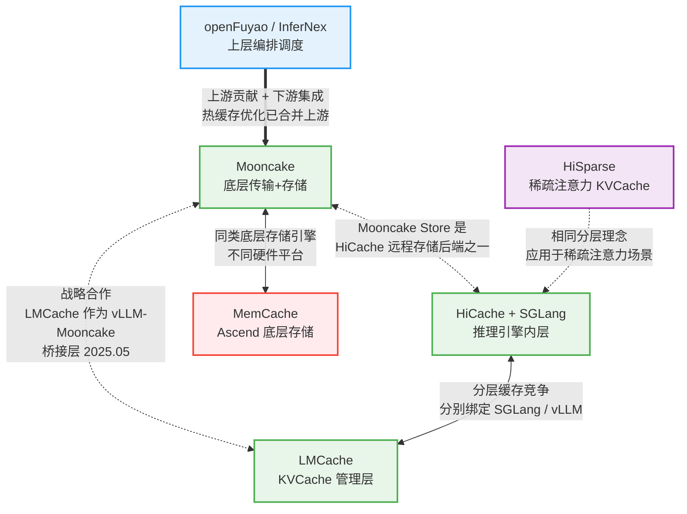

# 分布式 KVCache 技术趋势洞察与 openFuyao 规划

> **文档性质：** 技术趋势洞察报告
> **目标受众：** 技术团队、技术管理层
> **覆盖范围：** Mooncake V1/V2/V3、HiCache+SGLang、HiSparse、MemCache、LMCache、openFuyao/InferNex

---

## 目录

- [Section 1: 引言与核心洞察摘要](#section-1-引言与核心洞察摘要)
- [Section 2: 技术演进趋势](#section-2-技术演进趋势)
- [Section 3: 生态格局与竞合分析](#section-3-生态格局与竞合分析)
- [Section 4: 架构深度对比](#section-4-架构深度对比) <!-- 待撰写 -->
- [Section 5: openFuyao 差异化定位与突破方向](#section-5-openfuyao-差异化定位与突破方向) <!-- 待撰写 -->
- [Section 6: 双线规划路线图](#section-6-双线规划路线图) <!-- 待撰写 -->

---

## Section 1: 引言与核心洞察摘要

### 背景

LLM 推理中 KVCache 管理已成为核心性能瓶颈——它占用 GPU HBM 的 60-80%，在长上下文场景下单次请求的 KVCache 可达数十 GB。随着上下文窗口从 4K 扩展到 128K 甚至 1M tokens，重计算 KVCache 的开销呈线性增长，严重影响推理吞吐和延迟。分布式 KVCache 通过将 KVCache 的存储和传输从 GPU 本地解耦，利用 CPU DRAM、SSD 和远程节点构建多级存储池，显著降低重计算开销和首 Token 延迟（TTFT）。

### 核心论点

**分布式 KVCache 正从"PD 分离的传输管道"演变为"多层级、多注意力机制、异构硬件的智能存储系统"。** 这一演进体现在四个关键维度：

1. **存储层级深化**——从单纯的 GPU-to-GPU RDMA 传输，发展为 GPU HBM / CPU DRAM / SSD / 远程存储的多级缓存体系（HiCache 三层模型、LMCache 四层扩展含 NVMe GDS）。
2. **注意力机制多样化**——从统一的 MHA 格式，扩展到 GQA（分组查询）、MLA（DeepSeek 压缩潜在向量）、Hybrid 混合注意力（Qwen3.5+）和稀疏注意力（DSA），迫使 KVCache 系统提供可插拔的布局适配层。
3. **异构硬件支持**——从 NVIDIA GPU 单一平台，扩展到 AMD GPU、华为 Ascend NPU、Moore Threads GPU 等多元硬件生态，传输引擎需要适配 HCCL、ROCm、MUSA 等多种互连协议。
4. **生态集成深化**——从独立的 put/get 存储接口，演进为与推理引擎深度集成的注意力感知决策系统（vLLM KV Connector、SGLang RadixAttention）。

### 关键数据点

以下数据点来自各系统的官方发布和学术文献，量化展示了分布式 KVCache 技术的实际收益：

| 数据点 | 来源 |
|--------|------|
| Mooncake Store + vLLM 实现 3.8x 吞吐提升、46x TTFT 降低 | [vLLM Blog, 2026-05-06](https://vllm.ai/blog/2026-05-06-mooncake-store) |
| Mooncake 为 Kimi K2 在 128xH200 上实现 224k/288k tokens/sec (prefill/decode) | [Mooncake GitHub README](https://github.com/kvcache-ai/Mooncake/) |
| HiCache 实现最高 6x 吞吐提升、80% TTFT 降低 | [SGLang Blog, 2025-09-10](https://lmsys.org/blog/2025-09-10-sglang-hicache/) |
| 蚂蚁集团使用 DeepSeek-R1-671B + Mooncake Store 后端 TTFT 降低 84% | [SGLang HiCache Blog](https://lmsys.org/blog/2025-09-10-sglang-hicache/) |
| HiSparse 在 GLM-5.1 长上下文场景实现 5x 吞吐提升 | [SGLang Blog, 2026-04-10](https://lmsys.org/blog/2026-04-10-sglang-hisparse/) |
| LMCache CacheBlend 在 RAG 场景接近 100% KVCache 命中率，获 EuroSys 2025 Best Paper | [EuroSys 2025](https://dl.acm.org/doi/10.1145/3693.comfortable), [LMCache GitHub](https://github.com/LMCache/LMCache) |
| LMCache + Mooncake 在 8xH800 Qwen2.5-72B 上 TTFT 降低 69.1%、吞吐提升 191% | [LMCache Blog](https://blog.lmcache.ai) |
| openFuyao InferNex PD KVCache 感知路由实现 22.08% E2EL 改善 | [openFuyao v26.03 Release](https://www.openfuyao.cn/zh/blogs/blogsList/openFuyao-26-03-released/) |

### 结论

KVCache 生态正从单一项目竞争走向分层协作——底层存储引擎趋于收敛（Mooncake Store 成为主流），上层管理层持续竞争（HiCache 绑定 SGLang、LMCache 绑定 vLLM），异构硬件是中国市场的独特变量。openFuyao 在异构 NPU 场景拥有独特定位，应聚焦**"异构推理的云原生编排层"**而非在底层存储引擎上重复造轮子，通过上游贡献建立技术影响力，通过自研编排层构建差异化护城河。

---

## Section 2: 技术演进趋势

分布式 KVCache 领域正在经历深刻的技术演进。我们识别出四个相互交织但又各具方向性的关键趋势，它们共同定义了未来 12-24 个月的技术竞争格局。理解这些趋势的来龙去脉，是制定 openFuyao 技术路线的基础。

---

### 趋势 1：从 PD 分离到 Tiered Cache（存储层级深化）

#### 演进脉络

KVCache 存储架构经历了一条清晰的从"传输"到"分层存储"的深化路径：

| 阶段 | 代表系统/版本 | 时间节点 | 核心特征 |
|------|-------------|---------|---------|
| V1 纯 PD 分离 | Mooncake V1 | 2024.06 | KVCache 通过 RDMA 直接传输，GPU-to-GPU 为主，无存储层级抽象 |
| V2 传输抽象 | Mooncake V2 | 2024.11 | Transfer Engine 统一抽象层，支持 TCP/RDMA/CXL/NVMe-oF 多种传输方式 |
| V3 多级存储 | Mooncake Store V3 | 2025.03 | 引入 GPU HBM -> CPU DRAM -> SSD 分层存储引擎，支持多副本和条带化 |
| 标准化三层 | HiCache | 2025.09 | 标准化三层模型（GPU HBM / CPU DRAM / 远程存储），GPU 辅助 I/O 内核 |
| 四层扩展 | LMCache | 2025+ | 新增本地 NVMe GDS 层，NUMA 感知分配，256 token 细粒度分块 |

**Mooncake 的基础性贡献**在于率先将 Prefill-Decode 分离架构工程化落地，并通过 Transfer Engine 将传输层从具体硬件中解耦。截至 2024 年 11 月的 V2 版本，Mooncake 的传输引擎已抽象出 TCP、RDMA（InfiniBand/RoCEv2/eRDMA）、CXL/共享内存、NVMe over Fabric 等多种传输方式，并通过拓扑感知的路径选择（topology-aware path selection）实现多 NIC 带宽聚合和 NUMA 亲和性优化。这一抽象层使得上层存储引擎无需关心底层传输细节，为后续的多级存储奠定了架构基础。

**HiCache 的关键创新**在于将存储层级标准化为三层模型，并引入了 GPU 辅助 I/O 内核（GPU-assisted I/O kernel）。传统方案中，KVCache 从 CPU DRAM 到 GPU HBM 的拷贝依赖标准 `cudaMemcpy`，这一过程受限于 PCIe 带宽且 CPU 成为瓶颈。HiCache 的 GPU 辅助内核将数据搬运逻辑卸载到 GPU 上执行，通过 GPU SM（Streaming Multiprocessor）直接发起内存拷贝操作，实测吞吐量达到标准 `cudaMemcpy` 的 3 倍。这一创新使得 CPU DRAM 层从"低效的中间缓存"转变为"高效的扩展存储"，显著提升了整个分层体系的性价比。

**LMCache 的差异化路线**则体现在更细粒度的控制和更多存储层级上。LMCache 引入了第四层——本地 NVMe（通过 GPUDirect Storage / GDS 支持），适合大规模持久化场景。同时，LMCache 采用 256 token 的细粒度分块策略（相比之下 Mooncake 和 HiCache 通常以完整 sequence 为单位），这使得 RAG 等场景下的 KVCache 复用更加高效——只有实际命中的 KV 块才会被加载。此外，LMCache 的 NUMA 感知分配确保了在多路 CPU 服务器上，KVCache 数据被分配在距离目标 GPU 最近的 NUMA 节点上。

#### 关键洞察

1. **存储层级正在从"3 层够用"走向"N 层可选"**：GPU HBM -> CPU DRAM -> 远程 DRAM -> 本地 SSD -> 远程 SSD -> CXL 内存，每一层都有不同的延迟-容量-成本权衡。未来的系统需要能根据工作负载自动选择最优层级。

2. **GPU 辅助 I/O 是高价值创新方向**：HiCache 的 3x cudaMemcpy 吞吐证明，打破 CPU-GPU 数据搬运瓶颈的关键不在于增加带宽，而在于改变搬运方式。这一思路可以延伸到更多场景（如 GPU 直接发起 RDMA、GPU 感知的预取策略）。

3. **分块粒度决定复用效率**：Mooncake 以 sequence 为单位适合 PD 分离场景；LMCache 的 256-token 块适合 RAG/共享前缀场景。未来的系统需要支持可配置的分块策略。

4. **新存储介质即将入局**：CXL 内存（CXL 3.0 Type 3 设备）提供跨节点共享的内存语义访问，延迟在亚微秒级；持久内存（Intel Optane 继任者、三星 Memory Semantic SSD）可能填补 DRAM 与 SSD 之间的延迟鸿沟。这些新介质的加入将进一步丰富层级体系。

#### 趋势判断

未来 12 个月内，**自适应分层缓存（Adaptive Tiered Cache）** 将成为主流——系统根据访问频率、延迟要求和硬件拓扑自动决定 KVCache 的放置层级。我们预计 Mooncake Store 将引入更细粒度的层级管理（当前以 segment 为基本单位），而 HiCache 和 LMCache 将在各自的推理引擎生态中深化层级优化。对于 openFuyao 而言，新介质（CXL、持久内存）的适配将是异构推理场景下的差异化机会。

#### 参考来源

- Mooncake 论文：[arXiv 2407.00079](https://arxiv.org/abs/2407.00079)，FAST 2025 Best Paper
- HiCache 博客：[https://lmsys.org/blog/2025-09-10-sglang-hicache/](https://lmsys.org/blog/2025-09-10-sglang-hicache/)
- HiCache 设计文档：[https://docs.sglang.ai/advanced_features/hicache_design.html](https://docs.sglang.ai/advanced_features/hicache_design.html)
- LMCache 架构文档：[https://docs.lmcache.ai/developer_guide/architecture.html](https://docs.lmcache.ai/developer_guide/architecture.html)

---

### 趋势 2：从全量注意力到稀疏/混合注意力适配

#### 演进脉络

大语言模型的注意力机制正在快速多样化，KVCache 的存储格式也随之分化：

| 注意力类型 | 代表模型 | KVCache 特征 | 存储影响 |
|-----------|---------|-------------|---------|
| MHA（Multi-Head Attention） | 早期 LLM | 每 head 独立 K/V，格式统一 | 存储量最大，布局最简单 |
| GQA（Grouped-Query Attention） | GLM-4、Qwen 系列 | KV 组内共享，减少 head 数 | 内存占用减少，需组对齐处理 |
| MLA（Multi-head Latent Attention） | DeepSeek V3 | 压缩到低维潜在向量 | 4-8x 存储缩减，但需解压 |
| Hybrid（混合注意力） | Qwen3.5+ | 滑动窗口 + 全局注意力交替 | 不同层有不同 KV 格式，需变长存储 |
| DSA（稀疏注意力） | DeepSeek V3.2、GLM-5.1 | 仅保留活跃 KV 子集 | KV 子集高度动态，需稀疏索引 |

**这一演进对 KVCache 系统提出了根本性挑战**：不同注意力机制产生的 KVCache 在数据布局、维度、对齐方式上完全不同。例如，MHA 的每层 KV 形状是 `[num_heads, head_dim, seq_len]`；GQA 则是 `[num_kv_heads, head_dim, seq_len]`（其中 `num_kv_heads < num_heads`）；MLA 存储的不是完整 KV，而是压缩后的潜在向量 `[latent_dim, seq_len]`（`latent_dim` 远小于 `num_heads * head_dim`）；Hybrid 模型更复杂——不同层使用不同的注意力模式，有的层只保留最近 N 个 token 的 KV（滑动窗口），有的层保留全部 KV（全局注意力），导致同一模型内部 KVCache 格式不统一。

**Mooncake Store 的工程实践**已经建立了可插拔的布局适配层。从代码分析来看，Mooncake Store 实现了一个抽象基类 `KVCacheLayoutHandler`（定义于 `mooncake-store/include/kvcache_layout_handler.h`），提供统一的 `serialize` / `deserialize` / `calculateSerializedSize` / `validate` 接口，并提供了四种具体实现：

- `MHALayoutHandler` — 传统多头注意力布局
- `GQALayoutHandler` — 分组查询注意力布局（GLM-4、Qwen）
- `MLALayoutHandler` — 压缩潜在向量布局（DeepSeek V3）
- `HybridLayoutHandler` — 混合/滑动窗口布局（Qwen3.5+），支持 `[header][metadata_json][windowed_kv_data]` 存储格式

这种设计模式确保了新注意力机制可以通过新增 Handler 来支持，而无需修改存储引擎核心逻辑——这是生产系统应对快速变化的模型架构的正确工程实践。

**HiSparse 的突破**在于将稀疏注意力与 KVCache 管理深度融合。在 GLM-5.1 等使用 DSA（Dynamic Sparse Attention）的模型中，并非所有 KV 都参与计算，只有被注意力模式选中的"活跃" KV 子集才是必要的。HiSparse 精准地只将这些活跃 KV 子集保留在 GPU 上，丢弃或降级非活跃 KV，在长上下文场景实现了 5x 吞吐提升。这意味着 KVCache 系统不仅需要知道"存储什么格式的 KV"，还需要理解"哪些 KV 是活跃的"——这是从格式适配到语义理解的跃迁。

#### 关键洞察

1. **可插拔布局适配层是必备能力**：随着新模型架构的快速迭代（平均每 3-6 个月出现一种新的注意力变体），KVCache 系统必须能在不修改核心代码的前提下支持新布局。Mooncake Store 的 Handler 模式树立了工程标杆。

2. **稀疏注意力改变 KVCache 存储范式**：传统存储假设"所有 KV 都同等重要"，但稀疏注意力打破了这一假设。未来的 KVCache 系统需要维护稀疏索引（哪些 token 的 KV 是活跃的），并在跨节点传输时只传输活跃子集——这直接影响传输引擎的设计。

3. **Hybrid 模型带来工程复杂度**：同一模型内部不同层使用不同注意力模式，意味着一次推理请求的 KVCache 包含多种格式。存储引擎需要以"层"为粒度管理格式差异，而非以"模型"为粒度。

4. **MLA 的压缩-解压权衡**：MLA 在存储端大幅节省空间（4-8x），但在传输和加载时需要考虑是否传输压缩格式（节省带宽但增加 GPU 解压计算）还是传输解压后格式（增加带宽但减少 GPU 计算）。这一权衡目前尚无定论。

#### 趋势判断

未来 12-18 个月，**注意力机制多样化将加速**——随着 DeepSeek、Qwen、GLM 等模型团队的持续创新，新的注意力变体将不断涌现。KVCache 系统的竞争力将越来越取决于"新注意力机制的支持速度"。Mooncake Store 的 Handler 模式已经建立了正确的架构基线。对于 openFuyao，布局适配层的扩展性将是上游贡献的高价值切入点——每种新注意力机制的 Handler 实现都是可直接合并的独立 PR。

#### 参考来源

- HiSparse 博客：[https://lmsys.org/blog/2026-04-10-sglang-hisparse/](https://lmsys.org/blog/2026-04-10-sglang-hisparse/)
- Mooncake Store 布局处理器代码：`mooncake-store/include/kvcache_layout_handler.h`、`gqa_layout_handler.h`、`mla_layout_handler.h`、`hybrid_layout_handler.h`、`mha_layout_handler.h`
- DeepSeek MLA 论文（DeepSeek-V2 Technical Report）

---

### 趋势 3：从同构 GPU 到异构硬件生态

#### 演进脉络

KVCache 传输和存储的硬件基础正在从 NVIDIA GPU 单一平台向多元异构生态扩展：

| 硬件平台 | 互连技术 | Mooncake TE 支持 | 代表场景 |
|---------|---------|-----------------|---------|
| NVIDIA GPU | InfiniBand / RoCEv2 / GPUDirect | 原生支持（主力） | 主流大规模推理 |
| AMD GPU | ROCm / HIP | HIP Transport | 替代 GPU 方案 |
| 华为 Ascend NPU | HCCL / ADXL / device_rdma / sdma / host_urma | HCCL Transport + ADXL Direct Transport | 国产化推理（中国市场刚需） |
| Moore Threads GPU | MUSA | MUSA Transport | 国产 GPU 替代 |
| 异构集群 | 混合互连 | TCP 兜底 + 协议适配 | Ascend Prefill + NVIDIA Decode |

**Mooncake Transfer Engine 的架构优势**在于将传输层完全抽象化。从源码分析来看，Mooncake TE 的传输实现分布在 `mooncake-transfer-engine/src/transport/` 目录下，已覆盖以下传输协议：

- `tcp_transport/` — TCP 传输（兜底方案，通用性好）
- `rdma_transport/` — RDMA 传输（InfiniBand/RoCEv2/eRDMA，高性能场景）
- `nvlink_transport/` 和 `intranode_nvlink_transport/` — NVLink 传输（GPU 间高速互联）
- `cxl_transport/` — CXL 传输（共享内存语义）
- `nvmeof_transport/` — NVMe over Fabric 传输（远程存储访问）
- `hip_transport/` — AMD ROCm/HIP 传输
- `hccl_transport/` — 华为 Ascend HCCL 传输
- `ascend_direct_transport/` — 华为 Ascend 直连传输（device_rdma/sdma）
- `heterogeneous_rdma_transport/` — 异构 RDMA 传输
- `barex_transport/` — BaREx 传输

**这一覆盖广度在开源 KVCache 项目中独一无二**，是 Mooncake 能成为中国市场主流选择的核心原因之一。

**异构推理的实际需求**在中国市场尤为迫切。受限于芯片供应，中国企业普遍面临"Ascend Prefill + NVIDIA Decode"或"多品牌 GPU 混部"的场景。在这种场景下，Prefill 节点产生的 KVCache 需要跨硬件平台传输到 Decode 节点——这不仅要求传输层能同时操作两种硬件，还要求 KVCache 的数据格式在不同硬件间保持一致（或定义标准转换协议）。

**MemCache 的 Ascend 原生优化**代表了国产硬件深度适配的前沿探索。MemCache（vLLM-Ascend 社区项目）针对 Ascend NPU 的原生互连技术（`device_rdma`、`sdma`、`host_urma`）进行了专门的 KVCache 传输优化，绕过通用传输抽象层，直接利用 Ascend 硬件特性。这种"原生优先"的优化思路与 Mooncake TE 的"抽象优先"思路形成互补——前者追求单硬件极致性能，后者追求跨硬件统一接口。

#### 关键洞察

1. **异构推理在中国市场是刚需而非可选项**：受地缘政治影响，中国企业必须在 Ascend + NVIDIA 混合集群上运行推理服务。支持异构 KVCache 传输不是技术加分项，而是市场准入条件。

2. **传输协议数量不等于传输效率**：Mooncake TE 覆盖了 6+ 传输协议，但不同协议的性能差异巨大（RDMA 比 TCP 快 10x+）。关键不是"支持多少种"，而是"每种都优化到位"。

3. **国产硬件的原生互连尚未被充分挖掘**：Ascend 的 `device_rdma` / `sdma` / `host_urma` 提供了不同层次的传输能力，但当前 Mooncake TE 对 Ascend 的支持主要通过 HCCL 封装，尚未完全利用底层硬件直连能力。MemCache RFC 中提出的原生互连优化方向值得关注。

4. **异构集群的 KVCache 格式标准化是未解难题**：Ascend GPU 和 NVIDIA GPU 的内存布局可能不同（对齐方式、bank conflict 规避策略），KVCache 在跨硬件传输时可能需要格式转换。目前业界尚无统一的"KVCache 传输格式标准"。

#### 趋势判断

未来 12-24 个月，**异构硬件支持将从"能传输"升级为"能优化"**。当前多数系统的异构支持停留在 TCP 兜底或 HCCL/ROCm 适配层面；下一阶段的竞争焦点将是：针对每种硬件特性的深度优化（如 Ascend ADXL 的批量传输、AMD Infinity Fabric 的低延迟通信）、异构集群中的智能路由（根据源-目标硬件类型自动选择最优传输路径）、以及 KVCache 跨硬件格式标准化。对于 openFuyao，基于 Ascend 原生互连的 KVCache 传输优化是核心差异化方向。

#### 参考来源

- MemCache RFC：[https://github.com/vllm-project/vllm-ascend/issues/6410](https://github.com/vllm-project/vllm-ascend/issues/6410)
- Mooncake TE 传输引擎源码：`mooncake-transfer-engine/src/transport/`
- vLLM-Ascend PD 分离验证：[https://docs.vllm.ai/projects/ascend/en/v0.11.0/tutorials/multi_node_pd_disaggregation_mooncake.html](https://docs.vllm.ai/projects/ascend/en/v0.11.0/tutorials/multi_node_pd_disaggregation_mooncake.html)

---

### 趋势 4：从独立组件到生态集成

#### 演进脉络

KVCache 系统与推理引擎的关系正在从松耦合的独立组件走向深度集成的协作伙伴：

| 阶段 | 代表方案 | 集成深度 | 特征 |
|------|---------|---------|------|
| 独立存储 | Mooncake V1（2024.06） | 接口层集成 | 独立的 put/get 存储服务，推理引擎通过简单 API 访问 |
| 引擎集成 | vLLM KV Connector / SGLang HiRadixTree | 框架层集成 | KVCache 管理嵌入推理引擎调度逻辑 |
| 全栈协作 | LMCache 作为 vLLM-Mooncake 桥接（2025.05） | 语义层集成 | 跨系统 KVCache 生命周期管理 |
| 插件式后端 | HiCache 后端接口 | 极简集成 | 仅需实现 `get` / `exist` / `set` 三个函数即可接入新后端 |

**集成深度的演进方向**是从"数据搬运"走向"决策参与"。在早期阶段，KVCache 系统只是一个被动的存储服务——推理引擎告诉它"存这个"或"取那个"，它不参与任何调度决策。但随着 PD 分离、共享前缀、RAG 等场景的复杂化，KVCache 系统越来越多地参与到推理调度的决策过程中。

**vLLM KV Connector** 开创了推理引擎与 KVCache 存储深度集成的先例。KV Connector 不是一个独立服务，而是 vLLM 推理引擎内部的一个组件，它在 vLLM 的调度器（scheduler）做出批次决策之前，就可以查询远程 KVCache 的可用性，并根据 KVCache 命中情况调整调度策略。例如，如果某个请求的 KVCache 已经在远程节点上存在，调度器可以优先调度该请求并跳过 prefill 阶段。这种"注意力感知调度"（attention-aware scheduling）使得 KVCache 命中率从被动统计变为主动优化。

**HiCache 的极简集成设计**降低了生态参与的门槛。HiCache 定义了仅包含三个函数的后端接口：`get(keys)` 获取 KVCache、`exist(keys)` 检查是否存在、`set(keys, values)` 写入 KVCache。任何存储系统只需实现这三个函数即可成为 HiCache 后端——Mooncake Store、LMCache、本地内存、甚至是 Redis 都可以无缝接入。这种极简接口设计促进了生态繁荣，但也限制了深度优化的空间（后端无法感知推理引擎的调度意图）。

**LMCache 的"知识交付网络"定位**代表了最深层级的集成愿景。LMCache 将自己定位为"KDN（Knowledge Delivery Network）"——类比 CDN（内容分发网络），但分发的是"知识"（以 KVCache 形式编码的模型推理结果）。LMCache 的 CacheBlend 技术不仅能缓存和复用 KVCache，还能在不同请求之间智能混合部分 KVCache（例如，共享 system prompt 的 KVCache + 请求特定的 KVCache），在 RAG 场景中接近 100% 的 KVCache 命中率。2025 年 5 月，LMCache 与 Mooncake 正式建立战略合作，LMCache 作为 vLLM 和 Mooncake 之间的桥接层，使得 vLLM 用户可以透明地使用 Mooncake Store 作为分布式 KVCache 后端。

**SGLang 的 RadixAttention 与 HiCache 绑定**则展示了另一种深度集成路径。SGLang 的核心创新 RadixAttention 使用基数树（Radix Tree）管理 KVCache 的共享前缀，使得多个请求可以高效共享公共前缀的 KVCache。HiCache 与 RadixAttention 深度绑定，缓存粒度精确对齐到 Radix Tree 的叶子节点，实现了与推理引擎内部数据结构的无缝衔接。

#### 关键洞察

1. **集成深度正从"put/get 接口"向"注意力感知决策"演进**：下一代 KVCache 系统不仅存储和传输数据，还参与推理调度的决策——何时预取、何时驱逐、如何路由。这要求 KVCache 系统理解推理引擎的工作负载特征。

2. **极简接口促进生态，深度集成创造价值**：HiCache 的三函数接口让新后端接入变得容易，但深度优化（如 LMCache 的 CacheBlend、SGLang 的 RadixAttention 对齐）才能带来数量级的性能提升。两种策略各有所长，适合不同定位的系统。

3. **"桥接层"角色具有战略价值**：LMCache 作为 vLLM-Mooncake 桥接层的定位，使其在两个重要项目之间建立了不可替代的连接。这种"生态粘合剂"角色虽然技术门槛不如底层存储引擎高，但战略影响力巨大。

4. **标准化与碎片化的张力**：KVCache 存储接口趋向标准化（HiCache 的三函数模型），但各系统的深度集成能力（RadixAttention、CacheBlend）形成了差异化壁垒。未来可能形成"底层存储标准 + 上层管理层竞争"的格局。

#### 趋势判断

未来 12 个月，**KVCache 系统的竞争力将越来越取决于与推理引擎的集成深度而非存储效率本身**。存储效率（压缩比、吞吐量）的差异将逐渐缩小，但集成深度（能否参与调度决策、能否感知注意力模式）的差距将持续扩大。对于 openFuyao，在异构 NPU 场景下与推理引擎（vLLM-Ascend、MindIE）的深度集成是构建护城河的关键——单纯提供存储服务容易被替代，但深度参与调度决策的系统迁移成本极高。

#### 参考来源

- HiCache 博客：[https://lmsys.org/blog/2025-09-10-sglang-hicache/](https://lmsys.org/blog/2025-09-10-sglang-hicache/)
- LMCache 博客：[https://blog.lmcache.ai](https://blog.lmcache.ai)
- LMCache EuroSys 2025 论文（CacheBlend）
- vLLM PD 解耦验证：[https://docs.vllm.ai/projects/ascend/en/v0.11.0/tutorials/multi_node_pd_disaggregation_mooncake.html](https://docs.vllm.ai/projects/ascend/en/v0.11.0/tutorials/multi_node_pd_disaggregation_mooncake.html)
- vLLM Mooncake Store 集成博客：[https://vllm.ai/blog/2026-05-06-mooncake-store](https://vllm.ai/blog/2026-05-06-mooncake-store)

---

### 趋势交汇点：四大趋势的协同效应

以上四个趋势并非孤立演进，它们在多个维度产生交汇和协同：

1. **趋势 1 x 趋势 2（分层存储 x 注意力多样化）**：不同注意力机制的 KVCache 适合不同的存储层级。例如，MLA 的压缩潜在向量体积小、适合常驻 GPU HBM；MHA 的全量 KV 体积大、适合降级到 CPU DRAM 或 SSD。未来的分层缓存策略需要是"注意力感知"的。

2. **趋势 1 x 趋势 3（分层存储 x 异构硬件）**：不同硬件的存储层级结构不同——NVIDIA GPU 有 HBM + NVLink + InfiniBand 的成熟层级；Ascend NPU 有 HBM + HCCL + ADXL 的层级；CXL 内存可以跨硬件共享但延迟特性不同。异构集群中的分层缓存需要理解每种硬件的存储层级特征。

3. **趋势 2 x 趋势 4（注意力多样化 x 生态集成）**：推理引擎对 KVCache 的调度决策需要理解注意力模式。例如，对于 Hybrid 模型，推理引擎需要知道哪些层使用滑动窗口（KV 可安全驱逐）、哪些层使用全局注意力（KV 需保留），并据此做出调度决策。这要求 KVCache 系统向推理引擎暴露注意力语义信息。

4. **趋势 3 x 趋势 4（异构硬件 x 生态集成）**：异构推理场景下的集成挑战最大——不同硬件上的推理引擎（vLLM、MindIE、TensorRT-LLM）有不同的 KVCache 管理接口，异构 KVCache 传输需要在这些引擎之间建立统一的语义桥梁。

这些交汇点正是技术创新的机会空间，也是 openFuyao 可以建立差异化优势的领域。后续章节将在此基础上分析生态格局（Section 3）、对比架构差异（Section 4），并最终定义 openFuyao 的技术路线（Section 5、Section 6）。

---

## Section 3: 生态格局与竞合分析

分布式 KVCache 领域已经形成一个多层次的生态系统——底层传输与存储引擎、中间 KVCache 管理层、上层推理引擎集成，以及更上层的云原生编排调度。本节从定位矩阵、竞合关系和关键判断三个维度，客观呈现当前格局，为 openFuyao 的技术定位提供决策依据。

---

### 3.1 定位矩阵

下表从八个维度对五大系统进行横向对比，揭示各系统在生态中的差异化定位：

| 维度 | Mooncake | HiCache + SGLang | LMCache | MemCache | openFuyao / InferNex |
|------|----------|-------------------|---------|----------|----------------------|
| **核心定位** | 分布式 KVCache 存储引擎 + 传输引擎 | 分层 KV 缓存系统（RadixAttention 深度集成） | KVCache 管理层（KDN — 知识交付网络） | Ascend NPU 原生分布式 KVCache 引擎 | 云原生 AI 推理基础设施（编排 + 调度 + 存储） |
| **技术栈层级** | 底层传输 + 存储 | 推理引擎内层 | 推理引擎与存储之间的管理层 | 底层传输 + 存储（Ascend 原生） | 上层编排 + 调度 + 存储 |
| **推理引擎支持** | vLLM / SGLang / TRT-LLM / LMDeploy | SGLang 原生（RadixAttention 绑定） | vLLM 原生（KV Connector 绑定） | vLLM-Ascend | vLLM / vLLM-Ascend |
| **硬件生态** | NVIDIA / AMD / Ascend / Moore Threads | NVIDIA（主力） | NVIDIA | Ascend NPU | x86 / ARM / GPU / NPU |
| **存储层级** | GPU → DRAM → SSD（RDMA） | GPU → CPU → 远程存储 | GPU → CPU → 本地 NVMe → 远程 | 设备 → 主机 → 远程（Ascend RDMA） | 分布式池化存储 |
| **开源协议** | MIT | Apache 2.0 | Apache 2.0 | 华为内部（未开源） | Apache 2.0 |
| **社区活跃度** | PyTorch 生态核心项目；FAST 2025 Best Paper；2026.02 正式加入 PyTorch 组织；支撑 Kimi K2 大规模推理 | LMSYS / UC Berkeley 背书；蚂蚁集团、Novita AI、阿里云 Tair 等生产使用；SGLang 社区高速增长 | Tensormesh 公司运营；EuroSys 2025 CacheBlend Best Paper；2025.05 与 Mooncake 战略合作；vLLM 生态重要组成 | 华为内部驱动；vLLM-Ascend 社区 RFC #6410 提案阶段；尚未形成独立开源社区 | 华为 / 中国移动 / 中国联通联盟驱动；v26.03 正式发布；声称 10,000+ 节点调度能力 |
| **代表用户 / 案例** | Kimi K2（128x H200，224k/288k tokens/sec）；vLLM 官方集成（2026.05） | 蚂蚁集团 DeepSeek-R1-671B（TTFT 降低 84%）；Novita AI；阿里云 Tair | vLLM KV Connector 标准后端；RAG 场景近 100% 命中率 | vLLM-Ascend PD 分离验证（Mooncake 后端） | 中国移动 / 中国联通 AI 推理平台；InferNex PD 感知路由（E2EL 改善 22.08%） |

#### 定位矩阵解读

从矩阵中可以提炼出三个结构性特征：

**第一，技术栈层级分化明显。** Mooncake 和 MemCache 位于底层（传输 + 存储），HiCache 嵌入推理引擎内部，LMCache 位于推理引擎与存储之间的中间层，openFuyao 则定位在上层编排。这五个系统并不完全在同一维度竞争——底层竞争传输效率和硬件覆盖面，中层竞争 KVCache 管理策略和复用效率，上层竞争调度智能和运维自动化。

**第二，推理引擎绑定形成阵营效应。** HiCache 与 SGLang 深度绑定（RadixAttention），LMCache 与 vLLM 深度绑定（KV Connector），Mooncake 则保持引擎中立（同时支持 vLLM、SGLang、TRT-LLM、LMDeploy）。这种绑定关系既是竞争优势（深度集成带来性能优势），也是竞争局限（迁移成本高，生态受限于绑定引擎的市场份额）。

**第三，硬件生态是最大的分化因素。** Mooncake 覆盖 NVIDIA / AMD / Ascend / Moore Threads 四大平台；HiCache 和 LMCache 聚焦 NVIDIA；MemCache 专注 Ascend；openFuyao 追求全平台覆盖但深度有限。在中国市场，硬件多样性不是可选项，这直接影响了各系统的市场空间。

---

### 3.2 竞合关系

以下 Mermaid 图展示了五大系统之间的竞合关系网络：

#### 3.2.1 合作关系

**Mooncake 与 LMCache 的战略合作（2025.05）** 是当前生态中最具代表性的跨层合作。LMCache 定位为 vLLM 和 Mooncake Store 之间的"桥接层"——vLLM 通过 KV Connector 标准 API 与 LMCache 交互，LMCache 再通过 Mooncake Store 的存储接口进行远程 KVCache 的存取和管理。这一合作关系使得 vLLM 用户无需直接操作 Mooncake Store 的底层 API，降低了集成复杂度。同时，LMCache 在此基础上提供了 CacheBlend（跨请求 KVCache 智能混合）和 256-token 细粒度分块等上层优化能力，与 Mooncake Store 的高性能传输和存储形成互补。实测数据表明，LMCache + Mooncake 在 8xH800 Qwen2.5-72B 上实现了 TTFT 降低 69.1%、吞吐提升 191%。这一合作的战略意义在于：它验证了"底层存储引擎 + 中间管理层"的分层架构在工程上是可行的，且性能收益显著。

**Mooncake 与 HiCache 的后端合作** 体现了极简接口设计的生态价值。HiCache 定义了仅包含 `get` / `exist` / `set` 三个函数的后端接口，Mooncake Store 作为 HiCache 的远程存储后端之一，只需实现这三个函数即可接入。蚂蚁集团在 DeepSeek-R1-671B 上的生产实践正是基于此方案——SGLang 通过 HiCache 接口访问 Mooncake Store 中的远程 KVCache，实现了 84% 的 TTFT 降低。这一合作关系的意义在于：它证明了"推理引擎内层缓存 + 远程存储后端"的分层协作模式可以产生实际的生产价值。

#### 3.2.2 竞争关系

**HiCache 与 LMCache 的分层缓存之争**，本质上是推理引擎生态竞争在 KVCache 领域的映射。两个系统都提供分层 KVCache 管理能力，但技术路线和生态绑定截然不同：

- HiCache 深度绑定 SGLang，核心优势是 RadixAttention 基数树管理，GPU 辅助 I/O 内核实现了 3x cudaMemcpy 吞吐提升，适合 SGLang 生态内的深度优化场景。
- LMCache 深度绑定 vLLM，核心优势是 CacheBlend 跨请求混合技术和 256-token 细粒度分块，适合 RAG 和共享前缀场景。

两者的竞争格局受制于 vLLM 与 SGLang 之间的推理引擎市场份额竞争。如果 vLLM 保持市场份额领先，LMCache 的生态基础更稳固；如果 SGLang 在特定场景（如 MoE、PD 分离）中快速渗透，HiCache 将获得增长动能。短期内（12 个月内），两者将维持"各自深耕绑定引擎生态、在标准接口层面保持兼容"的竞合态势。

**Mooncake 与 MemCache 的底层存储引擎之争**，是中国市场异构硬件背景下的特殊竞争。两者定位相似（都是底层 KVCache 传输 + 存储引擎），但硬件平台不同：

- Mooncake 追求跨硬件统一抽象（NVIDIA / AMD / Ascend / Moore Threads），通过 Transfer Engine 的多传输协议适配实现硬件无关性。
- MemCache 专注 Ascend NPU 原生优化，直接利用 `device_rdma` / `sdma` / `host_urma` 等 Ascend 原生互连技术，追求单平台极致性能。

在纯 Ascend 集群场景下，MemCache 的原生优化可能带来性能优势；但在异构混合集群（Ascend + NVIDIA）场景下，Mooncake 的跨平台能力更具价值。值得注意的是，MemCache 目前以 vLLM-Ascend RFC #6410 提案的形式存在，尚未形成独立的开源社区，其长期发展路径仍存在不确定性。

#### 3.2.3 上下游关系

**openFuyao 与 Mooncake 的上下游关系** 是一种兼具贡献与集成的双向关系。openFuyao 团队已向 Mooncake 上游贡献了 Ascend 热缓存优化（hot cache optimization）代码，这些贡献已合并到 Mooncake 主分支，表明 openFuyao 在 Mooncake 生态中的技术参与度正在提升。在下游，openFuyao 的 InferNex 平台集成 Mooncake Store 作为分布式 KVCache 的存储后端，通过 PD KVCache 感知路由实现了 22.08% 的端到端延迟改善。这种"上游贡献 + 下游集成"的双向关系，既让 openFuyao 借力 Mooncake 的技术积累，也通过上游贡献建立了技术影响力。

#### 3.2.4 承继关系

**HiSparse 与 HiCache 的承继关系** 体现了同一技术理念在不同场景下的演化。HiCache 建立了"GPU → CPU → 远程存储"的三层分层缓存模型和 RadixAttention 基数树管理机制；HiSparse 将相同的分层理念应用于稀疏注意力（DSA）场景，核心创新在于只保留"活跃" KV 子集而非全量 KV，在 GLM-5.1 长上下文场景实现了 5x 吞吐提升。两者的承继关系表明：分层缓存是一个可复用的架构模式，可以在不同注意力机制场景下迁移应用。

---

### 3.3 关键判断

基于以上定位矩阵和竞合关系分析，我们提出三个关键判断：

#### 判断 1：底层存储引擎趋于收敛，Mooncake Store 成为主流

**判断结论：** 在 KVCache 底层传输与存储领域，Mooncake Store 正在成为事实标准，其他底层引擎（如 MemCache）将逐步融入 Mooncake 生态或在特定硬件平台上形成补充而非替代。

**证据支撑：** Mooncake 的 Transfer Engine 覆盖了 TCP / RDMA / NVLink / CXL / NVMe-oF / HIP / HCCL / Ascend Direct 等 6+ 传输协议，硬件覆盖面在开源项目中独一无二。2026 年 2 月 Mooncake 正式加入 PyTorch 组织，FAST 2025 Best Paper 的学术认可进一步巩固了其技术权威性。LMCache 与 HiCache 均已将 Mooncake Store 作为远程存储后端，形成"底层统一、上层竞争"的格局。vLLM 官方在 2026 年 5 月正式集成 Mooncake Store（vLLM Blog），标志着主流推理引擎的认可。

**对 openFuyao 的启示：** openFuyao 不应在底层存储引擎上重复造轮子，而应通过持续的上游贡献（Ascend 原生互连优化、新注意力机制布局 Handler）深化与 Mooncake 的绑定，同时在异构 NPU 场景下的深度优化中积累差异化能力。

#### 判断 2：上层管理层（HiCache vs LMCache）继续竞争，本质是推理引擎生态竞争

**判断结论：** HiCache 与 LMCache 的竞争短期内不会收敛，两者的竞争格局将跟随 vLLM 与 SGLang 的市场份额演变，KVCache 管理层的统一标准短期内难以形成。

**证据支撑：** HiCache 深度绑定 SGLang 的 RadixAttention，GPU 辅助 I/O 内核等核心优化与 SGLang 内部数据结构紧密耦合，迁移到 vLLM 的成本极高。LMCache 深度绑定 vLLM 的 KV Connector 和 CacheBlend 技术，同样与 vLLM 调度逻辑紧密耦合。两者的差异化价值（RadixAttention 基数树 vs CacheBlend 智能混合）服务于不同的工作负载模式，没有明显的"一方胜出"的技术逻辑。SGLang 与 vLLM 作为两大开源推理引擎，短期内市场份额不会出现根本性变化。

**对 openFuyao 的启示：** openFuyao 的编排层应同时兼容 HiCache 和 LMCache 的接口，避免绑定单一推理引擎生态。在异构 NPU 场景下，可以通过 vLLM-Ascend 生态切入 LMCache 兼容路径，同时关注 SGLang 对 Ascend 的支持进展。

#### 判断 3：异构硬件是中国市场独特变量，NPU 生态需要独立但与 GPU 互通的方案

**判断结论：** 中国市场的异构硬件需求（Ascend NPU + NVIDIA GPU 混合部署）是区别于全球市场的独特变量，需要既具备 NPU 原生优化能力、又能与 GPU 生态互通的 KVCache 方案。

**证据支撑：** 受地缘政治因素影响，中国企业普遍面临 Ascend + NVIDIA 混合集群的部署需求，这种场景在全球市场几乎不存在。MemCache 专注 Ascend 原生优化但尚未开源，且缺乏跨硬件互通能力；Mooncake 虽然支持 Ascend，但主要通过 HCCL 封装层，尚未充分利用 Ascend 的底层互连能力（device_rdma / sdma / host_urma）。目前没有任何开源系统在"Ascend 原生深度优化 + 跨硬件互通"这两个维度上同时达到生产级水平——这是一个明确的技术空白。

**对 openFuyao 的启示：** openFuyao 应聚焦于"Ascend 原生深度优化"这一差异化方向，通过 Ascend Direct Transport 的深度优化填补 Mooncake 尚未覆盖的性能空间，同时利用 Mooncake 的跨硬件抽象层实现与 GPU 生态的互通。这一"深度优化 NPU + 互通 GPU"的定位，既有技术壁垒（需要 NPU 原生互连的深度知识），又有生态价值（填补 Mooncake 的 Ascend 性能短板）。

---

<!-- Section 4: 架构深度对比 — 待撰写 -->

<!-- Section 5: openFuyao 差异化定位与突破方向 — 待撰写 -->

<!-- Section 6: 双线规划路线图 — 待撰写 -->
